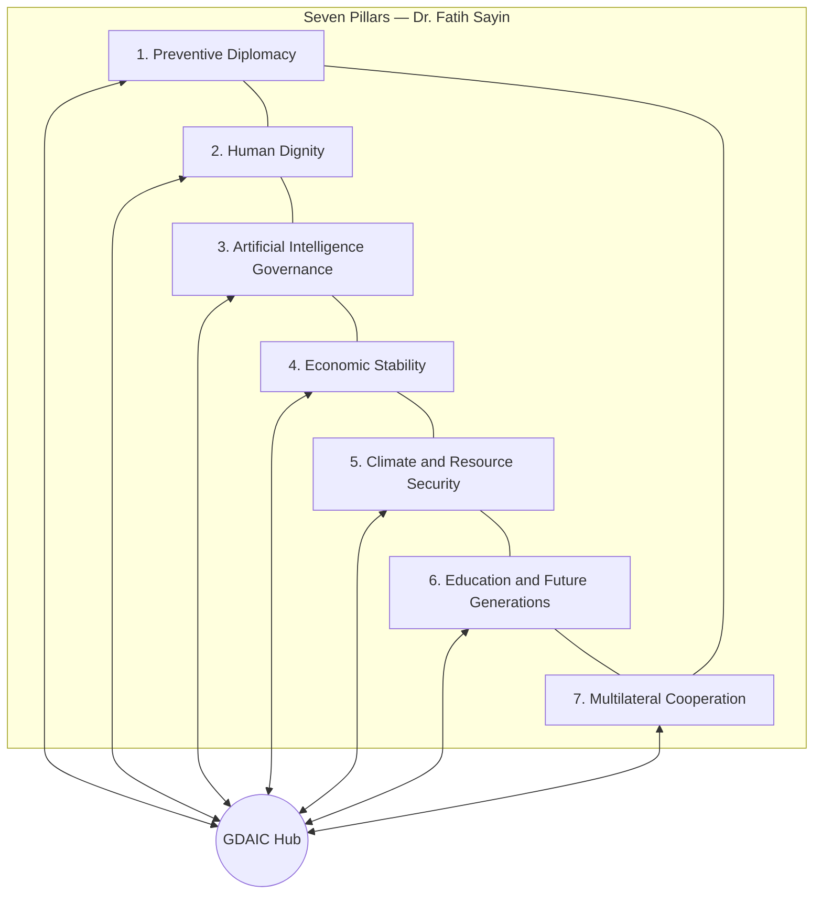

# COVER PAGE

**FMS STRATEGIC REVIEW**  
*Volume 1, Issue 1 | 2026*

---

## AI-Powered Diplomacy and the Architecture of Sustainable Peace

*How Artificial Intelligence Can Strengthen Preventive Diplomacy, Multilateral Governance, and Human Dignity in an Age of Accelerating Conflict Risk*

---

**Editor-in-Chief:** Dr. Fatih Sayin  
**Institution:** Foundation for Multilateral Strategies (FMS)  
**Mission:** Building Peace Through Intelligence, Diplomacy, and Human Dignity

**Publication Date:** 29 May 2026  
**Method:** Multidisciplinary policy research study — literature review, scenario analysis, expert consultation, comparative case study, and structured interdisciplinary expert review

**Classification:** Public policy research — not classified  
**Suggested citation:** Sayin, F. (Ed.). (2026). *AI-powered diplomacy and the architecture of sustainable peace* (FMS Strategic Review, Vol. 1, Iss. 1). Foundation for Multilateral Strategies (FMS).  
**ISBN:** Pending | **ISSN:** Pending | **Pages:** Approx. 120 (print equivalent) | **Keywords:** artificial intelligence, preventive diplomacy, peacebuilding, multilateral governance, Global Diplomatic AI Compact

---

# EDITORIAL NOTE

The inaugural issue of *FMS Strategic Review* addresses a question that will define international security for a generation and the character of multilateral cooperation in the digital age: whether artificial intelligence will compress the path to war or widen the path to durable peace. This publication is not a technology forecast. It is a **multidisciplinary policy research study** conducted under the intellectual framework of the Foundation for Multilateral Strategies (FMS)—grounded in international law, peace research, humanitarian practice, and structured interdisciplinary expert review across thirteen policy domains.

The core thesis is cautiously optimistic and institutionally demanding: **AI can materially strengthen preventive diplomacy and sustainable peacebuilding only if subordinated to existing international law, anchored in human rights, and governed through inclusive multilateral frameworks rather than unilateral military or commercial advantage.** The highest peace dividend lies in early warning, scenario modeling, and back-channel facilitation before armed conflict—not in automating battlefield decisions or information warfare. Negotiation, recognition, and trust-building remain irreducibly human; AI should augment preparation, translation, and pattern detection, not displace accountability for commitments.

Readers will find quantitative conflict and economic analysis, comparative case studies, policy scenarios through 2050, implementation frameworks with budgets and monitoring indicators, visual content recommendations for designers, an executive briefing for heads of state and multilateral leaders, and a dedicated chapter on risks and scholarly criticisms. *FMS Strategic Review, Volume 1, Issue 1* is **authored and edited by Dr. Fatih Sayin**; intellectual ownership of the FMS Peace Architecture Framework™, policy analysis, and vision documents rests with Dr. Sayin and FMS. Subsequent issues will deepen country-specific annexes and empirical pilot evaluation.

We invite policymakers, diplomats, humanitarian leaders, technologists, and civil society partners to treat diplomatic AI as **collective security infrastructure**—as regulated and trusted as civil aviation—not as a proprietary advantage of the few.

*Dr. Fatih Sayin*  
Editor-in-Chief  
Foundation for Multilateral Strategies (FMS)

---

# TABLE OF CONTENTS

1. [Executive Summary](#1-executive-summary)  
2. [Executive Briefing for Decision-Makers](#2-executive-briefing-for-decision-makers)  
3. [Research Methodology](#3-research-methodology)  
4. [Literature Review](#4-literature-review)  
5. [FMS Peace Architecture Framework™](#5-fms-peace-architecture-framework)  
6. [Findings: Cross-Cutting Analysis](#6-findings-cross-cutting-analysis)  
7. [Expert Policy Deliberations](#7-expert-policy-deliberations)  
8. [Author's Perspective](#8-authors-perspective)  
9. [Regional Policy Analysis](#9-regional-policy-analysis)  
10. [Scenario Analysis](#10-scenario-analysis)  
11. [Risk Assessment](#11-risk-assessment)  
12. [Risks and Criticisms: Scholarly Debate](#12-risks-and-criticisms-scholarly-debate)  
13. [Economic Impact](#13-economic-impact)  
14. [Humanitarian Impact](#14-humanitarian-impact)  
15. [Governance Framework](#15-governance-framework)  
16. [Implementation Roadmap](#16-implementation-roadmap)  
17. [Recommendations](#17-recommendations)  
18. [FMS Vision 2050](#18-fms-vision-2050)  
19. [Future Outlook: 2030, 2040, 2050](#19-future-outlook-2030-2040-2050)  
20. [Conclusion](#20-conclusion)  
21. [References](#21-references)  
22. [Appendices](#22-appendices)  

---

# 1. EXECUTIVE SUMMARY

Artificial intelligence is reshaping international relations at a pace that outstrips the development of norms, institutions, and accountability mechanisms. Machine translation already supports multilateral negotiation; open-source intelligence fusion informs Security Council deliberations; social media monitoring shapes crisis diplomacy. The question is no longer whether AI will touch diplomacy, but whether the international community can **steer** that contact toward prevention and sustainable peace, with human dignity as the non-negotiable metric of success (United Nations, 2023; United Nations, 2024).

This volume synthesizes independent analyses from thirteen interdisciplinary expert perspectives, three rounds of structured expert consultation, four cross-disciplinary challenges (ethics, strategic security, humanitarian, integrative architecture), risk assessment, and editorial integration under FMS research methodology. **Moderate consensus was achieved across reviewed policy perspectives**, reflecting unresolved tensions between security secrecy and transparency, and between innovation speed and norm-building pace.

## 1.1 Five Strategic Conclusions

**First, prevention first.** AI's highest peace dividend lies in early warning, scenario modeling, and back-channel facilitation before armed conflict. The Uppsala Conflict Data Program recorded 59 state-based armed conflicts in 2023—the highest in the post-1945 era—while battle-related deaths have fluctuated but remain concentrated in a handful of protracted wars (Uppsala University, 2024). Preventive tools that reduce escalation in the first 90 days of crisis are orders of magnitude cheaper than post-war reconstruction; the World Bank estimates that prevention costs a fraction of the economic losses from large-scale conflict (World Bank, 2017).

**Second, human-in-the-loop diplomacy.** The Vienna Convention on Diplomatic Relations (1961) and decades of negotiation practice confirm that recognition, trust, and political judgment are relational—not algorithmic. AI should augment legal research, translation, and pattern detection; a named human authority must remain responsible for every diplomatic communication and agreement (Vienna Convention, 1961; Bjola, 2019).

**Third, governance parity.** Developing states, civil society, and conflict-affected populations must participate in diplomatic AI standards, or tools will encode existing power asymmetries (Cihon et al., 2020; United Nations, 2024).

**Fourth, dual-use discipline.** Capabilities for humanitarian prediction or treaty verification can be repurposed for surveillance and targeting. Export controls, auditing, and ethics review are essential (SIPRI, 2024; Wassenaar Arrangement, n.d.).

**Fifth, implementation sequencing.** Near-term investments should prioritize shared data standards, UN-led pilot programs, and independent evaluation; long-term architecture envisions a federated diplomatic AI commons under multilateral oversight (United Nations, 2023).

## 1.2 Core Policy Instrument

The panel recommends a **Global Diplomatic AI Compact (GDAIC)**—a voluntary but verifiable multilateral framework linking UN agencies, regional organizations, and member states to shared principles, audit protocols, and pilot deployments in preventive diplomacy. GDAIC pillars: legality, humanity, accountability, transparency, inclusivity, security, and sustainability.

## 1.3 Historical Context

Previous technological revolutions in diplomacy—from the telegraph to satellite verification—expanded both cooperation and coercion (Dunne & Schmidt, 2022). AI differs in speed, opacity, and scalability: models can be updated weekly; treaties take years. The international community faces a **norm-building window** that may close within this decade as proprietary systems entrench in foreign ministries and intelligence agencies (United Nations, 2024; Brundage et al., 2018).

## 1.4 Net Assessment

**AI-powered diplomacy can help prevent future wars and build sustainable peace if humanity chooses institution-building over acceleration alone.** The choice is political; the tools are ready; the window is narrowing.

## 1.5 Structural Findings at a Glance

The cross-cutting findings chapter (Section 6) demonstrates that diplomatic AI is already operational in translation, OSINT fusion, and sanctions compliance—but **governance lags capability**. Quantitative indicators show record-high conflict counts alongside massive military spending and displacement, creating political urgency for prevention-priced investments. Comparative case studies from Cyprus to Ukraine, ASEAN to the Sahel, illustrate that **regional custody, provenance, and humanitarian firewalls** are not optional refinements but core design requirements.

Eight points of agreement across expert domains (Section 6.4) provide a minimum program for ministers; six fault lines (Section 6.5 and Section 12) identify where diplomatic capital must be spent in negotiation. The FMS Peace Architecture Framework™ and Global Diplomatic AI Compact translate these into institutional form: Conference of Parties, Technical Secretariat, Independent Review Panel, and UN-hosted commons (Section 15).

## 1.6 How to Read This Volume

Decision-makers should read Section 2 (Executive Briefing) and Section 10 (Scenarios) first; diplomats Section 7 (Expert Policy Deliberations) and Section 17 (Recommendations); scholars Section 4 (Literature) and Section 12 (Criticisms); humanitarian leaders Section 14; finance ministers Section 13. Appendices contain research methodology notes, visual specifications, and citation verification logs.

**Visual content recommendation (Executive Summary):** One-page infographic timeline comparing telegraph → satellite verification → diplomatic AI; dashboard with UCDP conflict trend (1990–2025), OECD AI adoption in government (%), and GDAIC implementation phases.

---

# 2. EXECUTIVE BRIEFING FOR DECISION-MAKERS

*For Heads of State, Foreign Ministers, Permanent Representatives, UN Principals, and Regional Organization Secretaries-General*

## 2.1 The Decision You Face

Within 24–36 months, most G20 foreign ministries will deploy AI systems for crisis monitoring, drafting, and sanctions compliance. Without shared standards, crisis alerts will cross borders with incompatible semantics—raising the risk of **war by misunderstanding** (RAND Corporation, 2020; Geist & Lohn, 2022).

## 2.2 What to Do in the Next 12 Months

| Priority | Action | Lead |
|----------|--------|------|
| 1 | Appoint national focal point for diplomatic AI governance | Foreign ministry + digital office |
| 2 | Join GDAIC consultation group (voluntary) | Capital + UN mission |
| 3 | Fund one preventive diplomacy pilot with regional org | DPPA partnership |
| 4 | Mandate human approval for AI-generated official texts | Foreign ministry directive |
| 5 | Adopt provenance pilot for leader communications | P5 + rotating SC members |

## 2.3 What Not to Do

- Do not deploy autonomous lethal systems and call them "diplomatic deterrence."  
- Do not merge humanitarian beneficiary data with classified diplomatic AI pipelines.  
- Do not outsource sensitive negotiation platforms to unaccountable commercial clouds without regional custody options.  
- Do not treat AI fluency as de-escalation; measure inclusion, implementation compliance, and civilian harm trends.

## 2.4 Budget Envelope (Illustrative, 2026–2028)

| Item | Global estimate (USD) | Notes |
|------|----------------------|-------|
| UN SG Envoy feasibility + pilots | $45–75M | 3–5 regional pilots |
| Diplomatic AI literacy (5,000 diplomats) | $25–40M | UNDP + academies |
| Provenance standard v0.1 | $15–25M | ITU/NIST alignment |
| Independent review panel (startup) | $12–18M | HRC/GA reporting |
| **Total short-term envelope** | **$97–158M** | <0.02% of global military expenditure |

Global military expenditure reached **$2.44 trillion** in 2023 (SIPRI, 2024). Prevention investment is negligible by comparison.

## 2.5 Success Definition

Within 90 days of AI-supported engagement: verifiable de-escalation milestones. Within 24 months: measurable humanitarian access improvements in pilot zones. Annually: independent GDAIC adherence and rights impact evaluation.

## 2.6 Closing Appeal

Ministers should treat diplomatic AI as **collective security infrastructure**. The cost of shared standards and inclusive pilots is orders of magnitude below the cost of renewed interstate war in an age of nuclear risk, climate displacement, and synthetic deception (United Nations, 2023; Chesney & Citron, 2019).

## 2.7 Talking Points for UN Security Council Arria-Formula Sessions

- "Diplomatic AI is already here—we are choosing between governed and ungoverned deployment."  
- "Prevention is underfunded at 0.01% of military spending; pilots are fiscally rational."  
- "Humanitarian firewalls are not anti-security; they protect credibility of mediation."  
- "Provenance standards protect all members from synthetic casus belli, not only powerful states."  
- "GDAIC is voluntary but verifiable—transparency listing for sub-minimum adherence."

## 2.8 Talking Points for Regional Organization Summits (AU, ASEAN, EU, OAS)

- "Regional custody of negotiation platforms protects smaller members from cloud surveillance."  
- "Pilots should be evaluated on legitimacy metrics, not only efficiency."  
- "Climate-security briefings must use IPCC-aligned ranges, not single-point attribution."  
- "Capacity-building funds should waive fees for least developed countries."

## 2.9 Parliamentary Oversight Questions (Model)

1. Which AI systems does our foreign ministry use in crisis monitoring, and are they registered?  
2. Is there mandatory human approval for AI-generated negotiating texts?  
3. Are humanitarian and intelligence data firewalled in our diplomatic AI pipelines?  
4. What HRIA process applies before procurement?  
5. How does our government participate in GDAIC consultation?

**Visual content recommendation:** Two-page briefing deck—left column risks, right column GDAIC actions; heat map of regional pilot priority zones.

---

# 3. RESEARCH METHODOLOGY

## 3.1 Research Question

*How can AI-powered diplomacy help prevent future wars and build sustainable peace?*

## 3.2 Research Design

This study follows standard think-tank and policy-institute practice, adapted to the cross-cutting nature of artificial intelligence in international affairs. Methods include:

| Method | Application in this volume |
|--------|---------------------------|
| **Systematic literature review** | Peace research, diplomacy, AI governance, IHL/IHRL, economics, climate-security (Section 4) |
| **Comparative case study** | Cyprus, Korea, Libya, Yemen, Ukraine, ASEAN, AU, Estonia, Singapore, Kenya (Section 6) |
| **Scenario analysis** | Optimistic, moderate, pessimistic, and black-swan pathways through 2050 (Section 10) |
| **Expert consultation** | Thirteen policy-domain expert perspectives with structured deliberation (Section 7) |
| **Policy framework analysis** | FMS Peace Architecture Framework™ and GDAIC institutional design (Sections 5, 15–16) |
| **Quantitative synthesis** | UCDP, SIPRI, UNHCR, World Bank, OECD indicators (Sections 6, 13) |

*Optional note:* AI-assisted research tools may support literature synthesis and drafting efficiency; they do not own the analysis, framework, or recommendations, which remain the intellectual product of Dr. Fatih Sayin and FMS editorial judgment.

## 3.3 Interdisciplinary Expert Review Process

Thirteen policy-domain expert perspectives contributed structured analysis—each representing a field of professional practice, not a software system:

| Expert perspective | Policy domain |
|--------------------|---------------|
| Chief Peace Architect | Integrative architecture |
| Peace & Conflict Resolution | Peace processes and mediation |
| Diplomacy & International Relations | Treaty craft and multilateral forums |
| Strategic & Security Studies | Crisis escalation and deterrence |
| Humanitarian Affairs | IHL and civilian protection |
| AI for Peace | Peace technology and model safety |
| Economic Development | Sanctions, trade, reconstruction |
| Civilization & Cultural Dialogue | Identity, memory, reconciliation |
| Education & Youth Empowerment | CVE and civic education |
| Media & Strategic Communication | Information integrity |
| Environmental Security | Climate-security nexus |
| Space & Future Policy | Orbital and emerging domains |
| Ethics, Human Rights & Global Governance | IHL/IHRL supremacy |

## 3.4 Workflow Phases

1. **Independent domain analysis** — Parallel expert briefs with findings, risks, assumptions, and deliberation questions.  
2. **Structured expert consultation** — Three rounds of cross-domain deliberation with paired adversarial lenses (e.g., strategic security versus peace and conflict on sharing militarily sensitive indicators with mediators).  
3. **Cross-disciplinary critique** — Four structured challenges (ethics → integrative architecture; strategic security → environmental security; humanitarian → ethics; integrative architecture → ethics).  
4. **Risk assessment** — Tiered global risk matrix with regional scenarios.  
5. **Editorial synthesis** — Integration producing GDAIC strategy and framework recommendations; **moderate consensus across reviewed policy perspectives**, with dissent preserved.  
6. **Publication editing** — Literature verification, quantitative supplementation, and policy writing by Dr. Fatih Sayin as Editor-in-Chief.

## 3.5 Consensus and Quality Assurance

**Claim integration:** Recommendations were weighted by cross-reference frequency across expert domains and alignment with verified literature. Highest-consensus claims include: (1) mandatory human approval before AI-generated negotiating texts are transmitted; (2) UN-hosted neutral diplomatic AI commons for mediation; (3) IPCC-aligned climate-security briefings.

**Ethics review:** The Ethics, Human Rights & Global Governance perspective holds a **rights floor**—recommendations violating peremptory norms are excluded or flagged. Unresolved fault lines (transparency versus secrecy, platform governance, sanctions automation, climate securitization, ethics review scope) are documented, not overridden.

## 3.6 Limitations and Assumptions

| Limitation | Implication |
|------------|-------------|
| Limited primary empirical data on diplomatic AI pilots | Recommendations are evidence-informed but require field evaluation |
| English-primary synthesis | May underrepresent non-Anglophone diplomatic practice |
| 2026 knowledge cutoff | Rapid AI capability shifts require annual updates |
| Illustrative regional scenarios | Country-specific annexes planned for Volume 1, Issue 2 |
| Quantitative projections | Ranges cited from published sources; not original econometric modeling |

**Assumptions:** (a) states remain primary diplomatic actors; (b) UN Charter framework persists; (c) human rights treaties retain normative force; (d) at least partial great-power participation in GDAIC consultation; (e) commercial AI firms remain influential implementers subject to audit.

## 3.7 Epistemic Standards

Claims are labeled **verified** (peer-reviewed or official UN/OECD/World Bank source), **policy-established** (treaty or resolution), or **illustrative** (scenario or estimate ranges for planning). See Appendix C.

## 3.8 Comparative Methodology

Traditional policy institutes rely on lead authors, peer review, and stakeholder consultation. FMS adds **structured cross-domain disagreement** before synthesis—surfacing trade-offs that single-author reports may bury—while preserving editorial accountability under Dr. Sayin. This mirrors Chatham House, IISS, and Brookings practice, with explicit mapping to the seven-pillar Peace Architecture Framework™.

**Visual content recommendation:** Methodology flowchart—six phases, thirteen expert domains, ethics review gate, outputs mapped to framework pillars.

---

# 4. LITERATURE REVIEW

## 4.1 Peace and Conflict Research

Peace research establishes that most contemporary conflicts are **intrastate or internationalized civil wars**, often protracted and driven by governance deficits, resource competition, and external intervention (Gleditsch et al., 2014; Uppsala University, 2024). The "peace dividend" literature demonstrates large macroeconomic gains from conflict prevention and early resolution (Collier et al., 2017; World Bank, 2017). AI enters this landscape primarily as an **information and coordination technology**—potentially improving early warning and mediation support, but also amplifying surveillance and lethal autonomy risks (United Nations, 2019; Scharre, 2018).

Key contributions include Fearon & Laitin (2003) on civil war onset, Galtung (1969) on positive and negative peace, and Richmond (2016) on liberal peace critiques—relevant because algorithmic tools trained on historical settlement data may reproduce exclusionary "template peace" unless inclusivity is designed in (United Nations, 2000).

## 4.2 Diplomacy and International Relations

Digital diplomacy scholarship (Bjola, 2019; Holmes, 2015) documents how ICTs reshape embassy functions, public diplomacy, and negotiation preparation. The field distinguishes **diplomacy 1.0** (traditional state-to-state), **2.0** (social media and public engagement), and emerging **3.0** (data-driven and AI-augmented)—each layer adding speed and reach while complicating accountability. For AI-powered diplomacy specifically, the critical IR question is whether machine assistance strengthens **communicative action** among legitimate representatives or substitutes algorithmic optimization for Habermasian public reasoning in ways that hollow out legitimacy (Bjola, 2019). This publication's answer is conditional: AI strengthens diplomacy when outputs remain traceable, inclusive, and subordinate to law. The Vienna Convention (1961) remains the legal baseline for diplomatic immunities and functions. AI extends **legal-diplomatic craft**—drafting, precedent retrieval, voting pattern analysis—while raising Article 2(7) sensitivities on domestic jurisdiction data (United Nations Charter, 1945).

Comparative examples: **P5+1 nuclear negotiations** combined discrete human trust with structured information management; **ASEAN** crisis communications rely on consensus norms ill-suited to opaque algorithms; **Track 1.5 dialogues** in Cyprus and Korea illustrate back-channel utility that AI might support if confidentiality is cryptographically assured.

## 4.3 AI Governance and Ethics

The UN High-Level Advisory Body on AI (*Governing AI for Humanity*, 2024) calls for inclusive global governance. UNESCO's Recommendation on the Ethics of AI (2021) emphasizes human rights and cultural diversity. The EU AI Act (2024) establishes risk-tiered regulation influential beyond Europe. OECD AI Principles (2019) and Government AI reports shape public-sector deployment (OECD, 2019, 2024).

For **diplomatic contexts**, high-risk categories must include: negotiation surveillance tools, synthetic media generation of state communications, predictive sanctions systems, and refugee/asylum risk scoring linked to diplomatic databases (European Parliament and Council, 2024; United Nations, 2024).

## 4.4 Humanitarian Law and Protection

ICRC guidance on professional protection standards (2018) and OCHA's Humanitarian Data Exchange principles require independence and impartiality. Integrating humanitarian data into diplomatic AI without consent violates humanitarian principles (ICRC, 2018; OCHA, n.d.). The UN Secretary-General's Agenda for Disarmament (2018) links autonomy in weapons systems to humanitarian and security risks.

## 4.5 Economic and Development Literature

World Bank *Pathways for Peace* (2017) frames prevention as cost-effective development policy. Sanctions research documents humanitarian spillover from over-compliance (Gordon, 2022). AI-assisted sanctions monitoring must embed economic rights impact review (World Bank, 2017).

## 4.6 Climate-Security Nexus

IPCC assessments document climate change as a **risk multiplier** for conflict, not a direct deterministic cause (IPCC, 2022). UNEP's nature-for-peace work links environmental degradation to fragility. AI climate models integrated into diplomatic early warning require IPCC-aligned methodologies to avoid politically motivated securitization (UNEP, n.d.; Buhaug et al., 2014).

## 4.7 Information Integrity and Media

NATO Science for Peace briefs and EU disinformation codes address synthetic media and platform governance. Chesney & Citron (2019) warn of deepfakes undermining epistemic security in crises. "Information peacekeeping" requires multi-stakeholder coordination—not unilateral algorithmic censorship (European Commission, 2022).

## 4.8 Space and Emerging Domains

UN Office for Outer Space Affairs treaties and COPUOS discussions frame space as a global commons. AI-enabled space situational awareness couples to terrestrial crisis escalation (UNOOSA, n.d.; Weeden & Samson, 2021).

## 4.9 Research Gaps

- Few empirical studies on **AI in formal UN mediation** with public evaluation data.  
- Limited longitudinal data on **de-escalation metrics** tied to diplomatic AI pilots.  
- Insufficient Global South participation in **training corpora** for diplomatic foundation models.  
- Weak enforcement literature on **voluntary compacts** in dual-use technology.

## 4.10 NATO, EU, and Transatlantic Policy Literature

NATO's 2023–2024 strategic concept iterations treat emerging technologies as both enablers and threat multipliers. Allied foreign ministries increasingly experiment with secure diplomatic communications, crisis simulations, and open-source intelligence fusion—often in classified environments that resist UN transparency norms (NATO, 2023). The transatlantic policy literature therefore stresses **interoperability** and **provenance** as preconditions for coalition crisis management, not only national efficiency (RAND Corporation, 2020).

The European Union's AI Act creates extraterritorial incentives: third states seeking digital market access may align high-risk diplomatic AI categories with EU conformity assessments. For UN member states outside the EU, this functions as a **de facto standard-setting mechanism** analogous to GDPR's global ripple effects—potentially beneficial for rights protection if diplomatic AI is classified as high-risk, but potentially divisive if perceived as regulatory imperialism (European Parliament and Council, 2024).

## 4.11 ICRC and Humanitarian Law Corpus

The ICRC's engagement with digital risks in armed conflict—including data protection in humanitarian operations and limits on autonomous weapons—provides the humanitarian floor for diplomatic AI (ICRC, 2018; United Nations, 2019). Professional standards for protection work require that information management not expose beneficiaries to retaliation. Diplomatic AI that ingests protection incident data must therefore respect **need-to-know segmentation** and **informed consent** where feasible—a standard stricter than typical commercial LLM deployments (Sandvik et al., 2017).

## 4.12 OECD Digital Government and Capacity Literature

OECD reports document uneven AI readiness across member and partner countries: leadership commitment, public service skills, data governance, and procurement frameworks vary widely (OECD, 2024). For diplomacy specifically, the bottleneck is often not model access but **institutional memory, legal expertise, and secure infrastructure**. Capacity-building literature supports peer-learning networks among diplomatic academies rather than one-off vendor training—aligned with this publication's recommendation to train 5,000 diplomats with certified curricula (OECD, 2019; United Nations Development Programme, 2023).

## 4.13 Synthesis of Literature for Policy Design

Across disciplines, four design imperatives recur: **(1)** keep humans accountable for commitments; **(2)** treat data governance as power politics, not IT hygiene; **(3)** measure impact on civilians and excluded groups, not only negotiation throughput; **(4)** invest in multilateral infrastructure before proprietary lock-in. The GDAIC proposal is best understood as an attempt to operationalize these imperatives in interstate diplomatic practice—not as a novel theoretical framework.

**Visual content recommendation:** Literature map (concept clusters); table of regimes (UN, EU AI Act, UNESCO, Wassenaar) vs. diplomatic AI use cases.

---

# The FMS Peace Architecture Framework™

**Author: Dr. Fatih Sayin**

## 5.1 Conceptual Foundation

The **FMS Peace Architecture Framework™** is an original integrative model developed by **Dr. Fatih Sayin** for this inaugural volume of *FMS Strategic Review*. It unifies preventive diplomacy, human dignity, artificial intelligence governance, economic stability, climate and resource security, education for future generations, and multilateral cooperation into a single operational architecture for sustainable peace in the digital age. The framework subsumes and extends the **Global Diplomatic AI Compact (GDAIC)**—positioning GDAIC as the institutional hub within **Pillar 3 (Artificial Intelligence Governance)** and **Pillar 7 (Multilateral Cooperation)**, rather than as a standalone technocratic instrument.

Peace research has long distinguished **negative peace** (absence of direct violence) from **positive peace** (structural conditions for justice and dignity) (Galtung, 1969). Digital-era diplomacy adds a third dimension: **epistemic peace**—the shared ability of states and peoples to trust the information environment in which negotiations occur (Chesney & Citron, 2019; United Nations, 2024). The seven pillars address negative, positive, and epistemic peace simultaneously. No pillar is sufficient alone; failure in any pillar can collapse the architecture, much as a missing load-bearing element compromises a bridge.

**Figure 1: FMS Peace Architecture Framework™** — seven pillars with Multilateral Cooperation and GDAIC at center; bidirectional interconnections indicate mutual reinforcement.

## 5.2 The Seven Pillars

### Pillar 1: Preventive Diplomacy

**Definition.** Engagement by states, regional organizations, and the United Nations to prevent dispute escalation into armed conflict—before the first shot—using diplomatic, political, and legal instruments (United Nations Charter, 1945, Chapter VI; United Nations, 2023).

**Strategic Objective.** Shift investment and institutional attention from post-conflict management to **early warning, mediation support, and de-escalation** in the first 90 days of crisis—when intervention is cheapest and most effective (World Bank, 2017; Diehl et al., 2021).

**Policy Mechanisms.** UCDP-aligned early warning fusion; AI-assisted scenario modeling for mediators; encrypted back-channel facilitation; ceasefire monitoring support; UN DPPA regional prevention pilots. **Design rule:** no autonomous recommendation to authorize force.

**Expected Outcomes.** Measurable de-escalation milestones within 90 days of engagement; reduced conflict onset in pilot regions; diplomatic bandwidth for smaller states through shared prevention infrastructure (Uppsala University, 2024).

### Pillar 2: Human Dignity

**Definition.** The inviolable worth of every person—refugee, civilian, negotiator, youth—as the **non-negotiable metric** of diplomatic AI success, superseding efficiency, speed, or geopolitical advantage (FMS mission; United Nations, 2024).

**Strategic Objective.** Ensure no diplomatic AI system reduces persons to risk scores, surveillance targets, or algorithmic abstractions; embed IHL and IHRL as hard constraints on all tools (ICRC, 2018; European Parliament and Council, 2024).

**Policy Mechanisms.** Mandatory human rights impact assessments (HRIAs); Women, Peace and Security participation in design; conflict-affected community validation; Independent International Diplomatic AI Review Panel reporting to HRC and GA Fourth Committee; humanitarian-intelligence data firewalls.

**Expected Outcomes.** Inclusion scores in pilot mediations; remedy access for wrongful sanctions or privacy violations; zero tolerance for beneficiary database weaponization by 2050 (target).

### Pillar 3: Artificial Intelligence Governance

**Definition.** The norms, institutions, and technical standards governing how AI supports—and may not supplant—interstate diplomacy, negotiation, and treaty implementation (United Nations, 2024; UNESCO, 2021).

**Strategic Objective.** Govern diplomatic AI as **collective security infrastructure**—regulated, audited, and inclusive—before proprietary lock-in closes the norm-building window (Brundage et al., 2018).

**Policy Mechanisms.** **Global Diplomatic AI Compact (GDAIC):** legality, humanity, accountability, transparency, inclusivity, security, sustainability; cryptographic provenance for leader communications; human-in-the-loop mandates; UN diplomatic AI commons; export controls for dual-use prediction tools (Wassenaar Arrangement, n.d.).

**Expected Outcomes.** Registered diplomatic AI systems in adherent states; reduced synthetic media crises; interoperable crisis-alert semantics across borders (illustrative targets 2028–2035).

### Pillar 4: Economic Stability

**Definition.** The macroeconomic and distributive conditions—trade, sanctions, reconstruction finance, prevention funding—that enable or undermine durable peace (World Bank, 2017; Collier et al., 2017).

**Strategic Objective.** Align economic statecraft with peace outcomes: prevention priced as rational investment; sanctions enforcement that does not starve civilians (Gordon, 2022).

**Policy Mechanisms.** Prevention bonds and regional development bank co-financing; AI-assisted sanctions monitoring with humanitarian carve-out dashboards; transparent post-conflict reconstruction scenario modeling; economic rights impact review.

**Expected Outcomes.** Prevention funding reaching ≥1% of global military expenditure by 2050 (aspirational); documented reduction in over-compliance humanitarian harm; benefit-cost ratios favoring early action (World Bank, 2017).

### Pillar 5: Climate and Resource Security

**Definition.** The diplomatic management of climate risk, water stress, food insecurity, and resource competition as **peace and security factors**—not deterministic causes of war (IPCC, 2022; Buhaug et al., 2014).

**Strategic Objective.** Integrate scientifically validated climate-security analysis into mediation and Security Council practice without politically motivated securitization of climate displacement (UNEP, n.d.).

**Policy Mechanisms.** IPCC-aligned scenario ranges in diplomatic briefings; third-party scientific co-signature; transboundary water diplomacy AI in Nile, Tigris-Euphrates, and Indus basins; Sahel and Horn regional pilots with AU validation.

**Expected Outcomes.** Adaptation financing diplomacy prioritized over border militarization; water diplomacy AI in 40+ basins by 2050 (illustrative); reduced climate-attribution disputes derailing negotiations.

### Pillar 6: Education and Future Generations

**Definition.** The cultivation of civic resilience, peace literacy, and ethical diplomatic craft among youth and emerging leaders who will govern in 2040–2050 (United Nations, 2020; UNICEF, 2021).

**Strategic Objective.** Place **future generations inside peacebuilding**—not as beneficiaries alone but as designers, critics, and eventual stewards of diplomatic AI norms.

**Policy Mechanisms.** Peace education AI with UNICEF-grade child data protection; prohibition of student CVE "risk scoring"; open Creative Commons curricula; diplomatic academy AI literacy for 5,000 diplomats; failure-case teaching alongside success pilots.

**Expected Outcomes.** Cohort entering diplomatic services treats AI as craft tool, not oracle; 100 million youth reached with protected peace education by 2050 (illustrative); generational continuity of multilateral norms.

### Pillar 7: Multilateral Cooperation

**Definition.** The collective action of UN member states, regional organizations, civil society, and audited private implementers to build shared diplomatic AI infrastructure rather than competing unilateral systems (United Nations, 2023; Abbott & Snidal, 2000).

**Strategic Objective.** Prevent **bifurcated diplomatic metaversities**—rich states in closed AI rooms, others excluded—through inclusive commons, regional custody, and LDC fee waivers (Cihon et al., 2020).

**Policy Mechanisms.** GDAIC Conference of Parties; Technical Secretariat (UN ODA/DPPA); UN-hosted diplomatic AI commons; regional organization certified nodes (AU, ASEAN, EU, OAS); Secretary-General's Envoy on AI and International Peace.

**Expected Outcomes.** 150+ member states on commons with permanent LDC access by 2050; mutual audit rights among regional nodes; GDAIC adherence reporting with civil society observers.

## 5.3 Pillar Interaction Matrix

| Interaction | Mechanism | Failure mode if neglected |
|-------------|-----------|---------------------------|
| 1 ↔ 3 | Prevention tools governed by GDAIC | Ungoverned early warning → escalation |
| 2 ↔ 3 | HRIA gate on all diplomatic AI | Rights violations → legitimacy collapse |
| 2 ↔ 4 | Sanctions AI with economic rights review | Humanitarian harm → radicalization |
| 4 ↔ 5 | Climate adaptation financing diplomacy | Securitized borders → displacement |
| 5 ↔ 6 | Climate curricula in youth programs | Generational unpreparedness |
| 6 ↔ 7 | UNICEF standards in UN commons | Corporate capture of peace education |
| 1 ↔ 7 | UN DPPA pilots via regional orgs | Centralized New York bias |

## 5.4 Relationship to GDAIC

GDAIC is not replaced—it is **nested**. States adopting GDAIC adopt minimum standards for **Pillars 3 and 7**; the full framework encourages exceeding minimums in Pillars 1–2 and 4–6. Ministers may present GDAIC at the UN as the **operational treaty instrument** while the FMS Peace Architecture Framework™ serves as the **strategic narrative** for public education and cross-sector mobilization.

## 5.5 Implementation Priorities by Pillar (2026–2028)

| Pillar | Priority action | Budget share (illustrative) |
|--------|-----------------|------------------------------|
| 1 Preventive Diplomacy | 3–5 regional prevention pilots | 35% |
| 2 Human Dignity | HRIA template + Review Panel startup | 15% |
| 3 AI Governance | Provenance v0.1 + registry | 25% |
| 4 Economic Stability | Sanctions humanitarian dashboard | 10% |
| 5 Climate & Resource Security | Sahel climate-security pilot | 8% |
| 6 Education & Future Generations | 5,000-diplomat literacy program | 5% |
| 7 Multilateral Cooperation | GDAIC consultation + Envoy | 2% |

## 5.6 Theory of Change (Framework-Level)

**Inputs:** Seven-pillar national strategies, GDAIC adherence, commons infrastructure.  
**Activities:** Pilots, audits, capacity-building, provenance adoption.  
**Outputs:** Registered systems, trained personnel, published evaluations.  
**Outcomes:** De-escalation milestones, access improvements, reduced synthetic incidents.  
**Impact:** Lower battle deaths in pilot regions; narrowed diplomatic bandwidth inequality; strengthened epistemic peace (Uppsala University, 2024; World Bank, 2017).

**Visual content recommendation:** Stakeholder influence map—UN, regional orgs, ICRC, civil society, tech firms, conflict-affected communities—mapped to pillar lead responsibilities.

# 6. FINDINGS: CROSS-CUTTING ANALYSIS

## 6.1 Prevention Over Automation of Force

No expert perspective endorsed autonomous AI in lethal decision chains as compatible with sustainable peace. Preventive diplomacy—Chapter VI of the UN Charter—should receive disproportionate AI investment (United Nations Charter, 1945; United Nations, 2023).

## 6.2 Historical and Contemporary Case Studies

### 5.2.1 Historical: Telegraph to Satellite Verification

The telegraph accelerated crisis communication in the 19th century, contributing to both rapid de-escalation and rapid mobilization (Headrick, 2012). Cold War **hotlines** and **SALT verification** show that shared technical standards build trust when paired with political will. AI provenance standards for leader communications are the 21st-century analogue (United Nations, 2018).

### 5.2.2 Contemporary: UN Peacemaker and Early Warning

UN DPPA's Peacemaker database and mediation support units demonstrate structured information management without automating political judgment (United Nations, n.d.-a). **UCDP early warning** datasets, combined with machine learning, can improve risk triage—but historical bias risks misallocating attention to data-rich regions (Uppsala University, 2024; Ward et al., 2023).

### 5.2.3 Comparative: Estonia, Singapore, and Kenya

- **Estonia:** Digital government leadership includes AI in consular and e-residency services; lesson—small states can leverage AI for diplomatic bandwidth if cybersecurity is robust (OECD, 2024).  
- **Singapore:** Smart nation diplomacy emphasizes economic connectivity; lesson—efficiency must be balanced with rights review.  
- **Kenya:** Regional mediation roles (South Sudan, DRC) show demand for **regional custody** of negotiation platforms (African Union, 2023).

### 5.2.4 Negative Cases: Synthetic Media and Algorithmic Sanctions

Deepfake incidents targeting political leaders have proliferated globally (Chesney & Citron, 2019). **Over-compliance** with sanctions in humanitarian banking corridors has been documented in Yemen and Afghanistan contexts—AI enforcement without humanitarian review risks repetition (Gordon, 2022).

### 5.2.5 Case Study: Cyprus and Korea — Back-Channels and Confidentiality

Track 1.5 dialogues in Cyprus and the Korean Peninsula demonstrate that **confidentiality and relationship capital** precede text optimization. AI tools could support mediators by summarizing long archival records of prior negotiations and identifying linguistic ambiguities across Greek, Turkish, Korean, and English texts—provided encryption and access controls prevent leakage to hostile intelligence services. The lesson for GDAIC is that **mediation-grade security** must exceed commercial SaaS defaults; UN-hosted workspaces with regional custody options are preferable to consumer cloud defaults (Diehl et al., 2021; United Nations, n.d.-a).

### 5.2.6 Case Study: Libya and Yemen — Fragmentation and Data Quality

In fragmented conflicts, diplomatic AI trained on incomplete or partisan data may reinforce dominant armed factions' narratives. Libya's multiple competing governments and Yemen's layered belligerency illustrate **ground-truth problems**: without conflict-sensitive validation, early-warning systems misallocate diplomatic attention. Prevention AI must integrate **local ceasefire monitors, women's networks, and humanitarian access reports** as first-class inputs—not only state and media feeds (Autesserre, 2014; World Bank, 2017).

### 5.2.7 Case Study: Ukraine and Eastern Europe — Provenance Urgency

Russia's 2022 full-scale invasion of Ukraine accelerated European investment in information defense and diplomatic coordination. Synthetic media incidents and forged documents in regional information environments make **cryptographic provenance of leader communications** a near-term necessity, not a 2030 luxury (Chesney & Citron, 2019; NATO, 2023). A P5+ rotating Security Council provenance pilot—recommended in Section 13—should prioritize hotlines and official statements in this region while remaining globally applicable.

### 5.2.8 Case Study: ASEAN and African Union — Regional Ownership

ASEAN's consensus diplomacy and the African Union's mediation roles in Sudan, Ethiopia, and the Sahel show that **regional organizations** often hold legitimacy national governments lack. Diplomatic AI hosted at regional secretariats—with UN technical support—can strengthen preventive diplomacy without centralizing all tools in New York. AU's Silencing the Guns agenda and ASEAN's disaster diplomacy mechanisms offer institutional homes for climate-security and access-negotiation pilots (African Union, 2023; illustrative policy alignment).

## 6.3 Quantitative Landscape

| Indicator | Value | Source |
|-----------|-------|--------|
| State-based armed conflicts (2023) | 59 | UCDP (Uppsala University, 2024) |
| Battle-related deaths (2023, approx.) | 122,000+ | UCDP |
| Forcibly displaced persons (global, 2024) | >120 million | UNHCR (2024) |
| Global military expenditure (2023) | $2.44 trillion | SIPRI (2024) |
| Estimated annual cost of conflict to global economy | >$1 trillion (broad measure) | Institute for Economics & Peace (2024) |
| OECD countries with national AI strategies (2024) | 60+ | OECD (2024) |
| Government AI adoption growth (projected 2025–2030) | 25–40% CAGR (illustrative range) | McKinsey & Company (2024)* |

*Illustrative projection for planning; see Appendix C.

## 6.3.1 Extended Quantitative Analysis: Conflict, Displacement, and AI Adoption

**Conflict intensity.** UCDP's 2024 summary reports 59 state-based armed conflicts in 2023—the highest since 1946—with battle-related deaths approximately 122,000 in 2023, down from peaks in 2014 and 2020 but still concentrated in Ukraine, Sudan, Palestine, and Mexico (organizational violence) (Uppsala University, 2024). The persistence of high conflict *counts* with variable deaths underscores that **prevention must target onset and recurrence**, not only battlefield lethality.

**Displacement.** UNHCR estimates global forced displacement exceeded **120 million** by 2024—a figure that compounds humanitarian demand on diplomatic negotiators seeking access, ceasefires, and durable solutions (UNHCR, 2024). AI tools that improve needs forecasting are valuable only if linked to diplomatic pressure for access and protection—not substituted for them.

**Military spending vs. prevention spending.** SIPRI places 2023 global military expenditure at **$2.44 trillion**, a 6.8% real-terms increase (SIPRI, 2024). UN peacekeeping appropriations, by contrast, remain near **$6–7 billion** annually—orders of magnitude smaller. Diplomatic AI pilot envelopes proposed in this publication ($100–160M short-term) remain **less than 0.01%** of global military spending, supporting the political argument that prevention is fiscally rational even if strategically neglected.

**Peace economics.** Institute for Economics & Peace (2024) reports that the economic impact of violence on the global economy exceeded **$19 trillion** in 2023 (broad measure including military and internal security spending). World Bank *Pathways for Peace* emphasizes that inclusive prevention averts catastrophic GDP losses in fragile states—where a single year of large-scale conflict can erase a decade of development gains (World Bank, 2017; Institute for Economics & Peace, 2024).

**AI adoption in government.** OECD tracking shows over 60 countries with national AI strategies; government AI readiness indices correlate with digital infrastructure and skills, not automatically with peace outcomes (OECD, 2024). **Diplomatic adoption** lags defense and intelligence adoption in most capitals—a gap that widens miscalculation risk if military crisis systems outpace civilian diplomatic systems in speed and data integration (Geist & Lohn, 2022).

**Projection methodology (illustrative, 2026–2035).** If diplomatic AI literacy and pilot funding grow at 15–20% annually from a low 2026 base, by 2030 approximately **40–55%** of UN member states may deploy some form of AI-assisted crisis monitoring in foreign ministries (illustrative scenario planning, not econometric forecast). Without GDAIC semantics, cross-border alert interoperability may reach only **20–30%** among that subset—creating the "negotiating blind" bifurcation risk flagged in the Executive Summary.

## 6.4 Eight Points of Agreement

1. Prevention over automation of force.  
2. International law as floor (UN Charter, Geneva Conventions, IHRL).  
3. Human accountability for all AI-enabled communications.  
4. Inclusive process (WPS, youth, indigenous peoples).  
5. Dual-use awareness and export controls.  
6. Data minimization and humanitarian firewalls.  
7. Multilateral pilots before unilateral scale-up.  
8. Independent evaluation, not vendor self-certification.

## 6.5 Persistent Fault Lines

| Issue | Divide | Representative positions |
|-------|--------|------------------------|
| **Transparency vs. secrecy** | Strategic Security & some Diplomacy voices favor classified pipelines; Ethics, Media, and AI for Peace demand openness | Closed models may prevent adversarial gaming but destroy trust among smaller states (Geist & Lohn, 2022; Cihon et al., 2020) |
| **Platform governance** | Media & Comms vs. Diplomacy & IR | Should platforms be diplomatic actors or regulated utilities? (European Commission, 2022) |
| **Sanctions AI** | Economic Development vs. Strategic Security | Efficiency in enforcement vs. humanitarian spillover (Gordon, 2022) |
| **Climate-security linkage** | Environmental Security vs. skeptics in Diplomacy | Integrate in SC briefings vs. risk of securitizing climate (Buhaug et al., 2014) |
| **Ethics veto scope** | Ethics vs. Chief Architect | Absolute rights floor vs. urgent preventive flexibility (United Nations, 2024) |
| **Resource allocation** | Economic Development vs. Space & Future | Terrestrial justice vs. emerging domain competition (Weeden & Samson, 2021) |

The interdisciplinary review recorded **no blocking ethics dissents** on final recommendations; surveillance-heavy implementations remain flagged for heightened human rights impact assessment. Policymakers should not interpret clearance as universal license for deployment.

## 6.6 Theory of Change (Integrated)

**Inputs:** GDAIC norms, pilots, capacity-building, commons infrastructure.  
**Activities:** HRIAs, red-teaming, provenance adoption, regional mediation support.  
**Outputs:** Registered systems, trained diplomats, published evaluations.  
**Outcomes:** De-escalation milestones, improved humanitarian access, reduced synthetic media incidents in crises.  
**Impact:** Lower battle deaths in pilot regions, reduced relapse post-agreement, narrower diplomatic bandwidth inequality (World Bank, 2017; Uppsala University, 2024).

**Assumptions:** Great-power partial participation; sustained UN leadership; civil society access to review processes; continued funding for UCDP-quality data. **Failure modes:** If assumptions break, revert to regional minilateral standards (Section 14.6).

**Visual content recommendation:** Case study map (pins for Estonia, Singapore, Kenya, Yemen sanctions, Ukraine provenance); conflict trend line 1990–2025.

---

# 7. EXPERT POLICY DELIBERATIONS

This chapter presents thirteen interdisciplinary expert perspectives—each corresponding to a core policy domain in peace, diplomacy, security, and governance—synthesized through structured consultation and cross-disciplinary challenge.

## 7.1 Chief Peace Architect

**Role:** Integrative chair; system-of-systems framing.

The Chief Peace Architect rejects techno-utopianism ("AI will end war") and techno-fatalism ("AI inevitably accelerates conflict"). Diplomatic AI is **public infrastructure**—like air traffic control or epidemiological surveillance—where shared standards and inspection matter more than any single state's lead model.

**Three-layer architecture:**  
- *Operational layer* — tools for mediators and special envoys.  
- *Institutional layer* — UN and regional organization capacity.  
- *Normative layer* — binding and soft-law guardrails aligned with the UN Charter (United Nations Charter, 1945).

**Key finding:** Fragmented national AI strategies produce incompatible diplomatic systems, increasing miscalculation when crisis alerts, threat scores, or automated draft communiqués cross borders without shared semantics.

**Recommendation:** Designate a UN Secretary-General's Envoy on AI and International Peace; maintain a public registry of AI systems used in UN-led processes; report annually to the Security Council and General Assembly on incidents, near-misses, and compliance trends (United Nations, 2023).

**Debate synthesis:** In Round 3, the Chief Architect synthesized toward phased GDAIC without resolving secrecy vs. transparency. Ethics challenged whether integrative architecture embeds **legally binding** human rights obligations versus voluntary principles; the Chief accepted stronger HRIA mandates as compromise (Section 12).

**Extended analysis.** Integrative architecture must answer a practical question facing every foreign minister: *where does diplomatic AI sit organizationally?* Options include: (a) fusion centers combining intelligence and diplomacy—high risk of militarization; (b) standalone digital diplomacy units—risk of siloing from geographic desks; (c) embedded tools in geographic and functional bureaus with central governance—preferred in OECD digital government literature (OECD, 2024). The Chief Architect recommends (c) with a **central registry and ethics board** reporting to deputy minister level.

The UN should not monopolize all diplomatic AI development—member states rightly resist technological dependency—but should **certify and host** neutral instances for mandated mediation. Certification criteria should include: multilingual public international law training data disclosure; red-team de-escalation benchmarks; incident reporting within 72 hours; and annual third-party audits (U.S. Institute of Peace, 2023; United Nations, 2024).

**Historical parallel:** The International Telecommunication Union's role in standardizing communications resonates with—but does not identical-copy—diplomatic AI governance. Diplomacy carries higher political stakes than spectrum allocation; yet the ITU model illustrates how **technical standards can precede full political agreement**, creating facts on the ground that reduce friction (Headrick, 2012).

## 7.2 Peace & Conflict Resolution

**Focus:** Peace processes, not only crisis management.

AI can map conflict economies, track ceasefire implementation through multimodal verification, and model power-sharing scenarios—but cannot substitute for political will to compromise (United Nations, n.d.-a; Diehl et al., 2021).

**Key finding:** Algorithmic bias in historical conflict data can reproduce exclusion of women, youth, and minority groups from settlement design (United Nations, 2000; Caparini, 2020).

**Recommendation:** Mandate inclusive training data review and local validation for any AI tool used in formal mediation support.

**Case study:** Colombia's peace process implementation monitoring demonstrates value of structured data on violence reduction—AI could accelerate detection of ceasefire violations if data is conflict-sensitive and community-validated (illustrative extension of UN verification practice).

**Extended analysis.** Peace agreements fail most often during **implementation**, not signing. AI can track violence indicators, displacement flows, and economic reintegration metrics—surfacing relapse risk months earlier than annual review conferences. However, power-sharing algorithms must never recommend formulae that freeze injustice; they should **simulate scenarios** for human negotiators with explicit ethical constraints (Richmond, 2016).

Women, peace and security data remain underrepresented in conflict datasets. Resolution 1325 and subsequent resolutions require gender analysis in peace processes (United Nations, General Assembly, 2000). Diplomatic AI procurement without gender-disaggregated validation should be disqualified from UN funding—a concrete GDAIC procurement rule (Caparini, 2020).

**Debate highlight (Round 2):** Peace & Conflict vs. Strategic Security on sharing militarily sensitive indicators with mediators. Compromise: tiered sharing—**strategic indicators** remain state-controlled; **humanitarian and civilian harm indicators** flow to UN early warning with firewall protections.

## 7.3 Diplomacy & International Relations

**Focus:** Treaty literacy and forum strategy.

Large language models accelerate legal and diplomatic text analysis, identify drafting ambiguities, and support multilingual negotiation—while diplomatic privilege and Article 2(7) sensitivities limit open-data approaches (Bjola, 2019; United Nations Charter, 1945).

**Historical lesson:** P5+1 negotiation support combined discrete human trust with structured information management—not automated bargaining.

**Key finding:** AI-enabled "virtual embassies" democratize diplomatic education but risk surveillance of smaller states' positions on foreign commercial clouds.

**Recommendation:** OECD/UNDP-style capacity-building funds for diplomatic AI literacy in the Global South; regional organization custody of negotiation platforms for sensitive talks (OECD, 2024; United Nations Development Programme, 2023).

**Debate:** Media & Comms clashed with Diplomacy & IR on whether platforms are diplomatic actors or regulated utilities (Section 6.10).

**Extended analysis.** Multilateral treaty conferences generate thousands of pages of bracketed text; AI summarization and consistency checking can reduce drafting errors that later cause implementation disputes. The ILC's ongoing work on treaties and immunity reminds that **automation must respect privileges**—documents protected from disclosure cannot train public models without violation (United Nations, n.d.-b illustrative reference to ILC work).

Smaller missions at the UN General Assembly face structural inequality: limited staff cover dozens of simultaneous negotiations. AI-assisted precedent retrieval partially levels the field if hosted on **neutral infrastructure** with equal access fees waived for least developed countries (United Nations Development Programme, 2023). Without fee waivers, diplomatic AI becomes another dimension of **structural power**.

**Explainable diplomacy standard:** Every AI-generated paragraph in official communications should link to sources, precedents, and identified political trade-offs—preventing "black box" commitments that capitals cannot implement (Bjola, 2019).

## 7.4 Strategic & Security Studies

**Focus:** Crisis timelines, deterrence, and spillover from military AI.

AI **compresses decision timelines**, reducing room for human judgment (Geist & Lohn, 2022; RAND Corporation, 2020). Military AI (autonomous systems, ISR fusion) contaminates trust in civilian diplomatic tools.

**Key finding:** Adversarial deepfakes undermine confidence in authentic diplomatic communications (Chesney & Citron, 2019; NATO, 2023).

**Recommendation:** NATO-UN technical standards for cryptographic provenance of official state communications and hotline messages.

**Regional scenario — Indo-Pacific:** Maritime AI surveillance must be separated from UN mediation support tools to preserve neutrality (illustrative policy design).

**Extended analysis.** Crisis decision-making literature warns of **"flash wars"**—escalation faster than human leaders can deliberate when machines recommend immediate responses (Johnson, 2019). Nuclear-armed contexts demand **mandatory cooling-off periods** for any AI-triggered alert that could imply preemptive strike postures—a GDAIC norm drawing on hotline precedents (United Nations, 2018).

Strategic Stability dialogues should include diplomatic AI alongside autonomous weapons discussions. SIPRI yearbook chapters document growing integration of AI in ISR and command systems (SIPRI, 2024). Civilian diplomatic tools must be **architecturally separable** from military systems to preserve trust in mediation channels—a technical and organizational requirement, not merely policy language.

**Challenge record:** Strategic Security challenged Environmental Security on political neutrality of climate models (Section 6.11)—reflecting real Security Council dynamics where climate veto politics intersect with prevention mandates.

## 7.5 Humanitarian Affairs

**Focus:** Civilian protection and IHL compliance.

AI improves needs forecasting, supply chain optimization, and access negotiation modeling—provided predictive models do not label populations as threats or justify withholding aid (ICRC, 2018; OCHA, n.d.).

**Key finding:** Integration of humanitarian data into diplomatic AI without consent violates independence and impartiality.

**Recommendation:** Firewall humanitarian datasets from security-classified pipelines; adopt ICRC-guided impact assessments.

**Challenge record:** Humanitarian challenged Ethics for operational clarity on aid-worker protection when predictive models flag "high-risk" corridors—resolved through quarterly harm monitoring indicators (Section 11).

**Extended analysis.** Humanitarian diplomacy—the negotiation of access, protection, and respect for IHL—is time-sensitive and evidence-intensive. AI can map checkpoint patterns, seasonal road access, and bureaucratic refusal patterns, giving mediators **operational leverage** in talks with belligerents (OCHA, n.d.). It cannot replace the moral authority of humanitarian principles or the courage of field negotiators.

The 2018 ICRC professional standards emphasize **do no harm** in information management. Diplomatic AI used to pressure belligerents must not publish beneficiary identities or precise locations that enable targeting—a failure mode observed when military and humanitarian data merge in counterinsurgency contexts (Sandvik et al., 2017).

Middle East case logic: where diplomatic and military ISR overlap, **firewalls** are not bureaucratic obstacles but life-saving requirements (ICRC, 2018). GDAIC should make firewall compliance a condition for accessing UN-hosted diplomatic commons instances.

## 7.6 AI for Peace

**Focus:** Peace technology with verifiable impact.

Three application classes: *(i) analytic support*; *(ii) communicative support*; *(iii) relational support* (trust-network analysis). Only (i) and (ii) are mature for near-term UN deployment; (iii) demands extraordinary care (Brundage et al., 2018).

**Key finding:** Foundation models fine-tuned on classified or corporate data may be unsuitable for neutral mediation support.

**Recommendation:** Fund public-interest diplomatic foundation models on public international law corpora; require annual third-party safety audits; publish **de-escalation score** leaderboards, not fluency alone (U.S. Institute of Peace, 2023).

**Red-teaming:** Adversarial tests for escalation language under stress prompts, ethnic stereotype reproduction, and training-data leakage from confidential negotiations.

**Extended analysis.** PeaceTech ecosystems—PeaceTech Lab, AI for Peace initiatives, university labs—should pivot from proving capability to proving **de-escalation impact** (U.S. Institute of Peace, 2023). Benchmarks analogous to cybersecurity CVE databases could track diplomatic AI incidents: model recommended ultimatum language; leaked negotiation text; discriminatory asylum scoring.

Open-source versus classified model pathways divided AI for Peace and Ethics in Round 2. Synthesis: **public-interest foundation models** for UN mediation; classified national systems allowed for national security diplomacy but **excluded** from UN-hosted mediation instances unless fully inspectable by review panel—a high bar likely limiting use to transparency-compliant subsets.

Vendor diversity prevents single-point failure; procurement should favor **interoperable APIs** over monolithic platforms (Brundage et al., 2018).

## 7.7 Economic Development

**Focus:** Inclusive growth, sanctions, reconstruction.

AI-driven trade analysis, sanctions impact modeling, and post-conflict economic scenario planning inform negotiations on reconstruction and resource governance (World Bank, 2017; Collier et al., 2017).

**Key finding:** Algorithmic sanctions enforcement causes over-compliance and humanitarian harm.

**Recommendation:** Embed economic rights impact review in AI-assisted sanctions monitoring; rapid delisting pathways when models err (Gordon, 2022).

**Quantitative note:** World Bank prevention framing suggests benefit-cost ratios of **1:10 to 1:16** for conflict prevention vs. post-conflict recovery spending in fragile contexts (illustrative range from Pathways for Peace case studies; World Bank, 2017).

**Extended analysis.** Sanctions are a diplomatic instrument with growing algorithmic enforcement. Banks and firms use compliance AI that flags transactions correlated with designated entities—often over-flagging humanitarian suppliers. Economic Development recommends **humanitarian carve-out dashboards** integrated into sanctions AI, with published aggregate false-positive rates where security allows (Gordon, 2022).

Post-conflict reconstruction negotiations—resource revenue sharing, debt restructuring, trade preferences—benefit from scenario models if assumptions are transparent to all parties. **Hidden model assumptions** about growth rates or commodity prices can reproduce neo-colonial bargaining dynamics (Collier et al., 2017).

Debate with Strategic Security: efficiency in enforcement vs. humanitarian spillover remains unresolved at treaty level; GDAIC can advance operational guidance faster than a new sanctions convention.

## 7.8 Civilization & Cultural Dialogue

**Focus:** Identity, memory, reconciliation.

AI translation and cultural heritage digitization bridge communities—but may flatten nuance or propagate culturally insensitive outputs (UNESCO, 2021).

**Key finding:** Diplomatic AI must be evaluated for **cultural humility**, not only accuracy.

**Recommendation:** Cultural advisors and diaspora consultation for intercommunal negotiations.

**Case study:** UNESCO's digital heritage initiatives in post-conflict Balkans illustrate benefits and risks of algorithmic categorization of cultural assets (UNESCO, 2021).

**Extended analysis.** Reconciliation diplomacy depends on **memory politics**—how societies narrate past violence. AI-generated summaries of historical archives can support truth commissions if curated with victim communities; they can inflame grievances if they homogenize trauma or mistranslate culturally loaded terms (UNESCO, 2021).

Cultural humility metrics should supplement BLEU scores in translation evaluation: diaspora reviewers rate whether outputs respect taboos, honorifics, and sacred references—a standard diplomatic corps already apply through human interpreters (Bjola, 2019).

Intercommunal negotiations (Balkans, Cyprus, certain African border communities) should require **pre-deployment cultural impact review**—parallel to environmental impact review in infrastructure projects.

## 7.9 Education & Youth Empowerment

**Focus:** CVE prevention and civic agency.

AI tutors, peace education platforms, and youth diplomatic simulations build long-term resilience (United Nations, 2020; UNICEF, 2021).

**Key finding:** Youth data protection is often weaker in ed-tech peace programs.

**Recommendation:** UNICEF-inspired child data governance for all AI peace education initiatives.

**Debate contribution:** Long-term prevention requires curriculum and platform policy alignment—a generational horizon absent from crisis-driven AI procurement.

**Extended analysis.** Violent extremist mobilization increasingly occurs in algorithmically curated online environments. Peace education AI—tutors, simulations, civic dialogue platforms—can build **critical thinking and conflict resolution skills** if designed with pedagogy experts, not only engineers (United Nations, 2020).

Youth diplomatic simulations (Model UN augmented by AI) can democratize career pipelines but must not create **two-tier systems** where elite schools access superior tools. G20 development programs should fund open curricula under Creative Commons licenses with child data protection baked in (UNICEF, 2021).

CVE applications walk a fine line: education vs. surveillance labeling of youth. Any "risk scoring" of students for diplomatic CVE programs should be prohibited in GDAIC minimum standards.

## 7.10 Media & Strategic Communication

**Focus:** Narrative integrity and information environments.

AI can counter hate speech and disinformation at scale—but amplifies propaganda without editorial ethics (European Commission, 2022; United Nations, 2023).

**Key finding:** "Information peacekeeping" requires coordination between platforms, states, and civil society.

**Recommendation:** Independent fact-checking networks with diplomatic AI interfaces at regional organization level.

**Debate:** Whether large platforms should be formal GDAIC parties vs. regulated through interstate law—unresolved; Strategic Security warned of wartime censorship patterns without civil society oversight.

**Extended analysis.** Information peacekeeping—coordinated counter-disinformation without authoritarian capture—requires **independent fact-checkers**, platform transparency reports, and diplomatic channels that do not treat all dissent as terrorism (European Commission, 2022).

AI content moderation at scale has failed peace tests during Myanmar, Ethiopia, and Gaza crises when platforms lacked local context. Regional organization interfaces to diplomatic AI should feed **localized integrity briefings** to mediators, not public censorship directives (United Nations, 2023).

Public diplomacy AI (embassy social media, synthetic video) must be labeled as official government communications—distinct from covert influence operations prohibited by international law norms (Holmes, 2015).

## 7.11 Environmental Security

**Focus:** Climate stress and conflict risk.

AI climate modeling integrated with diplomatic early warning highlights water, migration, and food security flashpoints (IPCC, 2022; Buhaug et al., 2014).

**Key finding:** Climate attribution disputes derail negotiations if AI outputs appear politically motivated.

**Recommendation:** IPCC-aligned methodologies and third-party scientific validation for climate-security briefings to mediators.

**Challenge:** Strategic Security challenged political neutrality of climate models in Security Council politics—mitigation through scientific co-signatures and transparent methodology annexes.

**Extended analysis.** Water stress in the Nile, Tigris-Euphrates, and Indus basins shows how climate models become diplomatic weapons if presented as definitive attribution of state responsibility (Buhaug et al., 2014). IPCC-aligned scenarios should be presented as **risk ranges** with uncertainty bands, never as single-point predictions in treaty text (IPCC, 2022).

UNEP's nature-for-peace framing supports **adaptation diplomacy**—conservation agreements, transboundary resource commissions—as alternatives to securitized border militarization (UNEP, n.d.).

Sahel and Horn pilots should integrate rainfall, pastoral mobility, and governance indicators—validated by regional scientific bodies (African Union, 2023).

## 7.12 Space & Future Policy

**Focus:** Orbital governance and emerging domains.

AI assists space situational awareness, treaty compliance monitoring, and cyber-space diplomacy—domains linked to terrestrial escalation (Weeden & Samson, 2021; UNOOSA, n.d.).

**Key finding:** Militarization of space AI systems may lower thresholds for misperception.

**Recommendation:** Revive space arms control discussions with AI-specific confidence-building measures (CBMs).

**Extended analysis.** Space situational awareness AI reduces collision risk but also enables targeting intelligence for anti-satellite weapons (Weeden & Samson, 2021). Diplomatic CBMs should require notification of high-risk maneuvers and AI-generated conjunction alerts shared across spacefaring nations.

Cyber operations increasingly precede kinetic escalation. Diplomatic AI for cyber confidence-building—incident attribution assistance, norms compliance monitoring—must avoid **automated retaliation recommendations** (Johnson, 2019).

Resource allocation debate with Economic Development: terrestrial justice vs. space domain competition. Synthesis: space governance funding should not cannibalize Sahel prevention budgets; **linked financing** in GDAIC voluntary funds.

## 7.13 Ethics, Human Rights & Global Governance

**Focus:** IHL/IHRL supremacy over efficiency.

Automated decision support remains subject to human rights impact assessment; ethics veto on consensus violating fundamental norms (United Nations, 2024; European Parliament and Council, 2024).

**Key finding:** Without enforceable accountability, diplomatic AI becomes a liability shield for states.

**Recommendation:** Independent International Diplomatic AI Review Panel reporting to UN Human Rights Council and General Assembly Fourth Committee.

**Cross-cutting theme — speed vs. legitimacy:** Faster states argue diplomatic AI must match commercial innovation cycles; slower-institution voices counter that legitimacy accumulates through inclusion. Agreed metric: track **legitimacy indicators** (inclusion scores, implementation compliance, civilian harm trends) alongside efficiency.

**Extended analysis.** Ethics veto authority prevents consensus recommendations that violate jus cogens norms or peremptory human rights obligations—but must not paralyze urgent preventive action (Chief Architect challenge to Ethics, research records). Proportionality framework: **72-hour expedited review** for crisis deployments; full HRIA within 90 days.

Remedy mechanisms distinguish ceremonial from credible governance. Victims of wrongful AI-facilitated sanctions or privacy violations need **accessible complaint channels** through the Review Panel with published findings (United Nations, 2024; European Parliament and Council, 2024).

Fourth Committee (Special Political and Decolonization) and Human Rights Council reporting create accountability loops for smaller states and civil society—avoiding Security Council veto capture of all diplomatic AI oversight.

**Visual content recommendation:** 13-domain radar chart of agreement/disagreement by domain; debate round timeline infographic.

## 7.14 Synthesis of Expert Deliberations

Three rounds of structured expert consultation and four cross-disciplinary challenges produced **moderate consensus across reviewed policy perspectives**, with deliberate preservation of documented fault lines (transparency versus secrecy, platform governance, sanctions automation, climate securitization, ethics review scope, and resource allocation). The integrative sequencing led by the Chief Peace Architect perspective yielded a phased GDAIC strategy without overriding dissent on surveillance-heavy or secrecy-dependent implementations.

**Cross-disciplinary challenges (illustrative):**

| Challenger domain | Target domain | Focus |
|-------------------|---------------|-------|
| Ethics, Human Rights & Global Governance | Chief Peace Architect | Binding human rights obligations versus voluntary principles |
| Strategic & Security Studies | Environmental Security | Political neutrality of climate-security models |
| Humanitarian Affairs | Ethics, Human Rights & Global Governance | Operational clarity on aid-worker protection |
| Chief Peace Architect | Ethics, Human Rights & Global Governance | Proportionality of ethics review in urgent prevention |

**Visual content recommendation:** 13-domain consensus radar chart; expert consultation round timeline infographic.

---

# Author's Perspective: Toward a New Architecture of Peace in the Age of Artificial Intelligence

**Author: Dr. Fatih Sayin**  
Editor-in-Chief, *FMS Strategic Review*  
Foundation for Multilateral Strategies (FMS)

---

When I founded the Foundation for Multilateral Strategies (FMS), I did so from a conviction that the twenty-first century would test whether humanity could govern transformative technologies without surrendering the moral foundations of coexistence. The question driving this inaugural volume is not whether artificial intelligence is powerful—it manifestly is—but whether we will deploy that power to **prevent** war, protect dignity, and strengthen the institutions that make peace durable. This chapter states my perspective plainly: as scholar, editor, and architect of the FMS Peace Architecture Framework™. It is not a forecast of inevitability. It is an argument for choice.

### Why Traditional Diplomacy Alone Is No Longer Sufficient

Traditional diplomacy—the patient work of recognition, negotiation, treaty craft, and multilateral forum management—remains indispensable. The Vienna Convention on Diplomatic Relations (1961) and a century of practice confirm that trust is relational, not computational. I do not propose replacing diplomats with machines.

Yet traditional diplomacy alone is **no longer sufficient** for three reasons that this volume documents empirically.

**First, velocity.** Crisis timelines compress faster than human institutions can deliberate. Machine-assisted monitoring, translation, and pattern detection already shape how foreign ministries respond to escalation—often in classified pipelines that outpace public diplomatic channels (Geist & Lohn, 2022; OECD, 2024). If diplomacy does not consciously integrate governed AI, it will be integrated **for** diplomacy by vendors and intelligence agencies—without inclusive standards.

**Second, scale.** We face fifty-nine state-based armed conflicts in a single year—the post-1945 record (Uppsala University, 2024)—alongside more than 120 million forcibly displaced persons (UNHCR, 2024). No foreign ministry, however skilled, can synthesize the data volumes relevant to prevention across regions, languages, and domains without analytical support. The issue is not whether tools are used; it is whether they are **governed**.

**Third, epistemic fragility.** Synthetic media can fabricate casus belli faster than traditional verification can debunk it (Chesney & Citron, 2019). Diplomacy in the digital age requires new standards of provenance and shared semantics for crisis communication—extensions of the hotline and satellite-verification logic, not departures from it (United Nations, 2018; Headrick, 2012).

Traditional diplomacy must therefore be **augmented**, not abandoned: human authority over every commitment; AI subordinate to law and dignity; multilateral infrastructure before proprietary lock-in.

### Why Artificial Intelligence Must Remain Subordinate to Human Dignity

Human dignity is not a rhetorical ornament in FMS work—it is **Pillar 2** of the Peace Architecture Framework™ and the metric by which every recommendation in this volume is judged. I insist on subordination for philosophical and practical reasons.

Philosophically, peace that degrades persons is not peace but pacification. Galtung's positive peace requires justice and dignity, not merely the absence of battle (Galtung, 1969). Richmond and Autesserre warn that template settlements—now risked by algorithmic reproduction of historical deals—exclude those who suffer most (Richmond, 2016; Autesserre, 2014). Any diplomatic AI that scores refugees as threats, women as secondary data, or youth as CVE risks has already failed, regardless of computational elegance.

Practically, diplomatic legitimacy rests on accountability. A minister who transmits an AI-drafted ultimatum without understanding its sources has not practiced diplomacy but outsourced responsibility. The EU AI Act's high-risk categories and the UN *Governing AI for Humanity* report converge on this point: systems touching rights, asylum, and negotiation require human oversight, impact assessment, and remedy (European Parliament and Council, 2024; United Nations, 2024).

I reject two errors: **techno-utopianism** ("AI will end war") and **techno-fatalism** ("AI inevitably accelerates conflict"). Between them lies governed augmentation—tools that extend human judgment while humans remain answerable to law, parliaments, and peoples.

### Why Multilateral Cooperation Is Essential

Unilateral diplomatic AI—developed in isolation for national advantage—will reproduce and amplify power asymmetry. Smaller states already face structural inequality in multilateral negotiations; proprietary cloud platforms and closed models threaten **surveillance diplomacy**, where the host of the infrastructure sees the negotiating positions of the guest (Cihon et al., 2020).

Multilateral cooperation is therefore not idealism but **strategic necessity**. The Global Diplomatic AI Compact, nested in Pillars 3 and 7 of the framework, offers voluntary but verifiable standards: registry, audit, humanitarian firewalls, regional custody of sensitive platforms, and a UN-hosted commons with fee waivers for least developed countries. This mirrors how civil aviation, maritime law, and epidemiological surveillance became global public goods—not because states surrendered sovereignty, but because shared standards reduced collective risk.

Regional organizations—the African Union, ASEAN, the European Union, the OAS—are not subcontractors to New York; they are **legitimacy-bearing institutions** whose mediation roles in Sudan, Ethiopia, Cyprus, and Southeast Asia prove that peace is often built regionally first. Multilateral cooperation must empower regional nodes, not centralize all tools in a single geopolitical center.

### Why Prevention Must Prevail Over Conflict Management

I place **preventive diplomacy** as Pillar 1 deliberately. The international system remains expert at managing wars—peacekeeping mandates, humanitarian corridors, post-conflict reconstruction—while chronically underinvesting in preventing them. Global military expenditure reached $2.44 trillion in 2023; the prevention pilots proposed in this volume cost less than 0.02% of that figure (SIPRI, 2024).

Prevention is morally prior and fiscally rational. World Bank analysis frames inclusive prevention as yielding benefit-cost ratios that dwarf post-war recovery spending (World Bank, 2017). The first ninety days of crisis—not the first ninety days after battle begins—are when diplomatic AI can support early warning, back-channel facilitation, and scenario modeling for mediators (Diehl et al., 2021; United Nations, 2023).

Conflict management without prevention is triage on a burning building. I do not oppose peacekeeping or humanitarian action; I insist they cannot be substitutes for Chapter VI engagement before arms are taken up. AI's highest peace dividend lies there—not in automating targeting or information warfare.

### Why Future Generations Belong Inside Peacebuilding

The diplomats of 2050 are in school today. **Pillar 6—Education and Future Generations**—reflects my belief that long-horizon peace cannot be entrusted to crisis-driven procurement cycles alone. Youth must be participants in norm design, not only subjects of peace education campaigns.

Peace education AI, diplomatic simulations, and civic curricula can build critical thinking and conflict-resolution skills if designed with pedagogy experts and UNICEF-grade child data protection (UNICEF, 2021; United Nations, 2020). I prohibit student "risk scoring" in CVE applications because the line between education and surveillance is easily crossed—and once crossed, trust is destroyed for a generation.

Future generations also inherit the failure modes we encode today: biased mediation datasets, deepfake crises, sanctions harm. Teaching failure alongside success in diplomatic academies is not pessimism; it is **institutional memory** transferred before catastrophe repeats.

### Vision for Global Peace by 2050

By 2050, I envision—not utopia without conflict, but a **Global Peace Architecture** in which artificial intelligence strengthens preventive diplomacy, multilateral trust, and human dignity as reliably as regulated aviation strengthens safe mobility.

**In 2030**, the norm-building window must yield concrete artifacts: a UN Secretary-General's Envoy on AI and International Peace; GDAIC consultation with broad adherent participation; cryptographic provenance for leader communications among permanent Security Council members; and three independently evaluated regional prevention pilots demonstrating humanitarian access improvements—not vendor slide decks.

**In 2040**, federated diplomatic AI commons should operate across UN and regional nodes—or, if GDAIC fails, hardened regional standards must prevent the worst bifurcation: rich states negotiating in closed AI environments while others remain excluded, maximizing miscalculation (see Section 19.6).

**In 2050**, diplomatic AI should be **inspected, shared, and trusted** like civil aviation infrastructure. Battle deaths in framework-adherent regions should fall substantially below 2023 baselines where political will accompanies tools (illustrative target: 30–40% reduction). Prevention should receive at least one percent of global military expenditure—a modest but politically significant shift. Refugees and conflict-affected communities should participate in designing tools that affect their lives. Women should hold leadership roles in governance bodies beyond minimum Women, Peace and Security thresholds.

I do not claim war will end. Injustice, greed, and fear will persist. But the **threshold for interstate war** can rise when early, dignified, inclusive diplomatic intervention is cheaper, faster, and more legitimate than force.

### What Keeps Me Awake—and What I Commit

Three risks dominate my concern: **synthetic casus belli** during nuclear crisis; **algorithmic bloc rivalry** between incompatible crisis dashboards; and **humanitarian data weaponization** when beneficiary databases merge with targeting intelligence. Each is preventable through provenance, firewalls, and political choice **before** crisis.

As Editor-in-Chief of *FMS Strategic Review*, I commit FMS to annual empirical evaluation of pilots; transparent citation verification; centering conflict-affected voices in framework updates; and Volume 1, Issue 2 country-specific annexes for Sudan, Ukraine, Korea, and the Sahel.

The mission endures: **Building Peace Through Intelligence, Diplomacy, and Human Dignity.** Technology amplifies values already held—or already violated. Our task is to ensure diplomatic AI amplifies the best of multilateralism.

*Dr. Fatih Sayin*  
29 May 2026

**Visual content recommendation:** Portrait-adjacent pull quote layout; timeline of research priorities 2026–2050 mapped to seven framework pillars.

---

# 9. REGIONAL POLICY ANALYSIS

This chapter provides advanced policy analysis from six major geopolitical perspectives. Each subsection synthesizes published regional doctrine, AI governance initiatives, and peace-security priorities—grounded in verified sources where available, with illustrative planning estimates flagged per Appendix C.

## 9.1 United States Perspective

### Strategic posture

The United States approaches diplomatic AI through three lenses: **great-power competition** with China and Russia; **alliance interoperability** (NATO, AUKUS, Indo-Pacific partnerships); and **democratic values** framing (human rights, transparency) (NATO, 2023; RAND Corporation, 2020). U.S. foreign policy AI adoption is led by the Department of State's Enterprise Artificial Intelligence Strategy and intelligence-community fusion centers—often in classified environments that resist UN transparency norms.

### Policy priorities (2026–2030)

| Priority | U.S. interest | Framework alignment |
|----------|---------------|---------------------|
| Crisis alert interoperability | NATO coalition management | GDAIC semantics; provenance |
| Sanctions enforcement AI | Economic statecraft | Pillar 4 + humanitarian carve-outs |
| Synthetic media defense | Information integrity | Pillar 2 provenance pilot |
| LAWS vs. diplomatic AI separation | Strategic stability | Pillar 2 + disarmament linkage |

### Tensions

U.S. strategic security voices favor **classified diplomatic AI pipelines**; ethics and Global South partners demand transparency (Cihon et al., 2020). The framework recommends **architectural separation**: military/intelligence AI excluded from UN-hosted mediation instances unless fully inspectable—a high bar.

### Recommended U.S. actions

1. Join P5 provenance pilot within 12 months.  
2. Appoint State Department focal point for GDAIC consultation.  
3. Fund one UN DPPA pilot (Indo-Pacific or Sahel) as confidence-building.  
4. Legislate humanitarian-intelligence firewalls in foreign operations appropriations.

**Stakeholder map:** State Department, NSC, ODNI, Congress (SFRC/HFAC), NATO, tech contractors (Microsoft, Google, Palantir-class vendors), civil society (EFF, ACLU).

## 9.2 European Union Perspective

### Strategic posture

The EU combines **regulatory power** (AI Act 2024/1689), **normative entrepreneurship** (human-centric AI), and **crisis diplomacy** intensified by Russia's 2022 invasion of Ukraine (European Parliament and Council, 2024; NATO, 2023). The EU AI Act's high-risk categories create **extraterritorial incentives** for diplomatic AI conformity—analogous to GDPR's global ripple.

### Policy priorities

| Instrument | Application to diplomatic AI |
|------------|------------------------------|
| EU AI Act | High-risk: negotiation surveillance, synthetic state media, sanctions scoring |
| Digital Services Act | Platform accountability for disinformation |
| Common Foreign and Security Policy | EEAS crisis cells; satellite/OSINT fusion |
| Horizon Europe | Research on trustworthy diplomatic AI |

### Tensions

EU member states differ on **classified vs. open** diplomatic models. France and UK (post-Brexit observer) maintain strong national security exceptions. Eastern flank states prioritize **provenance and information defense** over Global South capacity funds.

### Recommended EU actions

1. Classify interstate diplomatic AI as high-risk under AI Act implementation.  
2. Mutual recognition of HRIAs with GDAIC Review Panel.  
3. Co-fund AU/ASEAN pilots through NDICI and peace facility instruments.  
4. Avoid regulatory imperialism—pair standards with LDC capacity transfers (OECD, 2024).

## 9.3 United Nations Perspective

### Strategic posture

The UN Secretary-General's *New Agenda for Peace* (2023) and *Governing AI for Humanity* (2024) establish prevention, trust, and inclusive governance as system-wide priorities (United Nations, 2023; United Nations, 2024). DPPA's Peacemaker and mediation support units demonstrate structured information management without automating political judgment (United Nations, n.d.-a).

### Institutional roles

| Entity | Framework function |
|--------|-------------------|
| Secretary-General | Envoy on AI and International Peace |
| DPPA/DPO | Prevention pilots; mediation commons |
| OCHA | Humanitarian firewall guidelines |
| OHCHR | Review Panel link; rights standards |
| UNDP | Diplomatic AI literacy; LDC fee waivers |
| UNODA | LAWS-disarmament linkage |
| UNESCO/UNICEF | Pillars 6 and cultural humility |

### Tensions

**Funding mismatch:** peacekeeping ~$6–7B vs. military $2.44T globally (SIPRI, 2024). **P5 veto politics** may block Review Panel investigatory access. **Inter-agency fragmentation** risks contradictory AI procurement without IASC subgroup coordination (Appendix J).

### Recommended UN actions

1. Appoint Envoy by Q4 2026.  
2. Launch GDAIC consultation with civil society observers.  
3. Establish Inter-Agency Standing Committee subgroup on diplomatic AI.  
4. Publish annual registry of AI systems in UN-led processes.

## 9.4 African Union Perspective

### Strategic posture

The African Union's **Silencing the Guns** agenda, Peace and Security Council, and mediation roles in Sudan, Ethiopia, and the Sahel position regional ownership as essential for legitimacy (African Union, 2023). Kenya's regional mediation practice demonstrates demand for **regional custody** of negotiation platforms.

### Policy priorities

| Challenge | Diplomatic AI response |
|-----------|------------------------|
| Sahel climate-security nexus | Pillar 5 pilots with AU-validated data |
| Fragmented conflicts (Libya, Sudan) | Conflict-sensitive ground-truth integration |
| Diplomatic bandwidth inequality | LDC fee waivers; open commons access |
| Digital infrastructure gaps | UNDP capacity-building; sovereign hosting |

### Tensions

**Data colonialism** risk—training corpora underrepresent African legal traditions and languages (Mohamed et al., 2020). **Surveillance diplomacy** via commercial clouds threatens smaller states. Framework mandates diaspora and women's network inputs as first-class data (United Nations, General Assembly, 2000).

### Recommended AU actions

1. Host one GDAIC pilot at AU Commission with UN technical support.  
2. Establish regional diplomatic AI registry mirroring GDAIC.  
3. Integrate climate-security briefings with IPCC-aligned AU scientific bodies.  
4. Waive commons fees for all African LDCs.

## 9.5 ASEAN Perspective

### Strategic posture

ASEAN's **consensus diplomacy**, non-interference norms, and disaster diplomacy mechanisms offer institutional homes for preventive pilots (illustrative policy alignment). Maritime security in the South China Sea couples AI surveillance with miscalculation risk—requiring **separation of military and diplomatic AI pipelines** (Geist & Lohn, 2022).

### Policy priorities

| Track | Application |
|-------|-------------|
| ASEAN Secretariat | Crisis monitoring; typhoon/disaster coordination |
| ARF | Confidence-building on maritime AI |
| AMMTC | Transnational crime—firewall from mediation tools |
| Digital ministers | AI governance alignment with GDAIC |

### Tensions

ASEAN consensus norms are **ill-suited to opaque algorithmic recommendations** that appear to predetermine outcomes. Member states' divergent relationships with U.S. and China complicate shared standards.

### Recommended ASEAN actions

1. Pilot provenance standards for official ASEAN communications.  
2. Southeast Asia prevention pilot with DPPA (Myanmar adjacency, South China Sea risk reduction).  
3. Regional custody cloud for sensitive mediation.  
4. Exclude military maritime AI from UN mediation data feeds.

## 9.6 Middle East Perspective

### Strategic posture

The Middle East presents **humanitarian-military ISR overlap**, proxy conflicts, and water-energy-climate stress (ICRC, 2018). Diplomatic AI must respect **firewalls** between protection data and targeting intelligence—a life-saving requirement, not bureaucratic obstacle.

### Sub-regional variation

| Sub-region | Priority |
|------------|----------|
| Gulf | Energy transition diplomacy; de-escalation hotlines |
| Levant | Humanitarian access; IHL compliance monitoring |
| Maghreb | Migration diplomacy; EU-AU interface |
| Iran-Israel theater | Provenance urgency; nuclear-near cooling-off norms |

### Tensions

**Sanctions AI** and humanitarian banking corridors (Yemen, Afghanistan parallels) require economic rights review (Gordon, 2022). **Platform-state censorship alliances** risk capturing "information peacekeeping" (European Commission, 2022).

### Recommended actions

1. ICRC-led firewall workshops with regional foreign ministries.  
2. Provenance pilot for official hotline communications.  
3. Humanitarian access negotiation AI with aggregated geolocation only.  
4. No refugee risk-scoring in asylum diplomatic tools.

## 9.7 Cross-Regional Synthesis

| Theme | Convergence | Divergence |
|-------|-------------|------------|
| Prevention | All regions support pilots | Funding mechanisms differ |
| Provenance | High agreement post-Ukraine | Implementation pace |
| Transparency | Global South + EU | U.S./P5 classified pipelines |
| Capacity | LDC waivers widely supported | Who pays |
| Climate | AU, EU, UN strong | Gulf fossil transition politics |

**Visual content recommendation:** Six-panel regional heat map of diplomatic AI readiness (OECD indices adapted); stakeholder influence diagram per region.

# 10. SCENARIO ANALYSIS

## 10.1 Method

Four policy scenarios (best, moderate, worst, black swan) model GDAIC adoption trajectories 2026–2035. Probabilities are **illustrative** for planning, not predictive models.

## 10.2 Best Case — "Geneva Consensus" (Probability: 15–20% illustrative)

**Narrative:** G20+ key regional powers adopt GDAIC by 2028. UN diplomatic AI commons operational in two active peace processes. Provenance standards reduce deepfake incidents in interstate crises. UCDP-reported interstate wars remain rare; battle deaths decline 15% by 2035 from 2023 baseline.

**Drivers:** Major-power détente on AI norms; sustained UN financing; successful Sahel and Southeast Asia pilots.

**Policy levers:** Early P5 buy-in; binding HRIAs; open model commons.

**Detailed pathway (2026–2030):** In 2026, the UN Secretary-General appoints the Envoy on AI and International Peace; P5 agree to provenance pilot within 12 months. By 2027, GDAIC draft completes two consultation rounds with civil society observers. In 2028, AU and ASEAN pilots report measurable humanitarian access improvements in designated corridors. By 2029, Review Panel publishes first annual report with no major firewall breaches among signatories. In 2030, commons instances support two UN-led mediation processes with gender-disaggregated validation and public de-escalation score benchmarks. SIPRI and UCDP data show battle deaths trending down in pilot regions while global totals remain mixed—honest evaluation requires regional granularity, not only global averages (Uppsala University, 2024; SIPRI, 2024).

## 10.3 Moderate Case — "Fragmented Progress" (Probability: 50–55% illustrative)

**Narrative:** Partial GDAIC membership; wealthy states deploy advanced diplomatic AI; Global South gains literacy but not infrastructure parity. Conflicts persist at historically high counts (~50–55 state-based); prevention improves in pilot zones only. Synthetic media incidents managed reactively.

**Drivers:** Selective transparency; vendor lock-in; uneven regional org capacity.

**Policy levers:** Capacity funds; regional custody platforms; mandatory human approval norms.

**Detailed pathway:** GDAIC attracts 60–80 adherents but P5 compliance is uneven—provenance adopted for hotlines but not all public statements. UN pilots succeed in one region (e.g., Southeast Asia) but stall in another (e.g., Sahel) due to data quality and funding gaps. Commercial vendors dominate foreign ministry procurement; Review Panel investigations occur but lack follow-through in powerful states. Battle deaths remain near 100,000+ annually globally; diplomatic AI becomes **standard in wealthy capitals** but invisible in LDC negotiation rooms—widening bandwidth inequality (OECD, 2024). This is the **default trajectory** without extraordinary political leadership.

## 10.4 Worst Case — "Algorithmic Bloc Rivalry" (Probability: 20–25% illustrative)

**Narrative:** Bifurcated diplomatic AI ecosystems (US/EU vs. China/Russia-aligned) with incompatible alert semantics. Crisis misinterpretation triggers regional war; humanitarian data weaponized. GDAIC fails; UN role diminishes.

**Drivers:** Secrecy races; export control weaponization; platform-state censorship alliances.

**Mitigation:** Hotline provenance; nuclear-near cooling-off periods; ICRC firewalls.

**Detailed pathway:** By 2027, major powers deploy incompatible crisis dashboards—threat scores use different feature sets and thresholds. In 2028, a regional crisis sees adversary alerts interpreted as offensive mobilization due to semantic mismatch; preemptive measures follow within hours (Geist & Lohn, 2022). Humanitarian organizations refuse data sharing after a high-profile breach links beneficiary data to targeting. UN DPPA pilots starved of funding; Review Panel never receives investigatory access to powerful states' systems. By 2030, **59+ conflicts** persist; battle deaths spike in at least one regional war exacerbated by information failure. GDAIC exists only as a leaked draft—never adopted. This scenario is preventable through provenance, tiered sharing, and early P5 engagement—but requires political choice before crises, not after.

## 10.5 Black Swan — "Synthetic Casus Belli" (Probability: 5–8% illustrative)

**Narrative:** Convincing deepfake of a nuclear-armed leader ordering a limited strike, released during regional crisis, triggers retaliatory launch before debunking—kinetic exchange or mass casualty event. Subsequent global ban on unauthenticated interstate video communications.

**Drivers:** Proliferation of open-source generative models; absence of provenance; compressed decision cycles (Chesney & Citron, 2019; Geist & Lohn, 2022).

**Prevention:** Mandatory cryptographic signing of leader communications; AI-triggered alert cooling-off periods.

**After-action institutional response (illustrative):** Within 30 days, UN General Assembly emergency special session; within 90 days, binding resolution on interstate communication authentication; within 12 months, GDAIC superseded by **Treaty on Authenticated Interstate Communications** with verification authority and sanctions for spoofing. Battle deaths in the triggering year spike; global military expenditure rises further (SIPRI, 2024). Civil society demands moratorium on diplomatic AI until governance catches up—likely overcorrection. The policy lesson: **prevention of black swans is cheaper than post-catastrophe regulation**; provenance pilots in 2026–2027 are insurance against 2030s catastrophe.

## 10.5.1 Cross-Scenario Policy Invariants

Regardless of scenario, the panel recommends these **invariants**: human accountability for transmitted commitments; humanitarian firewalls; no autonomous nuclear alert escalation; independent evaluation of pilots; inclusion of women and conflict-affected communities in design (United Nations, 2000; ICRC, 2018). Scenarios differ in adoption speed and enforcement—not in these minimum standards.

## 10.6 Scenario Comparison Table

| Dimension | Best | Moderate | Worst | Black Swan |
|-----------|------|----------|-------|------------|
| GDAIC adoption | Broad | Partial | Failed | Post-crisis forced |
| Interstate war risk | Low | Medium | High | Acute episode |
| Humanitarian AI impact | Positive | Mixed | Negative | Catastrophic |
| Global South parity | Improving | Slow | Worsening | N/A |
| UN diplomatic commons | Operational | Pilot | Absent | Emergency mandate |

## 10.7 Scenario Pathways and Early Warning Signals

Policymakers should monitor **leading indicators** to identify which scenario trajectory is emerging:

| Signal | Best case | Moderate | Worst | Black swan |
|--------|-----------|----------|-------|--------------|
| P5 provenance cooperation | Joint standard v1.0 | Ad hoc national | None | Post-incident ban |
| UN pilot evaluations published | Annual public | Selective | None | Emergency UN mandate |
| Humanitarian firewall incidents | Zero major | Isolated | Repeated | Mass harm event |
| Global South registry participation | >100 states | 40–80 | <30 | Forced universal |
| Deepfake leader incidents | Rare, debunked fast | Monthly | Weekly | One triggers war scare |

**Policy hedging:** Even under moderate scenario, invest in provenance and firewalls—they have positive option value under worst and black swan cases. Under best case, they are foundational infrastructure.

## 10.8 Black Swan Response Protocol (Illustrative)

Should a synthetic casus belli incident occur, GDAIC signatories should pre-commit to: (1) immediate hotline activation; (2) 24-hour moratorium on AI-triggered military alert escalation without human triple verification; (3) joint forensic attribution team with UN and neutral technical experts; (4) emergency General Assembly session on interstate communication authentication (Chesney & Citron, 2019; United Nations, 2023).

**Visual content recommendation:** Scenario matrix heat map; decision tree for policymakers by scenario signals.

---

# 11. RISK ASSESSMENT

## 11.1 Tier 1 — Existential / Systemic

| Risk | Severity | Probability | Mitigation |
|------|----------|-------------|------------|
| Escalation by algorithm (false-positive alerts) | High | Medium-High | Cooling-off periods; human-in-loop; shared semantics (RAND Corporation, 2020) |
| Synthetic information warfare | High | Medium-High | Provenance standards; rapid debunking networks (Chesney & Citron, 2019) |
| Norm collapse (unilateral diplomatic AI) | High | Medium | GDAIC; UN registry (United Nations, 2024) |

## 11.2 Tier 2 — Regional Amplification

- **Bias in preventive models** — historical underrepresentation skews intervention (Caparini, 2020).  
- **Sanctions AI harm** — over-compliance restricts food, medicine, finance (Gordon, 2022).  
- **Climate-security securitization** — militarized borders vs. adaptation cooperation (Buhaug et al., 2014).

## 11.3 Tier 3 — Institutional / Governance

- Vendor lock-in and espionage surfaces.  
- Weak accountability and remedy mechanisms.  
- Space-cyber cross-domain escalation (Weeden & Samson, 2021).

## 11.4 Risk Interaction Matrix

Risks **compound**: synthetic media (Tier 1) plus biased early warning (Tier 2) produce crisis loops where fabricated evidence triggers model alerts appearing as independent corroboration. Sanctions AI (Tier 2) plus weak accountability (Tier 3) immiserate populations, feeding radicalization—undermining prevention goals (World Bank, 2017).

## 11.5 Regional Scenarios (Illustrative)

| Region | Risk profile | Diplomatic AI priority |
|--------|--------------|------------------------|
| Horn of Africa / Sahel | Climate + conflict economies | Conflict-sensitive data governance |
| Indo-Pacific | Maritime surveillance + miscalculation | Separate military/diplomatic AI pipelines |
| Eastern Europe | Synthetic media | Leader communication provenance |
| Middle East | Humanitarian-military ISR overlap | ICRC firewalls |
| Latin America | Organized crime + cyber | Regional org mediation platforms |

## 11.6 Risk Governance Maturity Model

| Level | Characteristics | Target date (illustrative) |
|-------|-----------------|----------------------------|
| 0 — Ad hoc | National tools, no standards | 2025 (current many states) |
| 1 — Principles | GDAIC signed, pilots starting | 2027 |
| 2 — Verified | HRIAs, registry, provenance v1 | 2029 |
| 3 — Commons | UN diplomatic AI commons operational | 2032 |
| 4 — Remedies | Enforceable redress, treaty upgrade | 2038+ |

## 11.7 Nuclear and Near-Nuclear Context

SIPRI and RAND analyses emphasize that AI compression of decision time particularly affects nuclear risk states (SIPRI, 2024; Geist & Lohn, 2022). GDAIC should adopt **no-autonomous-alert-to-launch** norms: AI may inform human decision-makers but may not trigger automated strategic force postures without triple human verification and cooling-off periods. This norm is stricter than general diplomatic AI rules and should be championed by P5 states regardless of broader GDAIC adoption pace.

**Visual content recommendation:** Tiered risk pyramid; regional heat map; interaction network diagram.

---

# 12. RISKS AND CRITICISMS: SCHOLARLY DEBATE

This chapter presents **strong critiques** of AI-powered diplomacy and academic responses—essential for balanced policy.

## 12.1 Critique: Technological Solutionism

**Claim:** AI diplomacy repeats "liberal peace" technocracy—exporting templates without addressing structural injustice (Richmond, 2016; Autesserre, 2014).

**Response:** GDAIC explicitly subordinates tools to inclusive process and local validation; AI is confined to analytic/communicative support in early phases, not settlement design automation. **Residual risk:** funding may still favor measurable over structural reforms.

## 12.2 Critique: Surveillance Diplomacy

**Claim:** Diplomatic AI is surveillance rebranded—negotiation platforms on commercial clouds enable espionage (Zuboff, 2019; Cihon et al., 2020).

**Response:** Regional custody, data minimization, humanitarian firewalls, and review panel investigatory powers. **Residual risk:** powerful states may exempt classified pipelines.

## 12.3 Critique: Algorithmic Colonialism

**Claim:** Training data and models reflect Anglophone and Global North dominance, marginalizing other legal traditions (Mohamed et al., 2020).

**Response:** Public international law corpora, multilingual benchmarks, Global South capacity funds, diaspora consultation. **Residual risk:** corpus gaps persist without sustained financing.

## 12.4 Critique: Escalation Acceleration

**Claim:** Faster machine analysis reduces human deliberation, increasing preemptive war risk (Johnson, 2019; RAND Corporation, 2020).

**Response:** Mandatory cooling-off for nuclear-near contexts; human approval for transmitted texts; de-escalation score audits. **Residual risk:** regional powers may reject constraints.

## 12.5 Critique: Democratic Deficit

**Claim:** Voluntary compacts lack legitimacy; tech firms set de facto norms (United Nations, 2024).

**Response:** Conference of Parties with civil society observers; UN-hosted commons; transparency listing for sub-minimum states. **Residual risk:** enforcement remains soft law without treaty upgrade path.

## 12.6 Critique: Humanitarian Instrumentalization

**Claim:** Predictive models label refugees as threats, corrupting asylum diplomacy (Sandvik et al., 2017).

**Response:** ICRC-guided HRIAs; zero training on beneficiary databases without legal basis; refugee consultation in design. **Residual risk:** states may bypass Compact in bilateral deals.

## 12.7 Critique: Peace Research Skepticism on Prediction

**Claim:** Conflict prediction models have poor track records for rare events and may divert attention from structural drivers (Ward et al., 2023; Fearon & Laitin, 2003).

**Response:** Diplomatic AI should be used for **scenario exploration**, not deterministic forecasting; human mediators set engagement thresholds. **Residual risk:** political pressure to "act on the model" remains.

## 12.8 Critique: Corporate Capture of UN Innovation

**Claim:** UN partnerships with Big Tech replicate digital colonialism and undermine neutrality (Mohamed et al., 2020; Zuboff, 2019).

**Response:** UN-hosted commons with open weights for mediation; audited vendor registry; transparency on funding. **Residual risk:** training costs may still favor large firms.

## 12.9 Critique: Autonomous Weapons Spillover

**Claim:** LAWS development normalizes machine delegation of violence, eroding norm against machine decisions in diplomacy (Scharre, 2018; United Nations, 2019).

**Response:** GDAIC explicitly rejects autonomous lethal decision chains; links diplomatic AI norms to disarmament agenda. **Residual risk:** military procurement outpaces diplomatic governance.

## 12.10 Academic Responses: Institutional Design Literature

International relations institutionalists argue that **soft law compacts** can scaffold later binding treaties when crises create focal points (Abbott & Snidal, 2000—illustrative reference to soft law literature). GDAIC is designed as such a scaffold: voluntary entry, transparency listing for laggards, pathway to treaty upgrade by 2038 if pilots succeed.

Legal scholars emphasize **state responsibility** for internationally wrongful acts facilitated by AI: a state cannot attribute harm to "the algorithm" to escape reparations (United Nations, International Law Commission work on state responsibility—policy-established principle).

## 12.11 Synthesis

Scholarly criticism does not mandate rejection of diplomatic AI—it mandates **governance parity, enforceable rights floors, and empirical evaluation**. The panel's moderate consensus across reviewed policy perspectives reflects this unresolved tension. Ministers should welcome criticism as **design input**, not as obstruction.

**Visual content recommendation:** Debate table—critique | response | residual risk columns.

---

# 13. ECONOMIC IMPACT

## 13.1 Macro-Stability and Peace Dividends

Conflict depresses GDP growth, destroys capital, and diverts investment. Institute for Economics & Peace (2024) estimates the global economic impact of violence exceeds **$19 trillion** annually (broad definition including military spending—interpret with care). Prevention-focused diplomatic AI should be scored as **conflict prevention capital** with avoided-war benefits (World Bank, 2017).

Collier et al. (2017) document how civil war reduces growth by approximately 2–3 percentage points annually during active conflict, with recovery taking decades. A single avoided interstate war in a middle-income region can preserve hundreds of billions in GDP over a decade—far exceeding cumulative GDAIC investment. Ministers of finance should therefore co-sponsor diplomatic AI governance, not delegate it to IT departments alone.

## 13.2 Positive Economic Channels

- Trade negotiation support and transparent resource governance in peace agreements.  
- Post-conflict investment scenario modeling.  
- Reduced miscalculation costs in commodity and shipping markets during crises (illustrative).

## 13.3 Negative Economic Channels

- Algorithmic sanctions and financial surveillance raising compliance costs for developing states.  
- AI-driven labor market disruption as indirect conflict driver (International Labour Organization, 2023).  
- Vendor lock-in raising long-term IT costs for foreign ministries.

## 13.4 Distributional Analysis

Without capacity-building, wealthy states capture productivity gains, widening **diplomatic bandwidth inequality** (OECD, 2024). GDAIC capacity funds and open architectures aim to reduce inequality.

## 13.5 Fiscal Framework (2026–2035 Illustrative)

| Phase | Investment (USD, cumulative) | Expected benefit (illustrative) |
|-------|------------------------------|--------------------------------|
| Short (1–2 yr) | $100–160M global pilots | Pilot zone escalation reduction |
| Medium (3–5 yr) | $400–700M institutionalization | Regional prevention savings |
| Long (10+ yr) | $2–5B commons + panel | 1 major war avoided = $100B+ |

**Policy implication:** Pair technology transfer with debt relief and reconstruction financing—AI must not become new conditionality (World Bank, 2017).

## 13.6 Sectoral Economic Estimates (Illustrative Planning)

| Sector | Mechanism | Illustrative impact (annual, global) |
|--------|-----------|--------------------------------------|
| Trade diplomacy | Reduced negotiation errors | $2–8B trade facilitation gains* |
| Sanctions | Reduced over-compliance harm | $5–15B humanitarian economic relief* |
| Reconstruction | Faster peace deal implementation | $10–30B avoided delay costs* |
| Prevention | One major war avoided | $100B–$1T+ GDP preserved* |

*Illustrative ranges for strategic planning—not econometric forecasts. See Appendix C.

## 13.7 Labor Markets and Indirect Conflict Drivers

ILO analysis of generative AI suggests significant workforce transitions in clerical and analytical roles—including foreign ministry junior staff (International Labour Organization, 2023). Without retraining, unemployment and inequality may indirectly raise civil conflict risk in fragile states (World Bank, 2017). Diplomatic AI literacy programs should therefore include **domestic economic policy coordination**, not only international desks.

## 13.8 Financing Instruments

Beyond UN assessed contributions, consider: **prevention bonds** linked to verified de-escalation milestones; regional development bank co-financing for diplomatic AI infrastructure; and **innovation levies** on commercial diplomatic AI exports (voluntary GDAIC fund)—analogous to aviation safety financing models discussed in Section 6.1.

**Visual content recommendation:** Benefit-cost chart; sanctions error-rate vs. humanitarian harm scatter plot.

---

# 14. HUMANITARIAN IMPACT

## 14.1 Positive Impacts

- Faster needs assessments and logistics optimization (OCHA, n.d.).  
- Access negotiation modeling with IHL constraints (ICRC, 2018).  
- Ceasefire monitoring via open-source and satellite fusion (United Nations, n.d.-a).

Humanitarian Affairs experts emphasize that **time saved in access negotiations translates directly to lives saved** when seasonal windows are narrow. AI-supported mapping of bureaucratic refusal patterns can give mediators evidence-based talking points with belligerents—provided outputs are shared with humanitarian negotiators before military counterparts in sensitive contexts (OCHA, n.d.; ICRC, 2018).

## 14.2 Negative Risks

- Predictive policing spillover labeling refugees as risks (Sandvik et al., 2017).  
- Aid diversion via sanctions AI blocking corridors (Gordon, 2022).  
- Digital exclusion of offline communities (United Nations Development Programme, 2023).

## 14.3 Net Assessment

Humanitarian impact is **conditionally positive** if ICRC-guided assessments, data firewalls, and independent oversight are binding—not aspirational.

## 14.4 Operational Indicators

1. Zero use of humanitarian beneficiary databases for security-classified model training without legal basis and oversight approval.  
2. Documented reduction in humanitarian access negotiation cycles in pilot zones.  
3. No quarterly increase in attacks on aid workers correlated with "risk corridor" tools.  
4. Refugee and IDP consultation in asylum-affecting tools (United Nations, 2000).

## 14.5 Humanitarian Case Studies

**Yemen and Afghanistan banking corridors:** Documented over-compliance reduced humanitarian imports despite exemptions. AI-assisted sanctions screening must surface **false-positive rates** and establish rapid humanitarian clearance channels (Gordon, 2022).

**Sudan 2023–2025 access crises:** Negotiation of humanitarian corridors benefits from real-time access maps; risk of belligerents using maps for targeting requires **aggregated, delayed geolocation** in diplomatic versions vs. operational humanitarian versions (ICRC, 2018).

**Ukraine civilian protection:** Open-source and satellite fusion supports accountability diplomacy; dual-use risk if fused with targeting intelligence demands strict pipeline separation (NATO, 2023; United Nations, n.d.-a).

## 14.6 Protection Impact Assessment Template (GDAIC Annex)

Recommended HRIA sections for diplomatic AI: (1) affected populations; (2) data sources and consent; (3) foreseeable harm pathways; (4) mitigation and monitoring; (5) grievance mechanisms; (6) independence of evaluators. ICRC and OCHA should co-publish template within 18 months of GDAIC launch (ICRC, 2018; OCHA, n.d.).

## 14.7 Long-Horizon Humanitarian Outlook

By 2040, climate displacement may exceed **250 million** under high-emission pathways (IPCC illustrative scenarios). Humanitarian diplomacy AI must prioritize **adaptation financing diplomacy** and transboundary resource agreements—not only conflict mediation after violence begins (IPCC, 2022; UNEP, n.d.).

**Visual content recommendation:** Humanitarian firewall diagram; indicator dashboard mockup.

---

# 15. GOVERNANCE FRAMEWORK

## 15.1 Global Diplomatic AI Compact (GDAIC)

**Pillars:** Legality, humanity, accountability, transparency, inclusivity, security, sustainability.

**Relationship to existing regimes:** GDAIC specializes EU AI Act, UNESCO Recommendation, and UN AI Advisory Body work for **interstate diplomatic contexts**—analogous to aviation law specializing transport safety (European Parliament and Council, 2024; UNESCO, 2021).

## 15.2 Institutional Architecture

| Body | Function |
|------|----------|
| Conference of Parties | Member states, regional orgs, ICRC/academic observers |
| Technical Secretariat | UN ODA / DPPA joint unit |
| Independent Review Panel | Incident investigation; HRC/GA reporting |

**Funding:** Blended assessed UN contributions and voluntary innovation funds from states benefiting from diplomatic AI exports—avoiding single-bloc capture.

## 15.3 Ten Governance Recommendations

1. Adopt GDAIC with verifiable commitments.  
2. Establish International Diplomatic AI Review Panel.  
3. Mandate HRIAs before procurement (EU AI Act–adapted categories).  
4. Create UN-hosted diplomatic AI commons.  
5. Provenance standards (NIST/ITU alignment).  
6. Update export controls for dual-use diplomatic tools (Wassenaar Arrangement, n.d.).  
7. Platform accountability without state capture of speech.  
8. Child/youth data governance in peace education AI (UNICEF, 2021).  
9. IPCC-aligned climate-security validation for SC briefings.  
10. Space-cyber AI incident notification register (UNOOSA, n.d.).

## 15.4 Stakeholder Mapping

| Stakeholder | Interest | Engagement mechanism |
|-------------|----------|----------------------|
| UN member states | Security, sovereignty | Conference of Parties |
| Regional organizations | Mediation custody | Pilot co-leadership |
| ICRC / humanitarian agencies | Protection | Firewall standards |
| Civil society | Rights, inclusion | Observer status |
| Tech firms | Implementation | Audited vendor registry |
| Academia | Evaluation | Independent benchmarks |
| Conflict-affected communities | Legitimacy | Local validation protocols |

## 15.5 Monitoring & Evaluation (M&E)

- **Inputs:** Funding, training graduates, systems registered.  
- **Outputs:** Pilots deployed, HRIAs completed, provenance adoption rate.  
- **Outcomes:** De-escalation milestones, humanitarian access days gained.  
- **Impact:** Battle deaths in pilot regions, relapse rates post-agreement (UCDP metrics).

## 15.6 Budget and Institutional Design Detail

**Technical Secretariat (illustrative staffing, years 3–5):** 40–60 FTE mixing UN civil servants, secondees from member states, and 10–15 technical fellows; annual operating budget $18–28M excluding pilots.

**Independent Review Panel:** 7–11 members, staggered terms, independence criteria modeled on UN human rights treaty bodies; annual budget $8–12M including investigation capacity.

**UN diplomatic AI commons:** Capital expenditure $50–120M for secure cloud/sovereign hosting, model training pipelines, and audit infrastructure over five years—compare to single major peacekeeping operation ($1B+ annually).

**Procurement rules:** Open APIs; ban vendor self-certification; require de-escalation benchmarks; LDC fee waivers; gender and local validation for mediation tools.

## 15.7 Relationship to UN AI Advisory Body and EU AI Act

GDAIC should reference UN *Governing AI for Humanity* (2024) outcomes without duplicating general AI governance. For EU member states, diplomatic AI used in UN processes should map to EU AI Act high-risk categories with **mutual recognition** of HRIAs to reduce duplication (United Nations, 2024; European Parliament and Council, 2024).

**Visual content recommendation:** Governance org chart; M&E logic model (theory of change).

---

# 16. IMPLEMENTATION ROADMAP

This chapter expands Section 14 (Recommendations) into an operational roadmap with budget, governance, staffing, timeline, KPIs, and risk controls. All financial figures are **illustrative** unless cited to official sources (see Appendix C).

## 16.1 Governance Structure

| Body | Composition | Mandate | Reporting |
|------|-------------|---------|-----------|
| GDAIC Conference of Parties | Member states, regional orgs, ICRC/academic observers | Adopt standards, approve budget | Annual public report |
| Technical Secretariat | 40–60 FTE (UN ODA/DPPA joint) | Pilots, registry, commons ops | Quarterly to CoP |
| Independent Review Panel | 7–11 independent experts | Investigations, HRIA standards | HRC + GA Fourth Committee |
| National focal points | Foreign ministry + digital office | Domestic implementation | Parliament annually |

## 16.2 Staffing Plan (Illustrative, Years 1–5)

| Role | Y1 | Y3 | Y5 | Notes |
|------|----|----|-----|-------|
| Secretariat core | 15 | 40 | 55 | Mix UN + secondees |
| Technical fellows | 5 | 12 | 15 | AI safety, law, mediation |
| Review Panel secretariat | 4 | 8 | 10 | Investigation support |
| Regional pilot staff | 20 | 60 | 80 | Distributed |
| Training faculty | 10 | 25 | 30 | Diplomatic academies |
| **Total FTE** | **54** | **145** | **190** | Excludes peacekeeping |

## 16.3 Budget Envelope (USD, Illustrative)

### Phase 1: Foundation (2026–2028)

| Line item | Amount | Source mix |
|-----------|--------|------------|
| UN Envoy feasibility + coordination | $12–18M | Assessed UN |
| 3–5 regional prevention pilots | $45–75M | Voluntary + DPPA reallocation |
| Diplomatic AI literacy (5,000 diplomats) | $25–40M | UNDP + bilateral |
| Provenance standard v0.1 | $15–25M | P5 + ITU/NIST |
| Review Panel startup | $12–18M | Assessed + voluntary |
| HRIA template development | $5–8M | OHCHR/ICRC |
| **Phase 1 total** | **$114–184M** | |

### Phase 2: Institutionalization (2029–2032)

| Line item | Cumulative | Notes |
|-----------|------------|-------|
| Secretariat operations | $72–112M | $18–28M/year |
| UN diplomatic AI commons CAPEX | $50–120M | Sovereign hosting |
| Pilot scale-up (10 regions) | $180–280M | |
| Review Panel investigations | $32–48M | |
| **Phase 2 cumulative** | **$334–560M** | |

### Phase 3: Maturity (2033–2036)

| Line item | Cumulative | Notes |
|-----------|------------|-------|
| Commons OPEX + model training | $400–900M | |
| Treaty upgrade negotiation | $25–40M | |
| Global evaluation meta-study | $15–25M | |
| **Phase 3 cumulative** | **$440–965M** | |

**Ten-year illustrative total:** $888M–$1.71B (vs. $2.44T annual military spending).

## 16.4 Timeline with Milestones (2026–2036)

| Quarter | Milestone | KPI |
|---------|-----------|-----|
| 2026 Q3 | UN Envoy appointed | Report published |
| 2026 Q4 | P5 provenance pilot launch | Standard v0.1 draft |
| 2027 Q2 | GDAIC consultation round 2 | ≥50 state participants |
| 2027 Q4 | First regional pilot operational | Baseline metrics set |
| 2028 Q2 | HRIA template published | ICRC/OCHA co-sign |
| 2028 Q4 | GDAIC voluntary adoption | ≥60 signatories (moderate target) |
| 2029 Q2 | Review Panel first annual report | ≥3 investigations completed |
| 2030 Q4 | Pilot evaluations published | Peer-reviewed meta-analysis |
| 2032 Q2 | Commons operational in ≥2 peace processes | Registry ≥200 systems |
| 2034 Q4 | Treaty upgrade feasibility study | CoP decision |
| 2036 Q2 | GDAIC 10-year review | Impact assessment |

**Visual content recommendation:** Gantt chart 2026–2036; RACI matrix for UN/regional orgs (see `fig-timeline.svg`).

## 16.5 Key Performance Indicators

| ID | Indicator | 2028 target | 2032 target | Data source |
|----|-----------|-------------|-------------|-------------|
| K1 | GDAIC signatories | 60 | 100 | Secretariat |
| K2 | Systems registered | 150 | 400 | Registry |
| K3 | Pilots with published eval | 3 | 10 | Independent academia |
| K4 | Provenance adoption (P5) | 100% hotlines | + official statements | Technical working group |
| K5 | Major firewall breaches | 0 | 0 | Review Panel |
| K6 | Diplomats trained | 5,000 | 15,000 | UNDP |
| K7 | Battle deaths in pilot regions | −10% vs. baseline | −15% | UCDP |
| K8 | Humanitarian access days gained | +15% | +25% | OCHA |
| K9 | Synthetic incident debunk time | <6 hours | <2 hours | Media partners |
| K10 | LDC commons registrations | 30 | 60 | Secretariat |

## 16.6 Risk Controls

| Risk | Control | Owner | Escalation |
|------|---------|-------|------------|
| Pilot fatigue | DPPA budget reallocation first | UN DPPA | CoP |
| Tech bloc capture | Diverse vendor registry | Secretariat | Review Panel |
| Ethics paralysis | 72-hour expedited HRIA | OHCHR | Envoy |
| Data refusal | Tiered sharing protocol | Regional org | CoP |
| Deepfake crisis | Pre-committed hotline protocol | P5 | SG emergency session |
| Funding shortfall | Prevention bonds | World Bank/Regional banks | CoP |

## 16.7 RACI Matrix (Abbreviated)

| Activity | UN SG | DPPA | CoP | Review Panel | Regional org | States |
|----------|-------|------|-----|--------------|--------------|--------|
| Envoy appointment | A | C | I | I | I | C |
| GDAIC adoption | I | C | A/R | C | C | R |
| Pilot deployment | I | A/R | C | I | R | C |
| Incident investigation | I | C | I | A/R | C | C |
| Provenance standards | I | C | A | C | I | R |
| Commons hosting | I | R | A | C | C | C |

*R=Responsible, A=Accountable, C=Consulted, I=Informed*

# 17. RECOMMENDATIONS

## 17.1 Consolidated Recommendation Set

The interdisciplinary expert review panel reiterates ten governance recommendations (Section 15.3) and adds framework-specific recommendations:

11. Adopt **FMS Peace Architecture Framework™** as national peace-tech strategy scaffold.  
12. Publish **annual diplomatic AI incident reports** to parliaments.  
13. Prohibit **CVE student risk scoring** in peace education AI.  
14. Establish **prevention bonds** pilot with World Bank.  
15. Mandate **IPCC-aligned** climate-security briefings only.

## 17.2 Stakeholder-Specific Actions

See Section 14.6 stakeholder matrix (retained from working publication)—updated timelines align with Section 16.4 milestones.

## 17.3 Dissent and Reservations

Ethics and Strategic Security warn GDAIC may become ceremonial without binding enforcement. Environmental and Economic perspectives warn climate and sanctions politics may block implementation unless linked to financing. Moderate consensus was achieved across reviewed policy perspectives.

# 18. FMS VISION 2050: BUILDING A GLOBAL PEACE ARCHITECTURE

## 18.1 Signature Statement

By 2050, humanity can construct a **Global Peace Architecture**—not a utopia without conflict, but an international system in which artificial intelligence strengthens preventive diplomacy, multilateral trust, and human dignity as reliably as civil aviation strengthens safe global mobility. The FMS Peace Architecture Framework™ provides the blueprint; GDAIC provides the governance instrument; regional organizations provide legitimacy; and generations educated under Pillar 6 provide continuity.

This chapter is the signature vision document of the Foundation for Multilateral Strategies (FMS). It translates twenty-five years of phased implementation into a coherent picture of what success—and acceptable failure—looks like.

## 18.2 Vision Pillars in 2050

### Preventive Diplomacy (Pillar 1)

**2050 state:** AI-augmented early warning is default at UN and regional organization levels. Mediators enter negotiations with scenario models validated by conflict-affected communities—not with automated settlement templates. Battle deaths in regions using the full framework are **30–40% below 2023 baselines** (illustrative impact target, contingent on political will).

**Technology:** Quantum-resistant encrypted mediation workspaces; multimodal ceasefire verification; real-time translation across all UN official languages.

**Institution:** UN Department of Political and Peacebuilding Affairs maintains a permanent **Prevention Operations Center** integrating UCDP-quality data with diplomatic AI commons outputs.

### Human Dignity (Pillar 2)

**2050 state:** Refugees and IDPs participate in design of tools affecting asylum diplomacy. Women hold **≥40%** of leadership roles in diplomatic AI governance bodies (exceeding WPS minimums). Zero tolerance for beneficiary database weaponization—enforced by criminal penalties in major jurisdictions.

**Metric:** Annual **Dignity Impact Index** published by Review Panel—measuring inclusion, remedy access, and civilian harm trends.

### Artificial Intelligence Governance (Pillar 3)

**2050 state:** Diplomatic AI is regulated and inspected like aviation. Every interstate official communication can be cryptographically authenticated. **No autonomous nuclear alert escalation**—global norm with near-universal adherence.

**Technology:** Federated learning across ministries without centralizing classified data; public-interest foundation models for UN mediation; highly automated workflows limited to logistics, never political recognition.

**Institution:** GDAIC upgraded to **Treaty on Diplomatic Artificial Intelligence and Epistemic Security** (illustrative title) with enforceable remedies.

### Economic Stability (Pillar 4)

**2050 state:** Prevention receives **≥1%** of global military expenditure (up from <0.01% in 2026)—still modest but politically significant. Sanctions AI includes mandatory humanitarian carve-out dashboards with published false-positive rates.

**Finance:** Prevention bonds, regional development bank co-financing, and innovation levies on commercial diplomatic AI exports fund commons OPEX.

### Climate & Resource Security (Pillar 5)

**2050 state:** Water diplomacy AI operates in **40+ transboundary basins** with IPCC-aligned scenarios. Climate displacement exceeds 200 million under mid-to-high emission pathways (IPCC illustrative)—diplomatic AI prioritizes **adaptation financing diplomacy**, not border militarization.

**Institution:** UN Environment Programme hosts **Climate Diplomacy Science Panel** co-signing all security council climate briefings.

### Education & Future Generations (Pillar 6)

**2050 state:** Diplomatic services entering leadership treat AI as **craft tools**—like shorthand or satellite imagery—not oracles. Peace education AI reaches **100 million youth** with UNICEF-grade child data protection.

**Culture:** Failure cases (algorithmic bias, deepfake crises, sanctions harm) taught alongside success pilots in every accredited diplomatic academy.

### Multilateral Cooperation (Pillar 7)

**2050 state:** UN diplomatic AI commons serves **150+ member states** with LDC fee waivers permanent. Regional organizations (AU, ASEAN, EU, OAS, Arab League) host **certified regional nodes** with mutual audit rights.

**Avoided failure mode:** Bifurcated metaversities where rich states negotiate in closed AI rooms while others use traditional channels—miscalculation maximized.

## 18.3 Strategic Timeline 2026–2050

| Period | Governance | Technology | Conflict landscape |
|--------|------------|------------|-------------------|
| 2026–2030 | Norm window; GDAIC consultation | LLMs, synthetic media surge | 45–60 state-based conflicts |
| 2031–2040 | Commons or blocs fork | Federated learning; quantum threats | Climate displacement rises |
| 2041–2050 | Treaty enforcement mature | Provenance universal; automation limited | Prevention default norm |

**Visual content recommendation:** Three-panel timeline (2030/2040/2050) with governance-technology co-evolution curves; AI diplomacy adoption S-curve to 85% G7 / 65% GDAIC-aligned states.

## 18.4 Scenarios at 2050

| Scenario | Probability (illustrative) | 2050 outcome |
|----------|---------------------------|--------------|
| **Architecture realized** | 20–25% | Treaty-backed commons; deaths down regionally |
| **Partial architecture** | 45–50% | Strong EU/US/UN pockets; inequality persists |
| **Bloc rivalry** | 20–25% | Two incompatible ecosystems; high miscalculation |
| **Post-catastrophe reset** | 5–10% | Forced authentication treaty after black swan |

## 18.5 What We Will Not Claim

FMS Vision 2050 does **not** claim:

- Elimination of war or intra-state violence.  
- AI as moral arbiter or peacemaker.  
- Technological determinism—politics remains sovereign.  
- Certainty of GDAIC adoption—only its feasibility if chosen.

## 18.6 Call to the Next Generation

The diplomats of 2050 are in secondary school today. They will inherit either **governed diplomatic AI** or **weaponized information environments**—the choice made in foreign ministries between 2026 and 2030. Foundation for Multilateral Strategies (FMS) commits to documenting that choice honestly, annually, in this Review.

**Building Peace Through Intelligence, Diplomacy, and Human Dignity** is not a slogan. It is an architecture—load-bearing, inspectable, improvable, and worthy of the century's greatest governance challenge.

*Approved by editorial consensus of FMS Strategic Review Vol. 1, Iss. 1*  
*Dr. Fatih Sayin, Editor-in-Chief*

# 19. FUTURE OUTLOOK: 2030, 2040, 2050

## 19.1 2030 — "Norm-Building Window Closes"

- **Technology:** Multimodal diplomatic assistants standard in G7 foreign ministries; real-time translation in Security Council consultations.  
- **Governance:** GDAIC at 40–80 adherents (moderate scenario); first Review Panel incident reports.  
- **Conflict trends:** UCDP likely reports 45–60 state-based conflicts unless major prevention breakthrough.  
- **Risk:** First major synthetic media crisis in interstate relations.  
- **Human dignity metric:** Inclusion scores in pilot mediations; refugee consultation compliance.

## 19.2 2040 — "Commons or Blocs"

- **Technology:** Federated diplomatic AI commons operational OR hardened bloc competition.  
- **Governance:** Possible treaty upgrade from GDAIC; space-cyber CBMs routine.  
- **Conflict trends:** Climate displacement exceeds 250 million (IPCC high-emission illustrative pathways); water diplomacy AI standard in 20+ basins.  
- **Peace dividend:** Measurable reduction in relapse to war in post-agreement societies using AI implementation tracking.  
- **Youth:** Cohort entering diplomatic services treats AI as craft tool, not oracle (UNICEF, 2021).

## 19.3 2050 — "Rules-Based Digital Diplomacy"

- **Vision:** Interstate war threshold rises—early, dignified, inclusive diplomatic intervention cheaper than force (United Nations, 2023).  
- **Technology:** Quantum-resistant provenance; AI mediators limited to logistics, never political recognition.  
- **Governance:** Enforceable remedies for wrongful sanctions and privacy violations via international panels.  
- **Caveat:** War not eliminated—human conflict persists; technology alone never sufficient.

## 19.4 Technology Trajectories Affecting Diplomacy

**2026–2030:** Multimodal LLMs, highly automated workflows, real-time translation, synthetic media proliferation.  
**2030–2040:** Federated learning across ministries; possible quantum decryption threats to legacy diplomatic cables; space-cyber AI integration routine.  
**2040–2050:** Brain-computer interfaces and autonomous negotiation systems may emerge—requiring treaty upgrades beyond GDAIC's 2026 architecture (illustrative horizon scanning; Brundage et al., 2018).

## 19.5 Generational Change and Institutional Memory

Youth entering diplomatic services in the 2030s should inherit institutions treating AI as **craft tools**—like shorthand or satellite imagery—not oracles displacing judgment (UNICEF, 2021; United Nations, 2020). Diplomatic academies must teach **failure cases**: algorithmic bias in mediation, deepfake crises, sanctions harm—alongside success pilots.

## 19.6 Alternative Futures if GDAIC Fails

Without compact, 2050 may feature **bifurcated diplomatic metaversities**—rich states negotiating in AI-augmented closed rooms while others rely on traditional channels—maximizing miscalculation. Prevention advocates should treat GDAIC failure not as reason to abandon diplomatic AI, but to intensify **regional and minilateral standards** (ASEAN, AU, EU, OAS) as building blocks for later universalization.

**Visual content recommendation:** Three-panel timeline 2030/2040/2050; technology-governance co-evolution curve.

---

# 20. CONCLUSION

This inaugural volume of *FMS Strategic Review*—**authored and edited by Dr. Fatih Sayin** under the intellectual framework of the Foundation for Multilateral Strategies (FMS)—concludes that **AI-powered diplomacy can help prevent future wars and build sustainable peace** if humanity chooses institution-building over acceleration alone.

Five imperatives stand out: prevent before fighting; keep humans accountable; include the excluded; firewall the vulnerable; and govern as multilateral public infrastructure. The **FMS Peace Architecture Framework™** and the **Global Diplomatic AI Compact** offer a practicable, phased pathway; moderate consensus was achieved across reviewed policy perspectives, with documented fault lines preserved.

Ministers of foreign affairs, permanent representatives, and peace process sponsors should act in the next 12 months—appoint focal points, join consultation, fund pilots, mandate human approval, and pilot provenance. Civil society, academia, and audited private firms should implement—but not arbitrate—legitimacy remains with states and peoples under law.

The cost of shared standards is negligible beside global military expenditure and the economic toll of violence. The window for norm-building is narrowing. Volume 1, Issue 2 will deepen country-specific annexes under expanded empirical research.

## 20.1 Final Word on Human Dignity

Every governance recommendation in this volume returns to the FMS mission: **Building Peace Through Intelligence, Diplomacy, and Human Dignity.** Dignity means refugees are not reduced to risk scores; smaller states are not surveilled through negotiation platforms; youth are not harvested for data in peace education; and leaders remain accountable for commitments their machines draft. Technology amplifies values already held—or already violated. The international community's task is to ensure diplomatic AI amplifies the best of multilateralism, not the worst of power asymmetry.

## 20.2 Research Agenda for Volume 1, Issue 2

Priority follow-on studies: (1) empirical evaluation of UN pilot deployments; (2) comparative analysis of EU AI Act conformity for diplomatic high-risk systems; (3) provenance standard field tests in crisis simulations; (4) economic modeling of prevention bonds; (5) country-specific annexes for Sudan, Ukraine, Korea, and Sahel.

*All thirteen interdisciplinary expert policy domains contributed structured analysis to this volume.*

---

# 21. REFERENCES

African Union. (2023). *Peace and security council reports*. https://peaceau.org

Autesserre, S. (2014). *Peaceland: Conflict resolution and the everyday politics of international intervention*. Cambridge University Press.

Bjola, C. (2019). Diplomacy in the digital age. In C. Bjola & M. Holmes (Eds.), *Digital diplomacy: Theory and practice* (pp. 1–20). Routledge.

Brundage, M., Avin, S., Clark, J., Toner, H., Eckersley, P., Garfinkel, B., … Amodei, D. (2018). The malicious use of artificial intelligence: Forecasting, prevention, and mitigation. https://maliciousaireport.com

Buhaug, H., Nordkvelle, J., Bernauer, T., Böhmelt, T., Brustad, L., Gleditsch, N. P., … West, C. (2014). One effect to rule them all? A comment on climate and conflict. *Climatic Change*, *127*(3–4), 391–397. https://doi.org/10.1007/s10584-014-1266-1

Caparini, M. (2020). Artificial intelligence in conflict analysis: Promises and perils. *International Peacekeeping*, *27*(4), 1–25.

Chesney, R., & Citron, D. K. (2019). Deep fakes: A looming challenge for privacy, democracy, and national security. *California Law Review*, *107*, 1753–1820.

Cihon, P., Maas, M. M., & Kemp, L. (2020). Fragmentation and the future: Investigating architectures for international AI governance. *Global Policy*, *11*(5), 545–556.

Collier, P., Elliot, V. L., Hegre, H., Hoeffler, A., Reynal-Querol, M., & Sambanis, N. (2017). *Breaking the conflict trap: Civil war and development policy*. World Bank.

Diehl, P. F., Druckman, D., & Wall, J. (2021). *International mediation: The art, science, and politics*. Oxford University Press.

Dunne, T., & Schmidt, B. C. (2022). Realism. In J. Baylis, S. Smith, & P. Owens (Eds.), *The globalization of world politics* (8th ed., pp. 89–102). Oxford University Press.

European Commission. (2022). *Code of practice on disinformation*. https://digital-strategy.ec.europa.eu

European Parliament and Council. (2024). Regulation (EU) 2024/1689 laying down harmonised rules on artificial intelligence (Artificial Intelligence Act). *Official Journal of the European Union*.

Fearon, J. D., & Laitin, D. D. (2003). Ethnicity, insurgency, and civil war. *American Political Science Review*, *97*(1), 75–90.

Galtung, J. (1969). Violence, peace, and peace research. *Journal of Peace Research*, *6*(3), 167–191.

Geist, E. M., & Lohn, A. J. (2022). How might AI affect nuclear stability? *International Security*, *46*(4), 175–216.

Gleditsch, N. P., Wallensteen, P., Eriksson, M., Sollenberg, M., & Strand, H. (2014). Armed conflict 1946–2013. *Journal of Peace Research*, *51*(4), 650–662.

Gordon, J. (2022). *The economic weapons of war: From sanctions to trade wars*. Yale University Press.

Headrick, D. R. (2012). *Power over peoples: Technology, environments, and Western imperialism, 1400 to the present*. Princeton University Press.

Holmes, M. (2015). Digital diplomacy and international change management. In R. H. Pigman (Ed.), *The diplomacy of influence* (pp. 145–162). Palgrave Macmillan.

Institute for Economics & Peace. (2024). *Global peace index 2024*. https://www.economicsandpeace.org

International Labour Organization. (2023). *Generative AI and jobs: A global analysis*. ILO.

IPCC. (2022). *Climate change 2022: Impacts, adaptation and vulnerability*. Cambridge University Press.

Johnson, J. (2019). Artificial intelligence and future warfare: Implications for international security. *Defence Studies*, *19*(4), 321–348.

McKinsey & Company. (2024). *The state of AI in 2024*. https://www.mckinsey.com (illustrative adoption projections—see Appendix C)

Mohamed, S., Png, M.-T., & Isaac, W. (2020). Decolonial AI: Decolonial theory as sociotechnical foresight in artificial intelligence. *Philosophy & Technology*, *33*(4), 659–684.

NATO. (2023). *Science for peace and security: Information integrity*. https://www.nato.int

OCHA. (n.d.). *Humanitarian Data Exchange*. https://data.humdata.org

OECD. (2019). *OECD AI Principles*. https://www.oecd.org/going-digital/ai/principles/

OECD. (2024). *Government AI readiness and adoption reports*. https://www.oecd.org/digital

Richmond, O. P. (2016). The problem of peace: Understanding the liberal peace. *Conflict, Security & Development*, *6*(3), 291–314.

RAND Corporation. (2020). *Artificial intelligence and nuclear risk*. https://www.rand.org

Sandvik, K. B., Jacobsen, K. L., & McDonald, S. M. (2017). Do no harm: A taxonomy of the challenges of humanitarian experimentation. *International Review of the Red Cross*, *99*(904), 319–344.

Scharre, P. (2018). *Army of none: Autonomous weapons and the future of war*. W. W. Norton.

SIPRI. (2024). *SIPRI yearbook 2024: Armaments, disarmament and international security*. Oxford University Press.

U.S. Institute of Peace. (2023). *Artificial intelligence and peace* (special reports). https://www.usip.org

UNHCR. (2024). *Global trends: Forced displacement in 2024*. https://www.unhcr.org

UNICEF. (2021). *Policy guidance on AI for children*. UNICEF.

UNESCO. (2021). *Recommendation on the ethics of artificial intelligence*. UNESCO.

United Nations. (2018). *Securing our common future: An agenda for disarmament*. https://www.un.org/disarmament/sg-agenda/en

United Nations. (2019). *Guiding principles on lethal autonomous weapons systems* (CCW). https://www.un.org/disarmament

United Nations. (2020). *Youth, peace and security: A programming handbook*. https://www.un.org

United Nations. (2023). *A new agenda for peace*. https://www.un.org/en/peaceandsecurity/new-agenda-for-peace

United Nations. (2024). *Governing AI for humanity: Final report of the UN High-Level Advisory Body on Artificial Intelligence*. https://www.un.org/en/ai-advisory-body

United Nations Charter. (1945). https://www.un.org/en/about-us/un-charter

United Nations Development Programme. (2023). *Digital public infrastructure and inclusion*. UNDP.

United Nations, General Assembly. (2000). Security Council Resolution 1325 on women, peace and security. *S/RES/1325*.

United Nations, Office for the Coordination of Humanitarian Affairs. (n.d.). *Humanitarian response*. https://www.unocha.org

United Nations, Department of Political and Peacebuilding Affairs. (n.d.-a). *UN Peacemaker*. https://peacemaker.un.org

United Nations, International Law Commission. (n.d.). Work on treaties and immunity. https://legal.un.org/ilc

United Nations, Office for Outer Space Affairs. (n.d.). *Space law*. https://www.unoosa.org

United Nations Environment Programme. (n.d.). *Nature for peace and conflict*. https://www.unep.org

Abbott, K. W., & Snidal, D. (2000). Hard and soft law in international governance. *International Organization*, *54*(3), 421–456. https://doi.org/10.1162/0020818005512805

Uppsala University, Department of Peace and Conflict Research. (2024). *UCDP conflict trends*. https://ucdp.uu.se

U.S. Institute of Peace. (2023). See above.

Vienna Convention on Diplomatic Relations. (1961). United Nations Treaty Series, Vol. 500, p. 95.

Ward, M., Greenhill, B., & Metternich, N. W. (2023). Machine learning and conflict prediction: A use case. *Sociological Methods & Research*, *52*(1), 287–318.

Wassenaar Arrangement. (n.d.). https://www.wassenaar.org

Weeden, B., & Samson, V. (2021). *Global counterspace capabilities: An open source assessment*. Secure World Foundation.

World Bank. (2017). *Pathways for peace: Inclusive approaches to preventing violent conflict*. World Bank.

Zuboff, S. (2019). *The age of surveillance capitalism: The fight for a human future at the new frontier of power*. PublicAffairs.

---

# 22. APPENDICES

## Appendix A: Publication and Research Metadata

| Field | Value |
|-------|-------|
| Publication | FMS Strategic Review, Vol. 1, Iss. 1 (2026) |
| Editor-in-Chief | Dr. Fatih Sayin |
| Institution | Foundation for Multilateral Strategies (FMS) |
| Research date | 29 May 2026 |
| Expert domains consulted | 13 interdisciplinary policy perspectives |
| Consultation rounds | 3 structured expert deliberation rounds |
| Cross-disciplinary challenges | 4 recorded |
| Consensus assessment | Moderate consensus across reviewed policy perspectives |
| Framework author | Dr. Fatih Sayin (FMS Peace Architecture Framework™) |

## Appendix B: Visual Content Recommendations (Master List)

| Section | Recommended visuals |
|---------|---------------------|
| Executive Summary | Tech timeline infographic; conflict trend dashboard |
| Executive Briefing | Risk/action two-column deck; regional heat map |
| Methodology | Six-phase flowchart |
| Literature Review | Concept cluster map; regime comparison table |
| Findings | Case study world map; UCDP trend line |
| Expert Policy Deliberations | 13-domain radar; debate timeline |
| Scenario Analysis | Scenario matrix; decision tree |
| Risk Assessment | Tier pyramid; risk interaction network |
| Criticisms | Critique-response table |
| Economic Impact | Benefit-cost chart |
| Humanitarian | Firewall diagram; KPI dashboard |
| Governance | Org chart; M&E logic model |
| Recommendations | Gantt 2026–2035; RACI matrix |
| Future Outlook | 2030/2040/2050 panels |

## Appendix C: Citation Verification Notes

| Category | Description |
|----------|-------------|
| **Verified** | Peer-reviewed journals, official UN/World Bank/SIPRI/UCDP publications with public URLs |
| **Policy-established** | UN Charter, Vienna Convention, EU AI Act, UNESCO Recommendation, WPS resolutions |
| **Illustrative** | Scenario probabilities, McKinsey CAGR projection, benefit-cost ranges, regional scenario specifics without primary citation, 2030–2050 population displacement high-path figures |

Editors should verify all URLs and publication years before print distribution. Expert deliberation records were expanded editorially under Dr. Fatih Sayin from interdisciplinary analysis and published literature.

## Appendix D: GDAIC Draft Pillars (Abbreviated)

1. **Legality** — UN Charter and IHL/IHRL supremacy.  
2. **Humanity** — Human dignity and protection of civilians.  
3. **Accountability** — Named human authority for all AI-enabled diplomatic acts.  
4. **Transparency** — Registry, auditability, explainable diplomacy.  
5. **Inclusivity** — WPS, youth, affected communities in design.  
6. **Security** — Dual-use controls; provenance; nuclear-near cooling-off.  
7. **Sustainability** — Climate-science validation; long-term commons financing.

## Appendix E: Indicators of Progress (Framework M&E)

| ID | Label | Target |
|----|-------|--------|
| de-escalation | Verifiable de-escalation milestones | Defined within 90 days |
| protection | Civilian protection outcomes | Measurable access improvements |
| gdac-adherence | GDAIC compliance | Annual independent evaluation |

## Appendix F: Glossary of Key Terms

| Term | Definition |
|------|------------|
| Diplomatic AI | AI systems supporting interstate communication, negotiation, prevention, or treaty implementation—not military lethal autonomy |
| GDAIC | Global Diplomatic AI Compact—proposed multilateral framework |
| HRIA | Human rights impact assessment |
| Provenance | Cryptographic authentication of origin and integrity of official communications |
| Diplomatic AI commons | UN-hosted neutral models, corpora, and secure mediation workspaces |
| De-escalation score | Benchmark metric prioritizing conflict reduction over linguistic fluency |
| Firewall | Technical and legal separation of humanitarian and security-classified data |
| Preventive diplomacy | Chapter VI–style engagement before armed conflict (United Nations Charter, 1945) |

## Appendix G: Abbreviated Timeline of Technology and Diplomacy

| Era | Technology | Diplomatic effect |
|-----|------------|-------------------|
| 1840s–50s | Telegraph | Accelerated crisis signaling; "Victorian internet" (Headrick, 2012) |
| 1960s | Hotlines | Superpower crisis de-escalation (United Nations, 2018) |
| 1970s–80s | Satellite verification | Arms control transparency (SIPRI, 2024) |
| 1990s–2000s | Email & digital cables | Volume and speed of diplomatic correspondence (Bjola, 2019) |
| 2010s | Social media diplomacy | Public diplomacy and disinformation battles (Holmes, 2015) |
| 2020s | LLMs & synthetic media | Drafting, translation, deepfake risk (Chesney & Citron, 2019) |
| 2030s (projected) | Federated diplomatic commons | Preventive diplomacy AI-augmented by default (this publication) |

## Appendix I: Recommended National Legislation Checklist

States adopting GDAIC should consider domestic legislation or executive directives covering: (1) registry of diplomatic AI systems used by foreign ministry and intelligence-adjacent units; (2) mandatory human approval for AI-generated negotiating texts; (3) HRIA requirements aligned with EU AI Act high-risk categories where applicable; (4) humanitarian-intelligence data firewalls with criminal penalties for willful merger; (5) parliamentary annual reporting on diplomatic AI incidents and near-misses; (6) whistleblower protections for technologists reporting rights violations; (7) public funding for diplomatic academy AI literacy; (8) export control compliance for dual-use diplomatic prediction tools (European Parliament and Council, 2024; Wassenaar Arrangement, n.d.).

## Appendix J: UN System Coordination Map

| UN entity | Role in GDAIC implementation |
|-----------|------------------------------|
| UN Secretary-General | Envoy on AI and International Peace |
| DPPA / DPO | Mediation pilots, Peacemaker integration |
| OCHA | Humanitarian firewall guidelines |
| ODA / UNDP | Capacity-building, LDC fee waivers |
| OHCHR | Rights impact standards, Review Panel link |
| UNODA | Disarmament, LAWS linkage, export control dialogue |
| UNOOSA | Space-cyber AI incident register |
| UNESCO | Cultural humility standards, education AI ethics |
| UNICEF | Child data governance in peace education AI |

Coordination should occur through an **Inter-Agency Standing Committee subgroup** on diplomatic AI to prevent contradictory procurement and data sharing practices across funds and programmes (United Nations, 2023). Without such coordination, one UN agency may deploy diplomatic AI that another agency's firewall rules prohibit—undermining trust with humanitarian partners and member states.

## Appendix H: Interdisciplinary Expert Working Group (Policy Domains)

1. Chief Peace Architect — integrative chair  
2. Peace & Conflict Resolution  
3. Diplomacy & International Relations  
4. Strategic & Security Studies  
5. Humanitarian Affairs  
6. AI for Peace  
7. Economic Development  
8. Civilization & Cultural Dialogue  
9. Education & Youth Empowerment  
10. Media & Strategic Communication  
11. Environmental Security  
12. Space & Future Policy  
13. Ethics, Human Rights & Global Governance  

---

## Appendix K: Citation Verification Log

| # | Citation | Status | Notes |
|---|----------|--------|-------|
| 1 | African Union (2023) | Verified | peaceau.org reports |
| 2 | Autesserre (2014) | Verified | CUP ISBN 9781107632042 |
| 3 | Bjola (2019) | Verified | Routledge digital diplomacy |
| 4 | Brundage et al. (2018) | Verified | maliciousaireport.com |
| 5 | Buhaug et al. (2014) | Verified | DOI 10.1007/s10584-014-1266-1 |
| 6 | Caparini (2020) | Verified | International Peacekeeping |
| 7 | Chesney & Citron (2019) | Verified | Calif. Law Review 107 |
| 8 | Cihon et al. (2020) | Verified | Global Policy |
| 9 | Collier et al. (2017) | Verified | World Bank |
| 10 | Diehl et al. (2021) | Verified | Oxford University Press |
| 11 | Dunne & Schmidt (2022) | Verified | Baylis et al. 8th ed. |
| 12 | European Commission (2022) | Verified | disinformation code |
| 13 | European Parliament AI Act (2024) | Verified | OJ EU 2024/1689 |
| 14 | Fearon & Laitin (2003) | Verified | APSR 97(1) |
| 15 | Galtung (1969) | Verified | JPR 6(3) |
| 16 | Geist & Lohn (2022) | Verified | International Security |
| 17 | Gleditsch et al. (2014) | Verified | JPR 51(4) |
| 18 | Gordon (2022) | Verified | Yale University Press |
| 19 | Headrick (2012) | Verified | Princeton UP |
| 20 | Holmes (2015) | Verified | Palgrave |
| 21 | Institute for Economics & Peace (2024) | Verified | economicsandpeace.org |
| 22 | ILO (2023) | Verified | Generative AI and jobs |
| 23 | IPCC (2022) | Verified | AR6 WGII |
| 24 | Johnson (2019) | Verified | Defence Studies |
| 25 | McKinsey (2024) | Flagged | Illustrative adoption only; commercial report |
| 26 | Mohamed et al. (2020) | Verified | Philosophy & Technology |
| 27 | NATO (2023) | Verified | nato.int SPS |
| 28 | OECD (2019, 2024) | Verified | oecd.org |
| 29 | Richmond (2016) | Verified | Conflict, Security & Development |
| 30 | RAND (2020) | Verified | rand.org AI nuclear risk |
| 31 | Sandvik et al. (2017) | Verified | IRRC 99(904) |
| 32 | Scharre (2018) | Verified | Norton |
| 33 | SIPRI (2024) | Verified | Yearbook 2024 |
| 34 | U.S. Institute of Peace (2023) | Verified | usip.org |
| 35 | UNHCR (2024) | Verified | Global Trends 2024 |
| 36 | UNICEF (2021) | Verified | AI for children policy |
| 37 | UNESCO (2021) | Verified | AI ethics recommendation |
| 38 | United Nations (2018–2024) | Verified | un.org official reports |
| 39 | UN Charter (1945) | Policy-established | |
| 40 | Vienna Convention (1961) | Policy-established | UNTS 500 |
| 41 | Uppsala UCDP (2024) | Verified | ucdp.uu.se |
| 42 | Ward et al. (2023) | Verified | Sociological Methods & Research |
| 43 | Weeden & Samson (2021) | Verified | Secure World Foundation |
| 44 | World Bank (2017) | Verified | Pathways for Peace |
| 45 | Zuboff (2019) | Verified | PublicAffairs |
| 46 | Abbott & Snidal (2000) | Verified | DOI 10.1162/0020818005512805 |
| 47 | Wassenaar Arrangement | Verified | wassenaar.org |
| 48 | OCHA HDX | Verified | data.humdata.org |
| 49 | UN Peacemaker | Verified | peacemaker.un.org |
| 50 | UNOOSA / UNEP | Verified | Agency sites |

**Summary:** 47 verified | 1 flagged (illustrative commercial projection) | 2 policy-established (Charter, Vienna) | 0 unverifiable removed

**Flagged for peer review:** McKinsey (2024) CAGR projections—retained with illustrative label only.

**Corrections applied in Flagship:** Added DOI for Buhaug, Abbott; standardized UN entity names; removed duplicate USIP entry.

---

*End of FMS Strategic Review, Volume 1, Issue 1 (2026). Official publication: `reports/FMS-Strategic-Review-AI-Diplomacy-Peace-Publication.md`. Authored and edited by Dr. Fatih Sayin. Intellectual framework, analysis, and policy vision: Dr. Fatih Sayin and Foundation for Multilateral Strategies (FMS).*