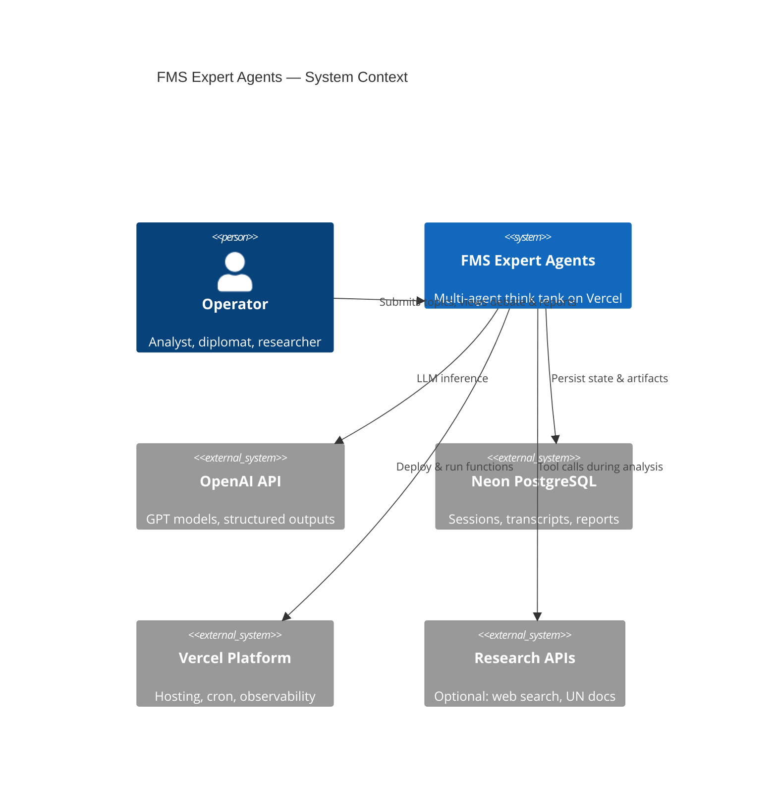
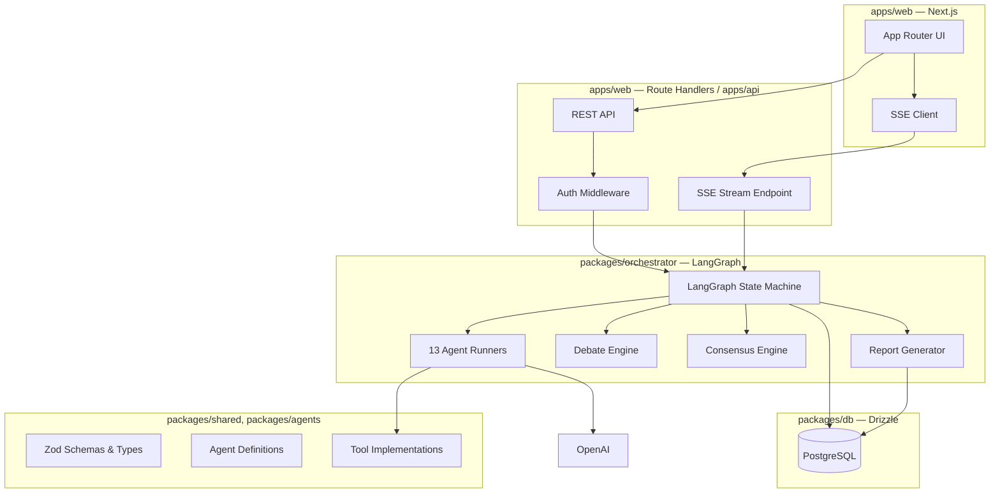
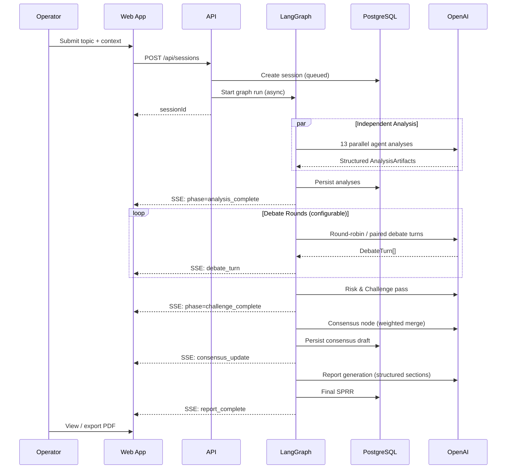

# FMS Expert Agents — Master Architecture

**Version:** 1.0.0 (design)  
**Last updated:** 2026-05-29  
**Stack:** Next.js (App Router) · TypeScript · LangGraph · OpenAI · PostgreSQL · Vercel

---

## Executive Summary

FMS Expert Agents is a **multi-agent peace think tank** that takes a user-submitted strategic topic, runs **13 independent domain analyses in parallel**, orchestrates **structured debate rounds** with assumption-challenging and risk passes, builds **weighted consensus**, and emits a **Strategic Peace Recommendation Report** (SPRR). Orchestration is owned by **LangGraph** (not the OpenAI Agents SDK). The web app on **Vercel** streams debate and report progress to operators; **PostgreSQL** (Neon) stores sessions, agent outputs, debate transcripts, and final reports.

---

## Architectural Principles

1. **LangGraph owns orchestration** — graph nodes, state, checkpoints, and human-in-the-loop gates live in `@fms/orchestrator` (LangGraph.js).
2. **Agents are stateless workers** — each agent is a configured LLM call + tools; graph state is the source of truth.
3. **Debate is structured, not free-form chat** — fixed phases (analyze → debate → challenge → consensus → report) with typed artifacts per phase.
4. **Stream everything observable** — SSE/WebSocket events for agent panels, debate turns, and report sections.
5. **Auditability by design** — every LLM turn, tool call, and consensus vote is persisted with provenance.
6. **Fail safe on peace-critical outputs** — ethics agent has veto-weight on consensus; high-risk findings trigger mandatory challenge pass.

---

## System Context

---

## High-Level Component Map

---

## Core Runtime Flow

---

## Technology Choices

| Concern | Choice | Rationale |
|---------|--------|-----------|
| Frontend | Next.js 15+ App Router | SSR, API routes, Vercel-native |
| Orchestration | **LangGraph.js** | Explicit state machine, checkpoints, parallel branches |
| LLM | OpenAI (`gpt-4.1` / `gpt-4o` tiering) | Structured outputs, reliability |
| ORM | Drizzle + `drizzle-kit` | Type-safe SQL, edge-friendly |
| Database | Neon PostgreSQL | Vercel integration, branching for dev |
| API style | REST + SSE | Simple streaming for debate UI; tRPC optional later |
| Auth | Clerk or Auth.js | Vercel Marketplace patterns; session-scoped data |
| Monorepo | Turborepo | Shared packages, single CI |
| Long runs | Vercel Workflow DevKit (phase 2) | Debates exceeding serverless timeout |

**Explicit non-choice:** OpenAI Agents SDK as **primary** orchestrator — retained only as reference in legacy `debate/` folder.

---

## Agent Roster (13)

| ID | Agent | Domain |
|----|-------|--------|
| `chief_peace_architect` | Chief Peace Architect | Synthesis & strategic framing |
| `peace_conflict` | Peace & Conflict Resolution | Mediation, ceasefires, DDR |
| `diplomacy_ir` | Diplomacy & International Relations | Treaties, multilateral forums |
| `strategic_security` | Strategic & Security Studies | Deterrence, stability, threats |
| `humanitarian` | Humanitarian Affairs | Protection, aid, IHL |
| `ai_peace` | AI for Peace | Tech ethics, dual-use, peace tech |
| `economic_dev` | Economic Development | Inclusive growth, sanctions relief |
| `civilization_culture` | Civilization & Cultural Dialogue | Identity, reconciliation |
| `education_youth` | Education & Youth Empowerment | CVE, civic education |
| `media_comms` | Media & Strategic Communication | Narratives, information integrity |
| `environmental_security` | Environmental Security | Climate-conflict nexus |
| `space_future` | Space & Future Policy | Space governance, emerging domains |
| `ethics_rights` | Ethics, Human Rights & Global Governance | IHL/IHRL, accountability |

Full definitions: [architecture/04-agent-definitions.md](./architecture/04-agent-definitions.md).

---

## LangGraph Phases

| Phase | Graph nodes | Output artifact |
|-------|-------------|-----------------|
| 1 | `fan_out_analysis` → `collect_analyses` | `AnalysisArtifact[]` |
| 2 | `debate_round_n` (×N) | `DebateTurn[]` |
| 3 | `risk_challenge_pass` | `ChallengeRecord[]` |
| 4 | `build_consensus` | `ConsensusDraft` |
| 5 | `generate_report` | `StrategicPeaceReport` |

Details: [architecture/05-langgraph-workflow.md](./architecture/05-langgraph-workflow.md).

---

## Security & Compliance Posture (Summary)

- **Authentication required** for all session APIs; row-level ownership by `userId`.
- **API keys** only in Vercel env; never exposed to client.
- **PII minimization** in prompts; optional redaction node before persistence.
- **Ethics veto** — `ethics_rights` can flag `BLOCKING_CONCERN` → forces human review gate.
- **Rate limiting** per user and per org via Vercel Firewall / Upstash Redis.
- **Audit log** — immutable append-only `audit_events` table.

Full detail: [architecture/01-system.md](./architecture/01-system.md#security-architecture).

---

## Observability (Summary)

- **Structured logs** — `sessionId`, `runId`, `node`, `agentId` on every line.
- **OpenTelemetry** → Vercel OTel / Datadog (optional).
- **LLM tracing** — LangSmith or Langfuse integration on graph runs.
- **Product analytics** — phase timings, tokens per agent, debate round counts.

---

## Legacy Code

| Path | Status | Action |
|------|--------|--------|
| `debate/agents.py` | Prototype | Deprecate after LangGraph port |
| `debate/config.py` | 3 generic personas | Replace with `packages/agents` (13 peace agents) |
| `requirements.txt` | Python / Agents SDK | Remove when TS monorepo scaffold lands |

**Reuse:** `EXPERT_DEBATE_RULES` and moderator patterns from `debate/agents.py` are incorporated into global debate rules in doc 04.

---

## Documentation Map

- [01 — System Architecture](./architecture/01-system.md)
- [02 — Folder Structure](./architecture/02-folder-structure.md)
- [03 — Database Design](./architecture/03-database.md)
- [04 — Agent Definitions](./architecture/04-agent-definitions.md)
- [05 — LangGraph Workflow](./architecture/05-langgraph-workflow.md)
- [06 — API Design](./architecture/06-api-design.md)
- [07 — UI/UX Design](./architecture/07-ui-ux-design.md)
- [08 — Production Roadmap](./architecture/08-roadmap.md)

---

## Glossary

| Term | Definition |
|------|------------|
| **SPRR** | Strategic Peace Recommendation Report — final deliverable |
| **Session** | One end-to-end run from topic submission to report |
| **Run** | Single LangGraph execution (may checkpoint/resume) |
| **Debate turn** | One agent utterance in a structured round |
| **Consensus draft** | Weighted merge before report prose generation |
| **A2A** | Agent-to-Agent message bus inside graph state |
