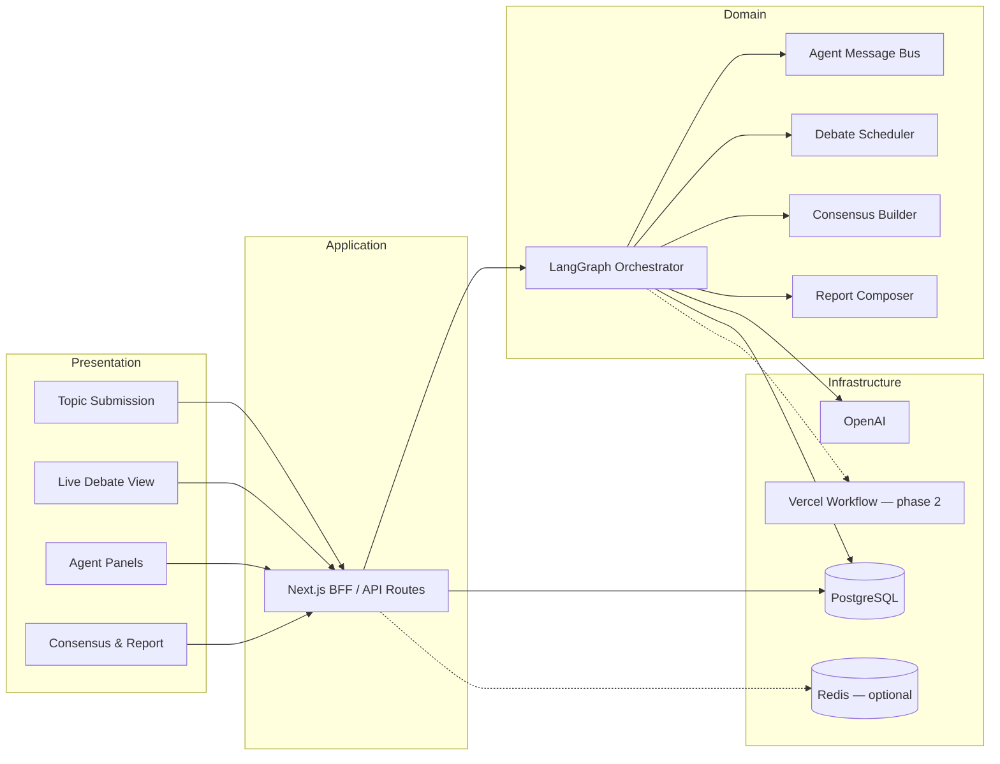
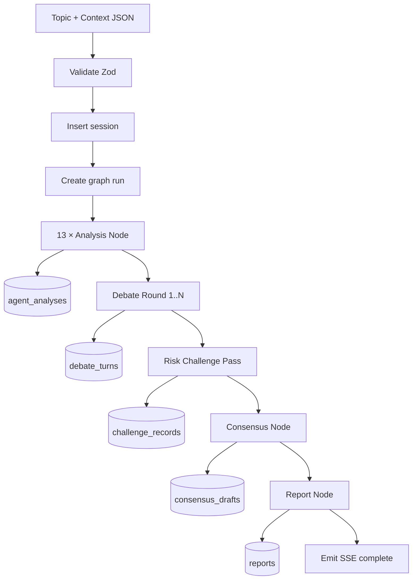
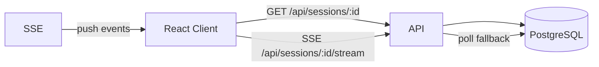
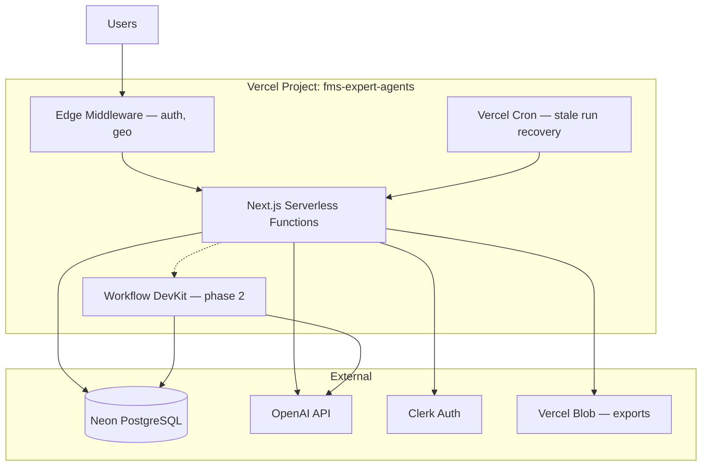
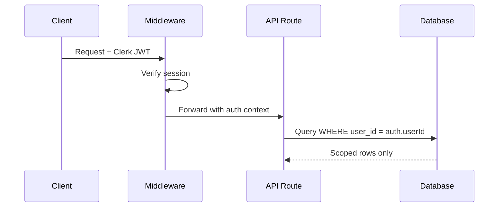

# 01 — System Architecture

[← Master Architecture](../ARCHITECTURE.md) · [Index](../README.md)

---

## 1. Purpose

Define component boundaries, data flows, Vercel deployment topology, security controls, and observability for FMS Expert Agents.

---

## 2. Logical Architecture



---

## 3. Component Boundaries

### 3.1 `apps/web` — Next.js Frontend + BFF

| Responsibility | In scope | Out of scope |
|----------------|----------|--------------|
| UI rendering, accessibility | ✓ | LLM prompt logic |
| Session CRUD via API routes | ✓ | Direct OpenAI calls from browser |
| SSE consumer for live updates | ✓ | LangGraph checkpoint storage internals |
| Auth session (Clerk/Auth.js) | ✓ | Long-running graph execution in browser |

**Boundary rule:** The browser never holds `OPENAI_API_KEY`. All AI calls originate server-side.

### 3.2 `packages/orchestrator` — LangGraph Core

| Responsibility | In scope | Out of scope |
|----------------|----------|--------------|
| Graph definition, nodes, edges | ✓ | HTTP routing |
| Parallel fan-out for 13 analyses | ✓ | User authentication |
| Debate round scheduling | ✓ | PDF layout (delegates to report package) |
| State schema + reducers | ✓ | Raw SQL (uses `@fms/db` repositories) |
| Checkpointing / resume | ✓ | |

### 3.3 `packages/agents` — Agent Definitions

| Responsibility | In scope | Out of scope |
|----------------|----------|--------------|
| System prompt templates | ✓ | Graph control flow |
| Per-agent tool sets | ✓ | Debate ordering |
| Zod input/output schemas | ✓ | |
| Model tier selection per agent | ✓ | |

### 3.4 `packages/db` — Data Access

| Responsibility | In scope | Out of scope |
|----------------|----------|--------------|
| Drizzle schema, migrations | ✓ | Business debate rules |
| Repository functions | ✓ | LangGraph state (except persistence adapter) |

### 3.5 `packages/consensus` — Consensus Engine

| Responsibility | In scope | Out of scope |
|----------------|----------|--------------|
| Weighted voting / objection handling | ✓ | LLM calls for debate |
| Ethics veto evaluation | ✓ | |
| Confidence scoring | ✓ | |

### 3.6 `packages/report` — Report Generator

| Responsibility | In scope | Out of scope |
|----------------|----------|--------------|
| SPRR section templates | ✓ | Topic intake UI |
| Structured output assembly | ✓ | Debate orchestration |
| Export (MD, PDF via `@react-pdf` or external) | ✓ | |

---

## 4. Data Flow

### 4.1 Write Path (Topic → Report)



### 4.2 Read Path (Live UI)



**Event types on SSE:** `phase_change`, `analysis_progress`, `debate_turn`, `challenge_finding`, `consensus_update`, `report_section`, `error`, `complete`.

### 4.3 Agent-to-Agent (A2A) Communication

Agents do not call each other directly. The **graph state** acts as the message bus:

```typescript
// Conceptual — see 05-langgraph-workflow.md
interface A2AMessage {
  fromAgentId: AgentId;
  toAgentId: AgentId | 'broadcast';
  phase: 'analysis' | 'debate' | 'challenge' | 'consensus';
  kind: 'claim' | 'rebuttal' | 'question' | 'support' | 'risk_flag';
  content: string;
  references?: string[]; // citation IDs or prior turn IDs
  createdAt: string;
}
```

Debate nodes read `state.messages` and prior `DebateTurn[]` to construct each agent's context window.

---

## 5. Deployment on Vercel

### 5.1 Topology



### 5.2 Function Sizing

| Route / Job | Runtime | `maxDuration` | Notes |
|-------------|---------|---------------|-------|
| `POST /api/sessions` | Node.js 20 | 10s | Enqueue only |
| `POST /api/sessions/:id/run` | Node.js 20 | 60–300s | MVP: inline graph; cap debate rounds |
| `GET .../stream` | Node.js 20 | 300s | SSE stream |
| Workflow: `runThinkTank` | WDK | hours | Phase 2 for full 13-agent + 3 debate rounds |
| Cron: `recover-stale-runs` | Node.js | 30s | Mark failed / resume |

### 5.3 Environment Variables

| Variable | Scope | Purpose |
|----------|-------|---------|
| `OPENAI_API_KEY` | Server only | LLM |
| `DATABASE_URL` | Server only | Neon pooled connection |
| `LANGCHAIN_API_KEY` | Server only | LangSmith tracing (optional) |
| `CLERK_SECRET_KEY` | Server only | Auth |
| `NEXT_PUBLIC_CLERK_PUBLISHABLE_KEY` | Client | Auth UI |
| `REDIS_URL` | Server only | Rate limits, SSE fan-out (optional) |
| `BLOB_READ_WRITE_TOKEN` | Server only | Report PDF storage |

### 5.4 Regional Strategy

- **Primary region:** `iad1` (US East) — lowest latency to OpenAI for US deployments.
- **Database:** Neon region aligned with Vercel function region.
- **Future:** EU residency project variant with `fra1` + Neon EU.

---

## 6. Security Architecture

### 6.1 Threat Model (Abbreviated)

| Threat | Mitigation |
|--------|------------|
| Unauthenticated session access | Clerk middleware; `userId` on all rows |
| Prompt injection via topic | Input sanitization; system prompt hardening; output schema validation |
| API key exfiltration | Server-only env; never in `NEXT_PUBLIC_*` |
| Cross-tenant data leak | RLS policies on Neon (phase 2); app-level `where userId` in MVP |
| Denial of wallet (LLM abuse) | Per-user quotas; max debate rounds; token budgets per session |
| Harmful peace recommendations | Ethics agent veto + human review gate |

### 6.2 Authentication Flow



### 6.3 Authorization Roles (Phase 2)

| Role | Permissions |
|------|-------------|
| `viewer` | Read sessions shared to org |
| `analyst` | Create sessions, run think tank |
| `admin` | Org settings, quotas, export all |
| `superadmin` | Internal FMS operations |

MVP: single-user ownership only.

### 6.4 Data Classification

| Data class | Examples | Retention |
|------------|----------|-----------|
| Public config | Agent names, UI copy | Indefinite |
| Operational | Debate transcripts, analyses | 90 days default; configurable |
| Sensitive | User PII, classified topic text | Encrypted at rest; org retention policy |

---

## 7. Observability

### 7.1 Logging Schema

Every server log line SHOULD include:

```json
{
  "level": "info",
  "msg": "debate_turn_complete",
  "sessionId": "uuid",
  "runId": "uuid",
  "node": "debate_round",
  "agentId": "diplomacy_ir",
  "phase": "debate",
  "durationMs": 4200,
  "tokens": { "prompt": 1200, "completion": 450 }
}
```

### 7.2 Metrics (Product + SRE)

| Metric | Type | Alert threshold |
|--------|------|-----------------|
| `fms.session.started` | counter | — |
| `fms.session.completed` | counter | completion rate < 80% |
| `fms.session.failed` | counter | > 5% / 1h |
| `fms.graph.node.duration_ms` | histogram | p95 > 120s |
| `fms.openai.tokens.total` | counter | daily budget |
| `fms.ethics.blocking_concerns` | counter | any → notify |

### 7.3 Tracing

- **LangGraph + LangSmith:** trace each node invocation with parent run ID.
- **Vercel OTel:** HTTP route latency, DB query spans.
- **Correlation:** `x-request-id` propagated from client → API → graph → DB.

### 7.4 Dashboards

1. **Operations** — error rate, p95 latency, OpenAI 429s  
2. **Product** — sessions/day, avg debate rounds, report export count  
3. **Cost** — tokens by agent, cost per completed SPRR  

---

## 8. Resilience Patterns

| Pattern | Implementation |
|---------|----------------|
| Idempotent session start | `Idempotency-Key` header on `POST /api/sessions` |
| Graph checkpointing | LangGraph checkpointer → Postgres (`graph_checkpoints`) |
| Partial failure in fan-out | Continue with 12/13 analyses; flag missing agent in UI |
| Stale run recovery | Cron marks `running` > 45 min as `stale`; optional resume |
| OpenAI retry | Exponential backoff on 429/5xx; fallback model tier |
| SSE reconnect | `Last-Event-ID` header resumes from `stream_events` table |

---

## 9. Integration Points

| Integration | Protocol | Used by |
|-------------|----------|---------|
| OpenAI Chat Completions / Responses | HTTPS | All agents |
| OpenAI Structured Outputs | JSON schema | Analysis, consensus, report |
| Neon PostgreSQL | TCP pooled | All persistence |
| Clerk | OAuth/JWT | Auth |
| Vercel Blob | REST | PDF/MD exports |
| Optional: Tavily / Bing | HTTPS | Research tools on select agents |

---

## 10. Non-Functional Requirements

| NFR | Target (Production) |
|-----|---------------------|
| Time to first debate turn | < 90s after submit (13 parallel analyses) |
| Full session (2 debate rounds) | < 15 min p95 |
| Availability | 99.5% (Vercel SLA tier) |
| Concurrent sessions per org | 5 (configurable) |
| Audit completeness | 100% of LLM calls logged |

---

[Next: Folder Structure →](./02-folder-structure.md)
