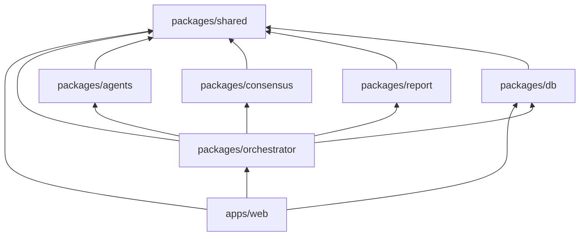

# 02 — Folder Structure

[← Master Architecture](../ARCHITECTURE.md) · [Index](../README.md)

---

## 1. Monorepo Overview

**Tooling:** Turborepo + pnpm workspaces + TypeScript project references.

```
fms-expert-agents/
├── apps/
│   └── web/                          # Next.js 15 App Router (UI + API routes)
├── packages/
│   ├── agents/                       # 13 agent definitions, prompts, schemas
│   ├── orchestrator/                 # LangGraph graph, nodes, state
│   ├── db/                           # Drizzle schema, migrations, repositories
│   ├── consensus/                    # Weighted consensus engine
│   ├── report/                       # SPRR templates & generation
│   ├── shared/                       # Zod types, constants, utils
│   └── config/                       # ESLint, TSConfig presets
├── docs/                             # Architecture (this folder)
├── scripts/                          # Dev utilities, seed data
├── turbo.json
├── pnpm-workspace.yaml
├── package.json
└── README.md
```

**Legacy (to remove after migration):**

```
debate/                               # Python OpenAI Agents SDK prototype — DEPRECATED
requirements.txt
```

---

## 2. `apps/web` — Next.js Application

```
apps/web/
├── app/
│   ├── (auth)/
│   │   ├── sign-in/[[...sign-in]]/page.tsx
│   │   └── sign-up/[[...sign-up]]/page.tsx
│   ├── (dashboard)/
│   │   ├── layout.tsx                # Shell: nav, org context
│   │   ├── page.tsx                  # Dashboard: recent sessions
│   │   ├── sessions/
│   │   │   ├── new/page.tsx          # Topic submission
│   │   │   └── [sessionId]/
│   │   │       ├── page.tsx          # Session overview
│   │   │       ├── debate/page.tsx   # Live debate
│   │   │       ├── agents/page.tsx   # Agent panels
│   │   │       └── report/page.tsx   # Consensus + SPRR
│   │   └── settings/page.tsx
│   ├── api/
│   │   ├── sessions/
│   │   │   ├── route.ts              # POST list/create, GET list
│   │   │   └── [sessionId]/
│   │   │       ├── route.ts          # GET/PATCH/DELETE session
│   │   │       ├── run/route.ts      # POST start/resume graph
│   │   │       ├── stream/route.ts   # GET SSE
│   │   │       ├── analyses/route.ts
│   │   │       ├── debate/route.ts
│   │   │       ├── consensus/route.ts
│   │   │       └── report/route.ts
│   │   └── health/route.ts
│   ├── layout.tsx
│   └── globals.css
├── components/
│   ├── ui/                           # shadcn/ui primitives
│   ├── session/
│   ├── debate/
│   ├── agents/
│   └── report/
├── hooks/
│   ├── use-session-stream.ts
│   └── use-session.ts
├── lib/
│   ├── auth.ts                       # Clerk helpers
│   └── api-client.ts
├── public/
├── next.config.ts
├── tailwind.config.ts
├── package.json
└── tsconfig.json
```

---

## 3. `packages/orchestrator` — LangGraph

```
packages/orchestrator/
├── src/
│   ├── graph/
│   │   ├── think-tank.graph.ts       # Main StateGraph export
│   │   └── index.ts
│   ├── nodes/
│   │   ├── fan-out-analysis.ts
│   │   ├── collect-analyses.ts
│   │   ├── debate-round.ts
│   │   ├── risk-challenge.ts
│   │   ├── build-consensus.ts
│   │   ├── generate-report.ts
│   │   └── human-review-gate.ts      # Conditional interrupt
│   ├── state/
│   │   ├── think-tank-state.ts       # Annotation.Root schema
│   │   └── reducers.ts
│   ├── edges/
│   │   └── routing.ts                # Conditional edge functions
│   ├── checkpointer/
│   │   └── postgres-checkpointer.ts
│   ├── runners/
│   │   └── invoke-agent.ts           # Single agent LLM call wrapper
│   └── index.ts
├── package.json
└── tsconfig.json
```

---

## 4. `packages/agents` — Agent Definitions

```
packages/agents/
├── src/
│   ├── registry.ts                   # AgentId → definition map
│   ├── types.ts
│   ├── debate-rules.ts               # Global EXPERT_DEBATE_RULES
│   ├── definitions/
│   │   ├── chief-peace-architect.ts
│   │   ├── peace-conflict.ts
│   │   ├── diplomacy-ir.ts
│   │   ├── strategic-security.ts
│   │   ├── humanitarian.ts
│   │   ├── ai-peace.ts
│   │   ├── economic-dev.ts
│   │   ├── civilization-culture.ts
│   │   ├── education-youth.ts
│   │   ├── media-comms.ts
│   │   ├── environmental-security.ts
│   │   ├── space-future.ts
│   │   └── ethics-rights.ts
│   ├── prompts/
│   │   └── system-prompt-builder.ts
│   ├── schemas/
│   │   ├── analysis-artifact.ts
│   │   ├── debate-turn.ts
│   │   └── challenge-record.ts
│   └── tools/
│       ├── research-search.ts
│       ├── citation-store.ts
│       └── risk-register.ts
├── package.json
└── tsconfig.json
```

---

## 5. `packages/db` — Database Layer

```
packages/db/
├── src/
│   ├── schema/
│   │   ├── users.ts
│   │   ├── sessions.ts
│   │   ├── agent-analyses.ts
│   │   ├── debate-turns.ts
│   │   ├── challenge-records.ts
│   │   ├── consensus.ts
│   │   ├── reports.ts
│   │   ├── stream-events.ts
│   │   ├── graph-checkpoints.ts
│   │   └── audit-events.ts
│   ├── repositories/
│   │   └── session-repository.ts
│   └── index.ts
├── drizzle/
│   └── migrations/
├── drizzle.config.ts
├── package.json
└── tsconfig.json
```

---

## 6. Supporting Packages

```
packages/consensus/
├── src/
│   ├── weights.ts                    # Agent voting weights
│   ├── merge.ts
│   ├── ethics-veto.ts
│   └── index.ts

packages/report/
├── src/
│   ├── sprr-template.ts
│   ├── sections/
│   └── export-markdown.ts

packages/shared/
├── src/
│   ├── constants.ts                  # AgentIds enum, phases
│   ├── errors.ts
│   └── events.ts                     # SSE event type unions
```

---

## 7. Dependency Graph



**Rule:** `packages/shared` has zero internal `@fms/*` dependencies. No circular imports.

---

## 8. Key File Conventions

| Convention | Example |
|------------|---------|
| Agent ID slug | `diplomacy_ir` (DB/API), `diplomacy-ir.ts` (file) |
| Zod schemas | `AnalysisArtifactSchema` in `packages/agents` |
| Graph node files | Verb-noun: `debate-round.ts` |
| API routes | REST plural: `/api/sessions/:id/debate` |
| Server-only | Import `'server-only'` in orchestrator + db |

---

## 9. Scripts (Root)

| Script | Command | Purpose |
|--------|---------|---------|
| `dev` | `turbo dev` | Start web + watch packages |
| `build` | `turbo build` | Production build |
| `db:generate` | `pnpm --filter @fms/db drizzle-kit generate` | New migration |
| `db:migrate` | `pnpm --filter @fms/db drizzle-kit migrate` | Apply migrations |
| `db:studio` | `drizzle-kit studio` | Local DB browser |
| `graph:visualize` | Custom script | Export Mermaid from graph (dev) |

---

## 10. Import Aliases (tsconfig)

```json
{
  "@fms/agents": ["packages/agents/src/index.ts"],
  "@fms/orchestrator": ["packages/orchestrator/src/index.ts"],
  "@fms/db": ["packages/db/src/index.ts"],
  "@fms/consensus": ["packages/consensus/src/index.ts"],
  "@fms/report": ["packages/report/src/index.ts"],
  "@fms/shared": ["packages/shared/src/index.ts"]
}
```

---

## 11. As-Built Tree (scaffold, 2026-05-29)

Monorepo scaffold created per this document. **Legacy** Python `debate/` retained at repo root until LangGraph port is complete.

<details>
<summary>Full directory tree (click to expand)</summary>

```
fms-expert-agents/
├── apps/web/
│   ├── app/
│   │   ├── (auth)/sign-in/[[...sign-in]]/page.tsx
│   │   ├── (auth)/sign-up/[[...sign-up]]/page.tsx
│   │   ├── (dashboard)/
│   │   │   ├── layout.tsx, page.tsx
│   │   │   ├── sessions/new/page.tsx
│   │   │   ├── sessions/[sessionId]/{page,debate,agents,report}/page.tsx
│   │   │   └── settings/page.tsx
│   │   ├── api/health/route.ts
│   │   ├── api/sessions/route.ts
│   │   ├── api/sessions/[sessionId]/{route,run,stream,analyses,debate,consensus,report}/route.ts
│   │   ├── layout.tsx, globals.css
│   ├── components/{ui,session,debate,agents,report}/
│   ├── hooks/{use-session,use-session-stream}.ts
│   ├── lib/{auth,api-client}.ts
│   ├── public/README.md
│   ├── next.config.ts, tailwind.config.ts, postcss.config.mjs, package.json, tsconfig.json
├── packages/
│   ├── agents/src/{definitions×13,prompts,schemas,tools,registry,types,debate-rules,index}.ts
│   ├── orchestrator/src/{graph,nodes,state,edges,checkpointer,runners,events,workflow,types,index}.ts
│   ├── db/{drizzle.config.ts,drizzle/migrations/,src/schema×9,repositories,index}.ts
│   ├── consensus/src/{engine,weights,merge,ethics-veto,types,index}.ts
│   ├── report/src/{sprr-template,sections,export-markdown,generator,types,index}.ts
│   ├── shared/src/{constants,errors,events,api,index}.ts
│   └── config/{eslint,typescript}/
├── scripts/{graph-visualize.mjs,seed/README.md,README.md}
├── docs/…
├── debate/… (legacy Python)
├── package.json, pnpm-workspace.yaml, turbo.json, tsconfig.json, .gitignore, README.md
```

</details>

### Deviations from original §1–§6

| Item | Notes |
|------|--------|
| `packages/orchestrator` | Extra stubs: `events/emit.ts`, `workflow/session-workflow.ts`, `debate/`, `nodes/analyze-agent.ts`, `nodes/initialize-session.ts`, `graph/config.ts` — in-memory workflow until LangGraph is wired. |
| `packages/consensus` | `engine.ts` + `types.ts` added alongside doc-listed `weights.ts` / `merge.ts` / `ethics-veto.ts`. |
| `packages/report` | `generator.ts` + `types.ts` added alongside doc-listed template/sections/export. |
| `packages/shared` | `api.ts` (Zod API contracts per doc 06) in addition to `constants` / `errors` / `events`. |
| `packages/db` | **Drizzle only** — a transient Prisma scaffold was removed to match [ARCHITECTURE.md](../ARCHITECTURE.md). |
| `apps/web` | No `src/app` — routes live under `app/` per Next.js App Router convention in §2. |
| API `export` route | Documented in [06-api-design.md](./06-api-design.md) as `/export`; not scaffolded yet (phase 2). |

---

[← System Architecture](./01-system.md) · [Next: Database Design →](./03-database.md)
