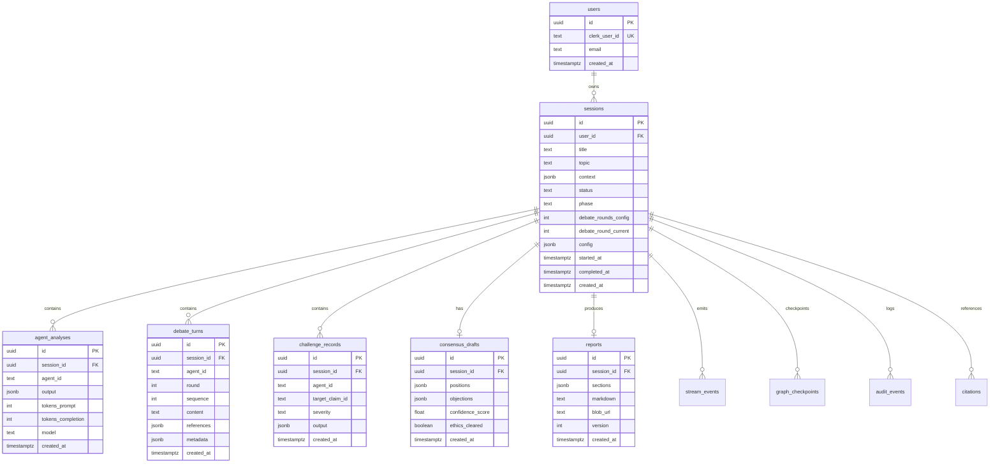

# 03 — Database Design

[← Master Architecture](../ARCHITECTURE.md) · [Index](../README.md)

---

## 1. Overview

- **Engine:** PostgreSQL 16 (Neon serverless)
- **ORM:** Drizzle ORM
- **Migrations:** `drizzle-kit generate` + `drizzle-kit migrate`
- **IDs:** UUID v7 (`uuid` column with `gen_random_uuid()` fallback)
- **Timestamps:** `timestamptz` UTC

---

## 2. Entity Relationship Diagram



---

## 3. Table Definitions

### 3.1 `users`

| Column | Type | Constraints |
|--------|------|-------------|
| `id` | `uuid` | PK, default `gen_random_uuid()` |
| `clerk_user_id` | `text` | NOT NULL, UNIQUE |
| `email` | `text` | NOT NULL |
| `display_name` | `text` | nullable |
| `created_at` | `timestamptz` | NOT NULL, default `now()` |
| `updated_at` | `timestamptz` | NOT NULL, default `now()` |

**Indexes:** `UNIQUE (clerk_user_id)`, `INDEX (email)`

---

### 3.2 `sessions`

| Column | Type | Constraints |
|--------|------|-------------|
| `id` | `uuid` | PK |
| `user_id` | `uuid` | FK → `users.id`, NOT NULL |
| `title` | `text` | NOT NULL |
| `topic` | `text` | NOT NULL |
| `context` | `jsonb` | default `{}` — regions, actors, time horizon |
| `status` | `text` | NOT NULL — enum below |
| `phase` | `text` | NOT NULL — enum below |
| `debate_rounds_config` | `int` | NOT NULL, default 2 |
| `debate_round_current` | `int` | NOT NULL, default 0 |
| `run_id` | `text` | nullable — LangGraph run correlation |
| `error_message` | `text` | nullable |
| `token_budget` | `int` | default 500000 |
| `tokens_used` | `int` | default 0 |
| `config` | `jsonb` | model tiers, feature flags |
| `started_at` | `timestamptz` | nullable |
| `completed_at` | `timestamptz` | nullable |
| `created_at` | `timestamptz` | NOT NULL |
| `updated_at` | `timestamptz` | NOT NULL |

**`status` values:** `draft` | `queued` | `running` | `paused` | `completed` | `failed` | `cancelled`

**`phase` values:** `intake` | `analysis` | `debate` | `challenge` | `consensus` | `report` | `done`

**Indexes:**

- `INDEX sessions_user_id_created_at (user_id, created_at DESC)`
- `INDEX sessions_status (status) WHERE status IN ('queued','running')`
- `INDEX sessions_run_id (run_id) WHERE run_id IS NOT NULL`

---

### 3.3 `agent_analyses`

Stores structured output from Phase 1 (independent analysis).

| Column | Type | Constraints |
|--------|------|-------------|
| `id` | `uuid` | PK |
| `session_id` | `uuid` | FK → `sessions.id` ON DELETE CASCADE |
| `agent_id` | `text` | NOT NULL |
| `output` | `jsonb` | NOT NULL — matches `AnalysisArtifact` schema |
| `tokens_prompt` | `int` | |
| `tokens_completion` | `int` | |
| `model` | `text` | |
| `latency_ms` | `int` | |
| `created_at` | `timestamptz` | |

**Unique:** `(session_id, agent_id)`

**Indexes:** `INDEX (session_id)`, `GIN (output jsonb_path_ops)` optional for search

---

### 3.4 `debate_turns`

| Column | Type | Constraints |
|--------|------|-------------|
| `id` | `uuid` | PK |
| `session_id` | `uuid` | FK CASCADE |
| `agent_id` | `text` | NOT NULL |
| `round` | `int` | NOT NULL, >= 1 |
| `sequence` | `int` | NOT NULL — order within round |
| `content` | `text` | NOT NULL |
| `reply_to_turn_id` | `uuid` | FK → `debate_turns.id`, nullable |
| `references` | `jsonb` | claim IDs, citations |
| `metadata` | `jsonb` | sentiment, stance tags |
| `tokens_completion` | `int` | |
| `created_at` | `timestamptz` | |

**Indexes:**

- `INDEX debate_turns_session_round (session_id, round, sequence)`
- `INDEX (session_id, created_at)`

---

### 3.5 `challenge_records`

Risk & assumption challenge pass (Phase 3).

| Column | Type | Constraints |
|--------|------|-------------|
| `id` | `uuid` | PK |
| `session_id` | `uuid` | FK CASCADE |
| `agent_id` | `text` | NOT NULL |
| `target_claim_id` | `text` | nullable — links to analysis/debate claim |
| `severity` | `text` | `low` \| `medium` \| `high` \| `critical` |
| `challenge_type` | `text` | `assumption` \| `risk` \| `evidence` \| `ethics` |
| `output` | `jsonb` | NOT NULL |
| `created_at` | `timestamptz` | |

**Index:** `(session_id, severity)`

---

### 3.6 `consensus_drafts`

| Column | Type | Constraints |
|--------|------|-------------|
| `id` | `uuid` | PK |
| `session_id` | `uuid` | FK CASCADE, UNIQUE |
| `positions` | `jsonb` | array of `{ agentId, stance, weight, text }` |
| `objections` | `jsonb` | unresolved objections |
| `recommendation_summary` | `text` | |
| `confidence_score` | `real` | 0–1 |
| `ethics_cleared` | `boolean` | default false |
| `blocking_concerns` | `jsonb` | ethics flags |
| `created_at` | `timestamptz` | |

---

### 3.7 `reports`

| Column | Type | Constraints |
|--------|------|-------------|
| `id` | `uuid` | PK |
| `session_id` | `uuid` | FK CASCADE |
| `version` | `int` | NOT NULL, default 1 |
| `sections` | `jsonb` | structured SPRR |
| `markdown` | `text` | rendered full report |
| `blob_url` | `text` | nullable PDF |
| `created_at` | `timestamptz` | |

**Unique:** `(session_id, version)`

---

### 3.8 `citations`

| Column | Type | Constraints |
|--------|------|-------------|
| `id` | `uuid` | PK |
| `session_id` | `uuid` | FK CASCADE |
| `agent_id` | `text` | |
| `source_type` | `text` | `url` \| `document` \| `internal` |
| `title` | `text` | |
| `url` | `text` | nullable |
| `snippet` | `text` | |
| `retrieved_at` | `timestamptz` | |

---

### 3.9 `stream_events` (SSE backfill)

| Column | Type | Constraints |
|--------|------|-------------|
| `id` | `bigserial` | PK |
| `session_id` | `uuid` | FK CASCADE |
| `event_type` | `text` | NOT NULL |
| `payload` | `jsonb` | NOT NULL |
| `created_at` | `timestamptz` | |

**Index:** `(session_id, id)` for `Last-Event-ID` resume

---

### 3.10 `graph_checkpoints`

LangGraph persistence adapter.

| Column | Type | Constraints |
|--------|------|-------------|
| `thread_id` | `text` | PK — `{sessionId}` |
| `checkpoint_ns` | `text` | PK |
| `checkpoint_id` | `text` | PK |
| `parent_checkpoint_id` | `text` | nullable |
| `checkpoint` | `jsonb` | NOT NULL |
| `metadata` | `jsonb` | |
| `created_at` | `timestamptz` | |

---

### 3.11 `audit_events` (append-only)

| Column | Type | Constraints |
|--------|------|-------------|
| `id` | `bigserial` | PK |
| `session_id` | `uuid` | nullable |
| `user_id` | `uuid` | nullable |
| `action` | `text` | NOT NULL |
| `resource` | `text` | |
| `payload` | `jsonb` | |
| `ip_hash` | `text` | nullable |
| `created_at` | `timestamptz` | |

**No UPDATE/DELETE** — enforced via DB role or application policy.

---

## 4. JSON Schema References (Application Layer)

### `AnalysisArtifact` (stored in `agent_analyses.output`)

```typescript
{
  agentId: string;
  executiveSummary: string;
  keyFindings: { id: string; text: string; confidence: number }[];
  recommendations: { id: string; text: string; priority: 'high'|'medium'|'low' }[];
  risks: { id: string; text: string; severity: string }[];
  assumptions: string[];
  questionsForDebate: string[];
  citations: string[];  // citation UUIDs
}
```

### `DebateTurn` (content + metadata)

```typescript
{
  claimsAddressed: string[];
  stance: 'support' | 'oppose' | 'nuance' | 'clarify';
  newClaims: { id: string; text: string }[];
}
```

---

## 5. Indexes Strategy Summary

| Query pattern | Index |
|---------------|-------|
| User's session list | `(user_id, created_at DESC)` |
| Active runs monitoring | `(status)` partial |
| Debate replay | `(session_id, round, sequence)` |
| SSE catch-up | `(session_id, id)` on `stream_events` |
| Agent analysis lookup | `UNIQUE (session_id, agent_id)` |

---

## 6. Migrations Strategy

### 6.1 Workflow


### 6.2 Environments

| Environment | Neon branch | Migration trigger |
|-------------|-------------|-------------------|
| Local | `dev-local` | `pnpm db:migrate` |
| Preview | per-PR branch | Vercel preview deploy hook |
| Staging | `staging` | merge to `main` |
| Production | `production` | manual promote / tagged release |

### 6.3 Rules

1. **Never edit applied migrations** — add new migration instead.
2. **Backward-compatible expands** — add columns nullable first.
3. **Destructive changes** — two-phase: deprecate → remove.
4. **Seed data** — `scripts/seed-dev.ts` for demo sessions only in non-prod.

---

## 7. Row-Level Security (Phase 2)

```sql
ALTER TABLE sessions ENABLE ROW LEVEL SECURITY;
CREATE POLICY sessions_owner ON sessions
  USING (user_id = current_setting('app.user_id')::uuid);
```

MVP uses application-level `WHERE user_id = $1` with connection pooling.

---

## 8. Retention & Archival

| Table | Default retention | Archival |
|-------|-------------------|----------|
| `sessions` + children | 90 days | Export to cold storage (S3/Blob) |
| `stream_events` | 7 days | Truncate after session complete + 7d |
| `graph_checkpoints` | 30 days | Delete after session `completed` |
| `audit_events` | 1 year | Compliance hold override |

---

[← Folder Structure](./02-folder-structure.md) · [Next: Agent Definitions →](./04-agent-definitions.md)
