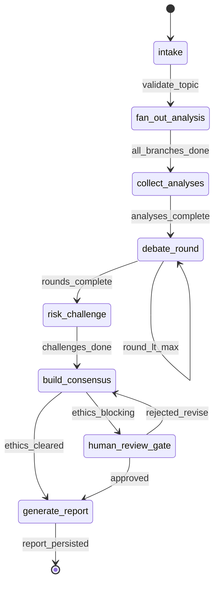
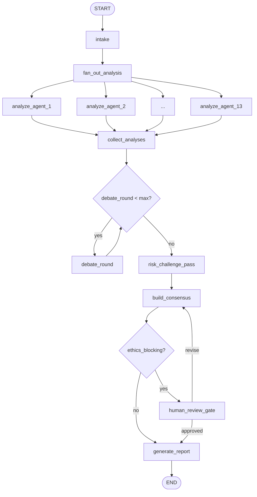
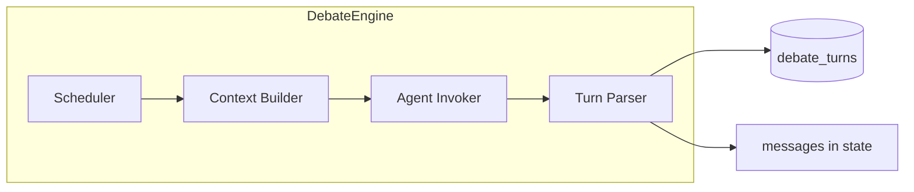

# 05 — LangGraph Workflow

[← Master Architecture](../ARCHITECTURE.md) · [Index](../README.md)

---

## 1. Overview

The think tank pipeline is a **LangGraph.js `StateGraph`** with parallel fan-out, sequential debate rounds, a dedicated risk/challenge subgraph, consensus merge, and report generation. Checkpoints enable resume on Vercel timeouts (phase 2: Workflow DevKit).

**Package:** `@fms/orchestrator`  
**Entry:** `runThinkTankGraph(sessionId, config)`

---

## 2. State Machine (High Level)



---

## 3. Graph Diagram (Nodes & Edges)



**Implementation note:** `fan_out_analysis` uses LangGraph `Send` API to spawn 13 parallel `analyze_agent` nodes with `agentId` in state.

---

## 4. State Schema

```typescript
import { Annotation } from '@langchain/langgraph';

export const ThinkTankState = Annotation.Root({
  // Session identity
  sessionId: Annotation<string>,
  userId: Annotation<string>,
  topic: Annotation<string>,
  context: Annotation<Record<string, unknown>>,

  // Configuration
  debateRoundsMax: Annotation<number>,
  debateRoundCurrent: Annotation<number>,
  modelOverrides: Annotation<Record<string, string>>,

  // Phase tracking
  phase: Annotation<ThinkTankPhase>,
  errors: Annotation<string[]>({
    reducer: (a, b) => [...a, ...b],
    default: () => [],
  }),

  // Phase 1 outputs
  analyses: Annotation<AnalysisArtifact[]>({
    reducer: (existing, incoming) => mergeByAgentId(existing, incoming),
    default: () => [],
  }),
  analysesCompleted: Annotation<number>({
    reducer: (a, b) => a + b,
    default: () => 0,
  }),

  // A2A message bus
  messages: Annotation<A2AMessage[]>({
    reducer: (a, b) => [...a, ...b],
    default: () => [],
  }),

  // Phase 2 outputs
  debateTurns: Annotation<DebateTurn[]>({
    reducer: (a, b) => [...a, ...b],
    default: () => [],
  }),

  // Phase 3 outputs
  challengeRecords: Annotation<ChallengeRecord[]>({
    reducer: (a, b) => [...a, ...b],
    default: () => [],
  }),

  // Phase 4 outputs
  consensusDraft: Annotation<ConsensusDraft | null>,
  ethicsBlocking: Annotation<boolean>,
  ethicsConcerns: Annotation<EthicsConcern[]>({
    reducer: (a, b) => [...a, ...b],
    default: () => [],
  }),

  // Phase 5 outputs
  report: Annotation<StrategicPeaceReport | null>,

  // Observability
  tokenUsage: Annotation<TokenUsage>({
    reducer: (a, b) => addTokenUsage(a, b),
    default: () => ({ prompt: 0, completion: 0 }),
  }),

  // Human-in-the-loop
  humanReviewStatus: Annotation<'pending' | 'approved' | 'rejected' | null>,
});
```

---

## 5. Node Definitions

### 5.1 `intake`

| Property | Value |
|----------|-------|
| **Purpose** | Validate session, load config, set `phase = 'analysis'` |
| **Reads** | DB: `sessions` row |
| **Writes** | `phase`, `debateRoundsMax`, emit SSE `phase_change` |
| **Retries** | 0 (fail fast) |

---

### 5.2 `fan_out_analysis` + `analyze_agent`

| Property | Value |
|----------|-------|
| **Purpose** | Parallel independent analysis for each of 13 agents |
| **Pattern** | `Send('analyze_agent', { agentId })` × 13 |
| **LLM** | OpenAI structured output per `AnalysisArtifact` schema |
| **Writes** | `analyses[]`, increment `analysesCompleted`, persist `agent_analyses` |
| **Retries** | 2 per agent with exponential backoff |
| **Partial failure** | If agent fails after retries, append to `errors[]` and continue |

**Pseudo-node:**

```typescript
async function analyzeAgent(state: typeof ThinkTankState.State, config) {
  const agentId = config.configurable.agentId;
  const artifact = await invokeAgentAnalysis(agentId, state);
  await db.saveAnalysis(state.sessionId, artifact);
  await emitStreamEvent(state.sessionId, 'analysis_progress', { agentId });
  return { analyses: [artifact], analysesCompleted: 1, tokenUsage: artifact.usage };
}
```

---

### 5.3 `collect_analyses`

| Property | Value |
|----------|-------|
| **Purpose** | Verify all 13 analyses present; build claim index for debate |
| **Conditional** | If `< 10` analyses → `errors` fatal unless `config.allowPartial` |
| **Writes** | `phase = 'debate'`, `messages` seed with executive summaries |

---

### 5.4 `debate_round`

| Property | Value |
|----------|-------|
| **Purpose** | Execute one full debate round across scheduled agents |
| **Reads** | `analyses`, `debateTurns`, `messages`, scheduling matrix |
| **Writes** | `debateTurns[]`, `messages[]`, `debateRoundCurrent++` |
| **Streaming** | Each agent turn streamed → SSE `debate_turn` |
| **Retries** | 1 per agent turn |

**Scheduling logic:**

```typescript
function getSpeakingOrder(round: number): AgentId[] {
  if (round === 1) return [...DOMAIN_AGENTS_SORTED, 'chief_peace_architect'];
  if (round === 2) return PAIRED_TENSION_ORDER; // interleaved pairs
  return selectTopContestedClaims(state).respondents;
}
```

**Edge after node:**

```typescript
function afterDebateRound(state): string {
  if (state.debateRoundCurrent < state.debateRoundsMax) return 'debate_round';
  return 'risk_challenge_pass';
}
```

---

### 5.5 `risk_challenge_pass`

| Property | Value |
|----------|-------|
| **Purpose** | Dedicated assumption & risk challenge — not general debate |
| **Participants** | Mandatory: `ethics_rights`, `strategic_security`, `humanitarian`, `chief_peace_architect` |
| **Optional** | Others if `questionsForDebate` unaddressed |
| **Writes** | `challengeRecords[]`, `phase = 'challenge'` |
| **Output schema** | `ChallengeRecord { targetClaimId, severity, challengeType, resolution }` |

**Sub-behaviors:**

1. Extract top 10 claims by contestation score from debate.
2. Each mandatory agent issues ≥1 challenge.
3. Original claim agents may issue **one** rebuttal (bounded).

---

### 5.6 `build_consensus`

| Property | Value |
|----------|-------|
| **Purpose** | Weighted merge via `@fms/consensus` + Chief synthesis LLM call |
| **Reads** | analyses, debateTurns, challengeRecords |
| **Writes** | `consensusDraft`, `ethicsBlocking`, `ethicsConcerns` |
| **Engine** | Deterministic weights + LLM narrative merge |

```typescript
const draft = consensusEngine.merge({
  analyses: state.analyses,
  turns: state.debateTurns,
  challenges: state.challengeRecords,
  weights: AGENT_WEIGHTS,
});
const ethics = ethicsVeto.evaluate(draft, state.challengeRecords);
return {
  consensusDraft: draft,
  ethicsBlocking: ethics.blocking,
  ethicsConcerns: ethics.concerns,
};
```

---

### 5.7 `human_review_gate` (conditional interrupt)

| Property | Value |
|----------|-------|
| **Purpose** | Pause graph when `ethicsBlocking === true` |
| **Mechanism** | LangGraph `interrupt()` — resume via API with `humanReviewStatus` |
| **Timeout** | 7 days; then session `paused` |
| **Resume API** | `POST /api/sessions/:id/run` body `{ action: 'approve' | 'reject' }` |

---

### 5.8 `generate_report`

| Property | Value |
|----------|-------|
| **Purpose** | Produce Strategic Peace Recommendation Report (SPRR) |
| **Pattern** | Section parallelization (optional) + Chief final integration |
| **Writes** | `report`, DB `reports`, `phase = 'done'` |
| **Sections** | See `@fms/report` template |

---

## 6. Edge Routing Table

| From | Condition | To |
|------|-----------|-----|
| `intake` | always | `fan_out_analysis` |
| `fan_out_analysis` | always | 13× `analyze_agent` (Send) |
| `analyze_agent` | always | `collect_analyses` |
| `collect_analyses` | `analyses.length >= 10` | `debate_round` |
| `collect_analyses` | else | `END` (failed) |
| `debate_round` | `round < max` | `debate_round` |
| `debate_round` | else | `risk_challenge_pass` |
| `risk_challenge_pass` | always | `build_consensus` |
| `build_consensus` | `ethicsBlocking` | `human_review_gate` |
| `build_consensus` | else | `generate_report` |
| `human_review_gate` | `approved` | `generate_report` |
| `human_review_gate` | `rejected` | `build_consensus` |
| `generate_report` | always | `END` |

---

## 7. Checkpointing

```typescript
import { PostgresSaver } from '@langchain/langgraph-checkpoint-postgres';

const checkpointer = PostgresSaver.fromConnString(process.env.DATABASE_URL!);
const graph = workflow.compile({ checkpointer });

await graph.invoke(initialState, {
  configurable: { thread_id: sessionId },
});
```

**Thread ID:** `sessionId` (UUID).  
**Resume:** `graph.invoke(null, { configurable: { thread_id: sessionId } })` after interrupt.

---

## 8. Stream Events (Graph → API)

| Event | When | Payload |
|-------|------|---------|
| `phase_change` | Each phase transition | `{ phase }` |
| `analysis_progress` | Each agent analysis done | `{ agentId, progress: n/13 }` |
| `debate_turn` | Each debate utterance | `{ turn: DebateTurn }` |
| `challenge_finding` | Each challenge record | `{ record }` |
| `consensus_update` | Consensus draft ready | `{ draft }` |
| `report_section` | Each SPRR section | `{ sectionId, content }` |
| `complete` | Graph END | `{ reportId }` |
| `error` | Fatal | `{ message, node }` |

---

## 9. Debate Engine (Sub-component)

Located in `packages/orchestrator/src/debate/`.



**Context builder** constructs per-agent prompt:

1. Topic + context  
2. Own analysis (full)  
3. Other analyses (executive summary only)  
4. Last round debate turns (full)  
5. Relevant A2A messages addressed to this agent  
6. Global debate rules  

**Contestation score** for Round 3:

```typescript
score(claim) = count(rebuttals) * 2 + count(oppose_stances) + ethics_flags * 3
```

---

## 10. Consensus Engine Interface

```typescript
interface ConsensusEngine {
  merge(input: ConsensusInput): ConsensusDraft;
}

interface ConsensusDraft {
  recommendationSummary: string;
  strategicPillars: Pillar[];
  phasedActions: Action[];
  dissent: DissentRecord[];
  confidenceScore: number;
  ethicsCleared: boolean;
}
```

Chief Peace Architect LLM call formats narrative; engine enforces numeric weights.

---

## 11. Report Generator Interface

```typescript
interface StrategicPeaceReport {
  title: string;
  sessionId: string;
  generatedAt: string;
  executiveSummary: string;
  sections: {
    id: string;
    title: string;
    content: string;
    contributingAgents: AgentId[];
  }[];
  dissentAppendix: DissentRecord[];
  indicatorsOfProgress: KPI[];
  risksAndMitigations: Risk[];
}
```

**SPRR section order:**

1. Executive Summary (Chief)  
2. Conflict & Peace Dynamics (peace_conflict, strategic_security)  
3. Diplomatic Pathways (diplomacy_ir)  
4. Humanitarian & Protection (humanitarian, ethics_rights)  
5. Economic & Environmental Foundations (economic_dev, environmental_security)  
6. Society, Culture & Youth (civilization_culture, education_youth)  
7. Technology, Media & Space (ai_peace, media_comms, space_future)  
8. Strategic Recommendations & Phasing (Chief + consensus)  
9. Metrics & Review (all)  
10. Dissent & Ethics Appendix (ethics_rights + dissent records)  

---

## 12. Error Handling in Graph

| Error type | Behavior |
|------------|----------|
| Single agent analysis fail | Continue; mark degraded |
| Debate turn fail | Retry once; skip agent with flag |
| OpenAI 429 | Backoff; pause graph 30s |
| Token budget exceeded | Graceful stop before consensus; status `failed` |
| DB write fail | Retry 3×; fatal |

---

## 13. Testing Strategy

| Test | Scope |
|------|-------|
| Unit | Reducers, scheduling, contestation score |
| Integration | Mock LLM → full graph with 2 agents |
| Snapshot | Consensus merge deterministic paths |
| E2E | Staging with real OpenAI (nightly, quota-limited) |

---

[← Agent Definitions](./04-agent-definitions.md) · [Next: API Design →](./06-api-design.md)
