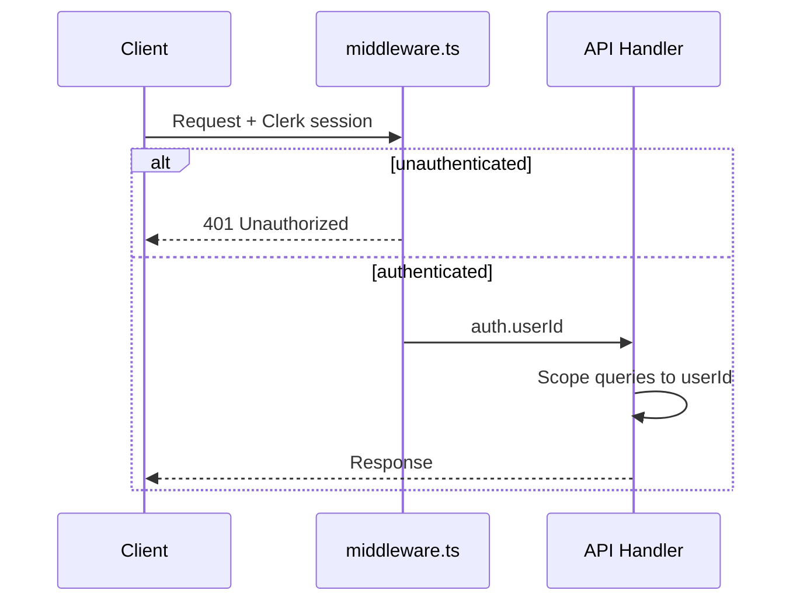

# 06 — API Design

[← Master Architecture](../ARCHITECTURE.md) · [Index](../README.md)

---

## 1. Overview

- **Style:** REST (JSON) + **SSE** for live debate/report streaming
- **Base path:** `/api`
- **Auth:** Clerk session JWT via cookies; Bearer token for future API keys
- **Versioning:** Header `X-API-Version: 1` (default v1)

**tRPC:** Deferred to phase 2 if internal dashboards multiply; REST keeps public contract simple.

---

## 2. Authentication



**Protected routes:** All except `GET /api/health`.

---

## 3. Resource Model

```
/users/me
/sessions
/sessions/:sessionId
/sessions/:sessionId/run
/sessions/:sessionId/stream
/sessions/:sessionId/analyses
/sessions/:sessionId/debate
/sessions/:sessionId/consensus
/sessions/:sessionId/report
/sessions/:sessionId/export
```

---

## 4. Endpoints

### 4.1 `GET /api/health`

**Auth:** None

**Response 200:**

```json
{
  "status": "ok",
  "version": "1.0.0",
  "timestamp": "2026-05-29T12:00:00.000Z"
}
```

---

### 4.2 `GET /api/users/me`

**Response 200:**

```json
{
  "id": "uuid",
  "email": "analyst@example.org",
  "displayName": "Analyst Name",
  "quota": {
    "sessionsRemaining": 8,
    "tokenBudgetMonthly": 2000000
  }
}
```

---

### 4.3 `GET /api/sessions`

List sessions for authenticated user.

**Query params:**

| Param | Type | Default |
|-------|------|---------|
| `status` | string | all |
| `limit` | int | 20 |
| `cursor` | string | — |

**Response 200:**

```json
{
  "sessions": [
    {
      "id": "uuid",
      "title": "Red Sea shipping de-escalation",
      "topic": "How can...",
      "status": "completed",
      "phase": "done",
      "createdAt": "2026-05-29T10:00:00.000Z",
      "completedAt": "2026-05-29T10:42:00.000Z"
    }
  ],
  "nextCursor": "opaque"
}
```

---

### 4.4 `POST /api/sessions`

Create session and optionally start run.

**Headers:** `Idempotency-Key: <uuid>` (recommended)

**Request body:**

```json
{
  "title": "Red Sea shipping de-escalation",
  "topic": "What diplomatic and security measures could reduce attacks on commercial shipping while protecting civilian crews and avoiding wider regional war?",
  "context": {
    "region": "Middle East / Red Sea",
    "actors": ["Houthi forces", "coalition navies", "commercial shippers", "UN"],
    "timeHorizon": "1y",
    "constraints": ["minimize civilian harm", "IHL compliance"]
  },
  "config": {
    "debateRounds": 2,
    "startImmediately": true,
    "allowPartialAnalysis": false
  }
}
```

**Response 201:**

```json
{
  "session": {
    "id": "uuid",
    "status": "queued",
    "phase": "intake",
    "debateRoundsConfig": 2
  }
}
```

**Errors:** `400` validation, `402` quota exceeded, `409` idempotency conflict

---

### 4.5 `GET /api/sessions/:sessionId`

**Response 200:**

```json
{
  "id": "uuid",
  "title": "...",
  "topic": "...",
  "context": {},
  "status": "running",
  "phase": "debate",
  "debateRoundCurrent": 1,
  "debateRoundsConfig": 2,
  "tokensUsed": 125000,
  "tokenBudget": 500000,
  "runId": "langgraph-run-id",
  "startedAt": "...",
  "createdAt": "..."
}
```

**Errors:** `404` not found or not owned

---

### 4.6 `PATCH /api/sessions/:sessionId`

Cancel or update draft.

**Request:**

```json
{
  "action": "cancel"
}
```

**Response 200:** updated session

---

### 4.7 `POST /api/sessions/:sessionId/run`

Start or resume LangGraph execution.

**Request (optional):**

```json
{
  "action": "start"
}
```

Resume after ethics gate:

```json
{
  "action": "approve",
  "reviewNote": "Proceed with recommendation 3 caveats."
}
```

```json
{
  "action": "reject",
  "reviewNote": "Revise economic sanctions section."
}
```

**Response 202:**

```json
{
  "sessionId": "uuid",
  "status": "running",
  "runId": "langgraph-run-id"
}
```

---

### 4.8 `GET /api/sessions/:sessionId/stream` (SSE)

Live updates for debate UI.

**Headers:**

- `Accept: text/event-stream`
- `Last-Event-ID: 12345` (optional, resume)

**Event format:**

```
id: 12346
event: debate_turn
data: {"turn":{"id":"...","agentId":"diplomacy_ir","round":1,"content":"..."}}

id: 12347
event: phase_change
data: {"phase":"consensus"}
```

**Event types:** `phase_change` | `analysis_progress` | `debate_turn` | `challenge_finding` | `consensus_update` | `report_section` | `error` | `complete`

**Response:** `200` stream until complete or client disconnect  
**Heartbeat:** `: ping\n\n` every 15s

---

### 4.9 `GET /api/sessions/:sessionId/analyses`

**Response 200:**

```json
{
  "analyses": [
    {
      "agentId": "peace_conflict",
      "output": { "executiveSummary": "...", "keyFindings": [] },
      "model": "gpt-4.1",
      "createdAt": "..."
    }
  ],
  "complete": true,
  "count": 13
}
```

---

### 4.10 `GET /api/sessions/:sessionId/debate`

**Query:** `round` (optional)

**Response 200:**

```json
{
  "turns": [
    {
      "id": "uuid",
      "agentId": "strategic_security",
      "round": 1,
      "sequence": 4,
      "content": "...",
      "metadata": { "stance": "oppose" },
      "createdAt": "..."
    }
  ],
  "currentRound": 2,
  "maxRounds": 2
}
```

---

### 4.11 `GET /api/sessions/:sessionId/consensus`

**Response 200:**

```json
{
  "draft": {
    "recommendationSummary": "...",
    "strategicPillars": [],
    "phasedActions": [],
    "dissent": [],
    "confidenceScore": 0.78,
    "ethicsCleared": true,
    "blockingConcerns": []
  }
}
```

**Response 404:** consensus not yet built

---

### 4.12 `GET /api/sessions/:sessionId/report`

**Response 200:**

```json
{
  "report": {
    "id": "uuid",
    "version": 1,
    "sections": [],
    "markdown": "# Strategic Peace Recommendation Report\n...",
    "blobUrl": null,
    "createdAt": "..."
  }
}
```

---

### 4.13 `POST /api/sessions/:sessionId/export`

Generate PDF and store in Vercel Blob.

**Request:**

```json
{
  "format": "pdf"
}
```

**Response 200:**

```json
{
  "blobUrl": "https://...",
  "expiresAt": "..."
}
```

---

## 5. Error Envelope

All errors use consistent shape:

```json
{
  "error": {
    "code": "VALIDATION_ERROR",
    "message": "topic must be at least 20 characters",
    "details": [{ "path": "topic", "issue": "too_short" }]
  }
}
```

| HTTP | Code | When |
|------|------|------|
| 400 | `VALIDATION_ERROR` | Zod fail |
| 401 | `UNAUTHORIZED` | No session |
| 403 | `FORBIDDEN` | Not owner |
| 404 | `NOT_FOUND` | |
| 402 | `QUOTA_EXCEEDED` | Token/session limits |
| 409 | `CONFLICT` | Idempotency / already running |
| 429 | `RATE_LIMITED` | |
| 500 | `INTERNAL_ERROR` | |
| 503 | `GRAPH_UNAVAILABLE` | Orchestrator down |

---

## 6. Rate Limits

| Scope | Limit |
|-------|-------|
| `POST /sessions` | 10 / hour / user |
| `POST .../run` | 5 concurrent / user |
| SSE connections | 3 concurrent / user |
| OpenAI tokens | Per-session `tokenBudget` |

Implementation: Upstash Redis sliding window in middleware.

---

## 7. Webhooks (Phase 2)

`POST` to customer URL on `session.completed` with HMAC signature.

---

## 8. TypeScript Client Example

```typescript
// apps/web/lib/api-client.ts
export async function createSession(body: CreateSessionBody) {
  const res = await fetch('/api/sessions', {
    method: 'POST',
    headers: {
      'Content-Type': 'application/json',
      'Idempotency-Key': crypto.randomUUID(),
    },
    body: JSON.stringify(body),
  });
  if (!res.ok) throw await res.json();
  return res.json();
}

export function streamSession(sessionId: string, onEvent: (e: StreamEvent) => void) {
  const es = new EventSource(`/api/sessions/${sessionId}/stream`);
  es.addEventListener('debate_turn', (msg) => onEvent(JSON.parse(msg.data)));
  es.addEventListener('complete', () => es.close());
  return () => es.close();
}
```

---

## 9. OpenAPI

Generate from Zod schemas via `@asteasolutions/zod-to-openapi` in phase 1.5 — spec at `docs/openapi/v1.yaml` (future).

---

[← LangGraph Workflow](./05-langgraph-workflow.md) · [Next: UI/UX Design →](./07-ui-ux-design.md)
