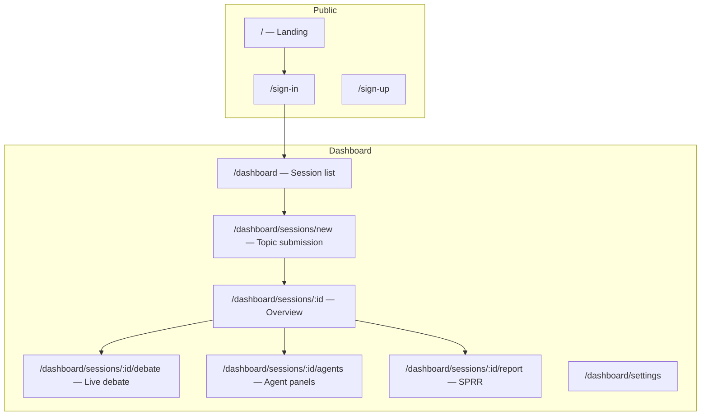

# 07 — UI/UX Design

[← Master Architecture](../ARCHITECTURE.md) · [Index](../README.md)

---

## 1. Design Principles

1. **Clarity under complexity** — 13 agents produce volume; progressive disclosure prevents overwhelm.
2. **Live credibility** — Streaming debate turns build trust; show agent identity and stance visually.
3. **Peace-first aesthetics** — Calm, dignified, institutional (not militaristic or sensational).
4. **Accessibility** — WCAG 2.2 AA; readable typography; keyboard navigation for debate timeline.
5. **Audit-friendly** — Every claim traceable to agent + turn + optional citation.

---

## 2. Page Map



---

## 3. Key Screens

### 3.1 Landing (`/`)

| Element | Purpose |
|---------|---------|
| Hero | Mission: "Building Peace Through Intelligence, Diplomacy, and Human Dignity" |
| How it works | 3 steps: Submit → Debate → Consensus Report |
| Agent roster grid | 13 cards with domain icons |
| CTA | Sign in / Start session |

---

### 3.2 Topic Submission (`/dashboard/sessions/new`)

```mermaid
wireframe
  title Topic Submission
  Header: "New Think Tank Session"
  Field: Session title
  Field: Strategic question (textarea, min 20 chars)
  Section: Context
    - Region (select/combobox)
    - Key actors (tags)
    - Time horizon (radio)
    - Constraints (tags)
  Section: Configuration
    - Debate rounds (1-3 slider, default 2)
    - Advanced: token budget warning
  Footer: [Save draft] [Start think tank →]
```

**Validation:** Inline Zod errors; character count on topic.  
**On submit:** Navigate to `/sessions/:id/debate` with SSE connected.

---

### 3.3 Live Debate (`/dashboard/sessions/:id/debate`)

**Layout:** Three-column (desktop); tabs (mobile)

| Column | Content |
|--------|---------|
| Left (240px) | Agent roster — status dots (idle / speaking / done) |
| Center (flex) | Debate timeline — streaming turns |
| Right (320px) | Phase progress + contested claims heatmap |

**Debate turn card:**

```
┌─────────────────────────────────────────────┐
│ [Avatar] Diplomacy & IR        Round 1 · #4 │
│ stance: oppose ■■■□□                          │
├─────────────────────────────────────────────┤
│ "I must challenge the security-first..."    │
│ Refs: claim-sec-2, claim-peace-1            │
└─────────────────────────────────────────────┘
```

**States:**

- `connecting` — SSE establishing  
- `live` — turns appending with typewriter optional  
- `paused` — ethics review banner  
- `complete` — CTA to Report  

---

### 3.4 Agent Panels (`/dashboard/sessions/:id/agents`)

Grid of 13 expandable cards.

| Card section | Data source |
|--------------|-------------|
| Executive summary | `agent_analyses` |
| Key findings | expandable list |
| Recommendations | priority badges |
| Risks | severity chips |
| Debate highlights | filtered `debate_turns` |

**Filter bar:** All agents | Disagreements only | Ethics flags

---

### 3.5 Session Overview (`/dashboard/sessions/:id`)

- Status badge + phase stepper (Analysis → Debate → Challenge → Consensus → Report)
- Token usage meter
- Quick links to Debate / Agents / Report
- Cancel session (destructive, confirm dialog)

---

### 3.6 Consensus & Report (`/dashboard/sessions/:id/report`)

**Tabs:**

1. **Consensus** — pillars, phased actions, confidence gauge, dissent cards  
2. **Full Report** — rendered markdown with section nav (sticky TOC)  
3. **Export** — PDF / Markdown download  

**Ethics banner (if concerns):**

> Ethics & Human Rights flagged 2 blocking concerns. Human review required before finalization.

---

## 4. Component Hierarchy

```
app/(dashboard)/
├── layout.tsx                    # DashboardShell
├── components/
│   ├── layout/
│   │   ├── DashboardShell.tsx
│   │   ├── Sidebar.tsx
│   │   └── PhaseStepper.tsx
│   ├── session/
│   │   ├── SessionCard.tsx
│   │   ├── SessionStatusBadge.tsx
│   │   └── TokenUsageMeter.tsx
│   ├── topic/
│   │   ├── TopicSubmissionForm.tsx
│   │   └── ContextFields.tsx
│   ├── debate/
│   │   ├── DebateLayout.tsx
│   │   ├── DebateTimeline.tsx
│   │   ├── DebateTurnCard.tsx
│   │   ├── AgentRoster.tsx
│   │   ├── AgentStatusDot.tsx
│   │   └── ContestedClaimsHeatmap.tsx
│   ├── agents/
│   │   ├── AgentPanelGrid.tsx
│   │   ├── AgentPanelCard.tsx
│   │   └── FindingList.tsx
│   ├── report/
│   │   ├── ConsensusView.tsx
│   │   ├── ReportMarkdown.tsx
│   │   ├── ReportTOC.tsx
│   │   ├── DissentCard.tsx
│   │   └── ExportButton.tsx
│   └── ui/                       # shadcn: Button, Card, Tabs, Badge, etc.
```

---

## 5. Design Tokens

### 5.1 Color (CSS variables — light mode)

| Token | Value | Usage |
|-------|-------|-------|
| `--background` | `hsl(210 20% 98%)` | Page bg |
| `--foreground` | `hsl(222 47% 11%)` | Body text |
| `--primary` | `hsl(210 60% 35%)` | Peace blue — CTAs |
| `--primary-foreground` | `hsl(0 0% 100%)` | |
| `--secondary` | `hsl(210 25% 92%)` | Cards |
| `--muted` | `hsl(210 15% 94%)` | Subtle bg |
| `--muted-foreground` | `hsl(215 16% 47%)` | Meta text |
| `--accent` | `hsl(165 35% 40%)` | Hope green — success/progress |
| `--destructive` | `hsl(0 65% 45%)` | Errors, critical risks |
| `--warning` | `hsl(38 92% 50%)` | Medium risks, ethics flags |
| `--border` | `hsl(214 20% 88%)` | Dividers |

**Agent accent colors** (avatar rings — colorblind-safe palette):

| Agent group | Color |
|-------------|-------|
| Core peace (chief, peace, diplomacy) | Blue family |
| Security & humanitarian | Slate / teal |
| Economic & environmental | Green family |
| Society & education | Warm ochre |
| Tech & media & space | Violet family |
| Ethics | Gold (`hsl(45 70% 45%)`) |

### 5.2 Typography

| Token | Value |
|-------|-------|
| `--font-sans` | `Inter, system-ui, sans-serif` |
| `--font-serif` | `Source Serif 4, Georgia, serif` — report prose |
| `--text-xs` | 0.75rem |
| `--text-sm` | 0.875rem |
| `--text-base` | 1rem |
| `--text-lg` | 1.125rem |
| `--text-xl` | 1.25rem |
| `--text-2xl` | 1.5rem — page titles |
| `--text-3xl` | 1.875rem — landing hero |

### 5.3 Spacing & Radius

| Token | Value |
|-------|-------|
| `--radius-sm` | 0.375rem |
| `--radius-md` | 0.5rem |
| `--radius-lg` | 0.75rem |
| `--spacing-unit` | 4px (Tailwind default) |

### 5.4 Motion

| Token | Value |
|-------|-------|
| `--duration-fast` | 150ms |
| `--duration-normal` | 250ms |
| Debate turn enter | `fade-in + slide-up 200ms` |
| Respect `prefers-reduced-motion` | disable slide |

---

## 6. Stance & Severity Visual Language

| Stance | Badge | Color |
|--------|-------|-------|
| support | `Support` | accent green |
| oppose | `Challenge` | primary blue |
| nuance | `Nuance` | muted purple |
| clarify | `Clarify` | secondary gray |

| Risk severity | Chip |
|---------------|------|
| low | outline |
| medium | warning bg |
| high | orange |
| critical | destructive |

---

## 7. Responsive Breakpoints

| Breakpoint | Layout |
|------------|--------|
| `< 768px` | Single column; debate tabs: Timeline / Roster / Progress |
| `768–1024px` | Two column; collapse right panel to drawer |
| `> 1024px` | Full three-column debate |

---

## 8. Empty & Error States

| State | Message pattern |
|-------|-----------------|
| No sessions | "Start your first think tank session" + CTA |
| Analysis in progress | Skeleton cards × 13 |
| SSE disconnect | "Reconnecting..." with retry button |
| Ethics pause | Explain blocking concerns + link to review UI |
| Failed session | Show `error_message` + support contact |

---

## 9. shadcn/ui Components (Install List)

`button`, `card`, `input`, `textarea`, `select`, `badge`, `tabs`, `progress`, `dialog`, `dropdown-menu`, `scroll-area`, `separator`, `tooltip`, `avatar`, `sheet` (mobile drawer)

---

## 10. Accessibility Checklist

- [ ] Focus trap in modals  
- [ ] `aria-live="polite"` on debate timeline for new turns  
- [ ] Agent avatars have `aria-label` with full role name  
- [ ] Color contrast ≥ 4.5:1 for body text  
- [ ] Skip link to main content  
- [ ] Report TOC navigable by keyboard  

---

[← API Design](./06-api-design.md) · [Next: Production Roadmap →](./08-roadmap.md)
