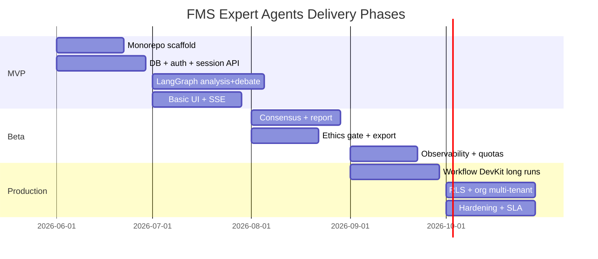
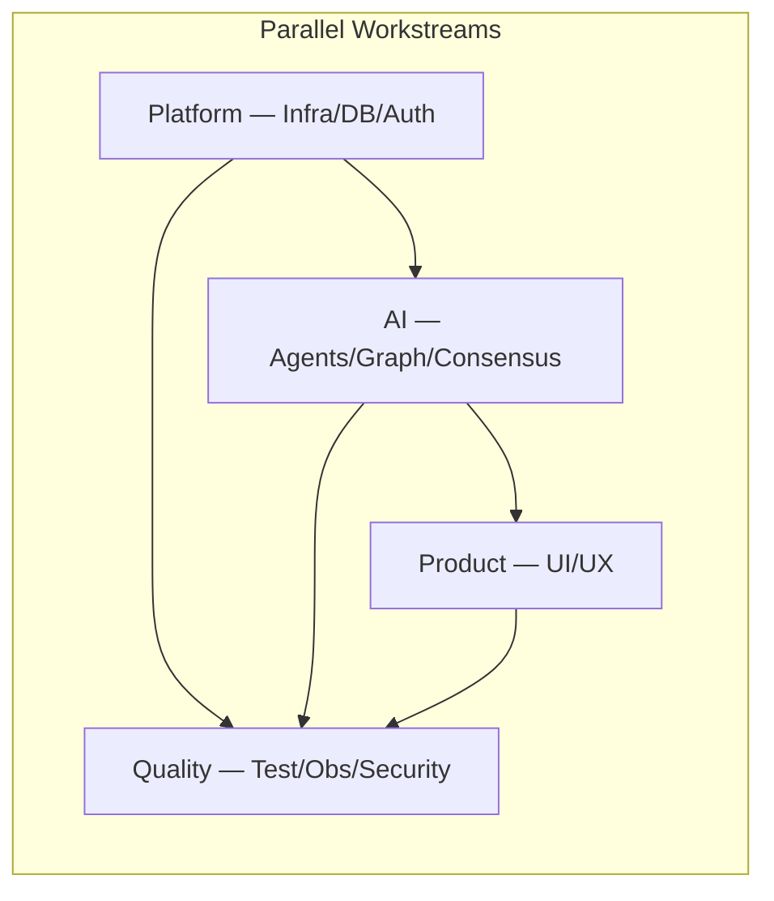

# 08 — Production Roadmap

[← Master Architecture](../ARCHITECTURE.md) · [Index](../README.md)

---

## 1. Phase Overview

---

## 2. Phase 1 — MVP (8–10 weeks)

**Goal:** End-to-end think tank on a single topic with 13 analyses, 2 debate rounds, basic consensus text, and streaming UI.

### Milestones

| # | Milestone | Deliverables | Success criteria |
|---|-----------|--------------|------------------|
| M1.1 | Monorepo bootstrap | Turborepo, `apps/web`, `packages/*` shells | `pnpm build` green |
| M1.2 | Database live | Drizzle schema, migrations, Neon staging | CRUD sessions |
| M1.3 | Auth | Clerk integration, protected routes | Unauthenticated → 401 |
| M1.4 | Agent package | 13 definitions + Zod schemas | Unit tests on schemas |
| M1.5 | LangGraph core | analysis fan-out + 2 debate rounds | Graph completes in dev |
| M1.6 | Session API | REST endpoints + SSE | UI receives `debate_turn` events |
| M1.7 | MVP UI | Topic form + debate timeline + agent cards | Demo session recordable |

### MVP scope cuts (explicit)

- No PDF export (markdown only)  
- No human ethics gate (log concerns only)  
- Inline graph execution (60s–300s cap); max 2 debate rounds  
- No research tools (citations manual/empty)  
- Single-user only  

### MVP risks

| Risk | Impact | Mitigation |
|------|--------|------------|
| Vercel timeout on 13 parallel analyses | High | Batch analyses in 2 waves of 7+6; reduce tokens |
| OpenAI cost spike | Medium | Hard token budget per session |
| LangGraph learning curve | Medium | Spike in week 1; reference LangChain docs |

---

## 3. Phase 2 — Beta (6–8 weeks)

**Goal:** Production-quality outputs, ethics gate, exports, observability.

### Milestones

| # | Milestone | Deliverables |
|---|-----------|--------------|
| M2.1 | Risk/challenge pass | Full graph phase 3 |
| M2.2 | Consensus engine | Weighted merge + dissent |
| M2.3 | SPRR generator | 10-section report template |
| M2.4 | Ethics human gate | Interrupt + approve/reject API |
| M2.5 | Research tools | Tavily/search integration |
| M2.6 | PDF export | Vercel Blob + react-pdf |
| M2.7 | Observability | LangSmith + structured logs + dashboard |
| M2.8 | Rate limits | Upstash quotas |

### Beta success criteria

- 10 pilot users complete 20 sessions with <10% failure rate  
- Average session < 15 min p95  
- Ethics flags reviewed within UI  
- SPRR rated "usable without editing" by ≥70% pilot feedback  

---

## 4. Phase 3 — Production (8–10 weeks)

**Goal:** Enterprise readiness, durability, multi-tenant, SLAs.

### Milestones

| # | Milestone | Deliverables |
|---|-----------|--------------|
| M3.1 | Vercel Workflow DevKit | Durable graph runs > 5 min |
| M3.2 | Org multi-tenant | Teams, shared sessions, RLS |
| M3.3 | Checkpoint resume | Stale run recovery cron |
| M3.4 | Webhooks | `session.completed` events |
| M3.5 | Security audit | Pen test remediation |
| M3.6 | DR + backups | Neon PITR, export archival |
| M3.7 | SLA 99.5% | PagerDuty, status page |

---

## 5. Workstream Breakdown

---

## 6. Team Sizing (Suggested)

| Role | MVP | Beta | Prod |
|------|-----|------|------|
| Full-stack (Next.js) | 1 | 1 | 1 |
| AI/ML engineer (LangGraph) | 1 | 1 | 0.5 |
| Product/design | 0.5 | 0.5 | 0.25 |
| DevOps/SRE | 0.25 | 0.5 | 0.5 |

---

## 7. Cost Model (Rough)

| Item | MVP monthly | Prod monthly (100 sessions) |
|------|-------------|------------------------------|
| OpenAI (13 agents × 2 rounds) | $500–2000 | $2000–8000 |
| Neon | $0–25 | $25–100 |
| Vercel Pro | $20 | $20–200 |
| Clerk | $0–25 | $25–100 |
| LangSmith | $0 | $39+ |

**Per-session token estimate:** 300K–800K tokens full pipeline.

---

## 8. Risk Register (Program Level)

| ID | Risk | Probability | Impact | Owner | Mitigation |
|----|------|-------------|--------|-------|------------|
| R1 | LLM hallucination in peace recs | High | Critical | AI lead | Ethics agent, citations, human review |
| R2 | Harmful recommendation published | Low | Critical | Product | Ethics veto + export gate |
| R3 | Serverless timeout | High | High | Platform | WDK phase 3, batch analyses |
| R4 | Cost overrun | Medium | High | Ops | Quotas, model tiering |
| R5 | Legacy Python confusion | Medium | Low | Eng | Delete `debate/` post-MVP |
| R6 | Scope creep (14th agent) | Medium | Medium | PM | Frozen roster v1.0 |

---

## 9. Definition of Done (Production)

- [ ] All 13 agents complete analyses in ≥95% of sessions  
- [ ] Full graph with challenge + consensus + SPRR  
- [ ] Ethics gate functional with audit log  
- [ ] SSE + polling fallback  
- [ ] Auth + tenant isolation verified  
- [ ] Load test: 20 concurrent sessions  
- [ ] Documentation current (this folder)  
- [ ] Runbook for on-call  
- [ ] Privacy policy + data retention implemented  

---

## 10. Post-Production Backlog

| Feature | Priority |
|---------|----------|
| Multi-language topics (AR, FR, ES) | P2 |
| Custom agent roster (subset of 13) | P2 |
| Comparison across sessions | P3 |
| Public read-only report sharing | P2 |
| RAG over UN document corpus | P2 |
| Mobile app (React Native) | P3 |
| Fine-tuned domain adapters | P3 |

---

## 11. Deprecation: Legacy Python

| When | Action |
|------|--------|
| MVP M1.5 complete | Archive `debate/` behind `legacy/` README |
| Beta start | Remove from default branch |
| Production | Delete `requirements.txt` Python deps |

---

[← UI/UX Design](./07-ui-ux-design.md) · [Back to Index](../README.md)
