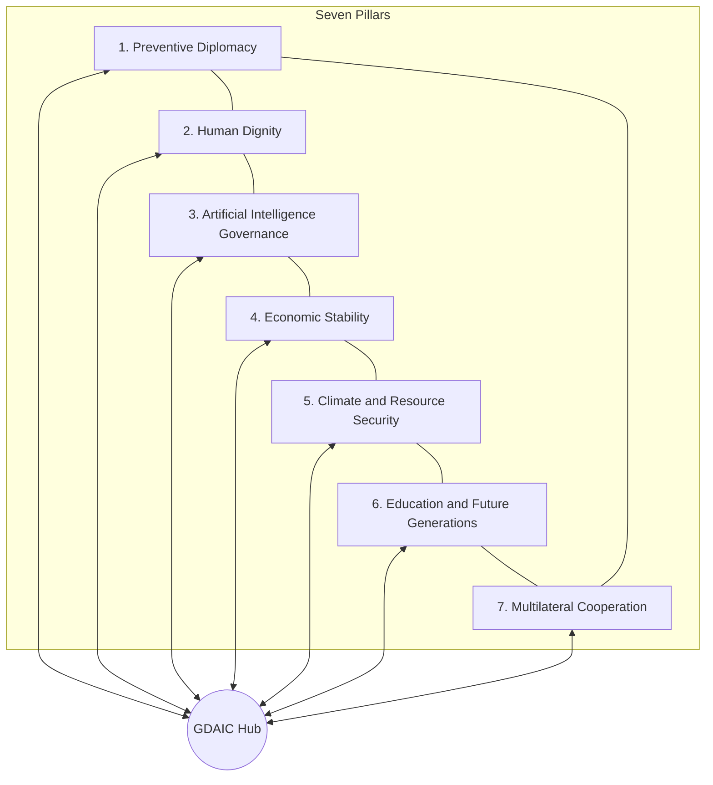
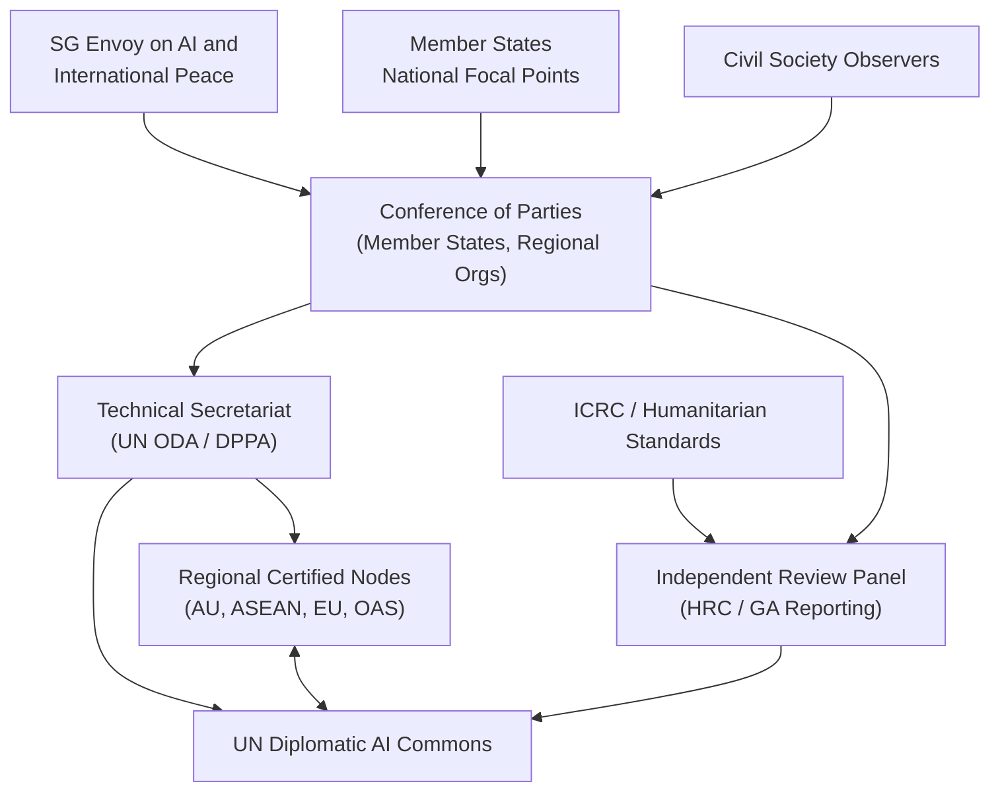

# AI-Powered Diplomacy and the Architecture of Sustainable Peace: A Human-Centered Framework for Preventive Diplomacy and Global Governance

**Author:** Dr. Fatih Sayin  
**Affiliation:** Foundation for Multilateral Strategies (FMS), www.fmsthinktank.org

---

## Abstract

**Purpose:** This article examines whether and how artificial intelligence (AI) can strengthen preventive diplomacy and sustainable peace architecture without displacing human accountability, international law, or democratic legitimacy.

**Methodology:** The study employs a multidisciplinary policy research design combining systematic literature review, comparative case analysis, scenario assessment, and structured interdisciplinary expert consultation across thirteen policy domains, synthesized under FMS research methodology.

**Findings:** AI's highest peace dividend lies in early warning, scenario modeling, translation, and back-channel facilitation before armed conflict—not in automating force or information warfare. Ungoverned deployment risks surveillance diplomacy, algorithmic bias, synthetic media crises, and diplomatic bandwidth inequality. The FMS Peace Architecture Framework™—seven mutually reinforcing pillars—and the proposed Global Diplomatic AI Compact (GDAIC) offer an integrative governance pathway subordinating tools to human dignity and multilateral cooperation.

**Originality:** The article introduces the FMS Peace Architecture Framework™ as an original integrative model nesting GDAIC within pillars of AI governance and multilateral cooperation, and advances human-centered AI diplomacy as a distinct policy paradigm from generic AI governance.

**Implications:** Policymakers should treat diplomatic AI as collective security infrastructure comparable to civil aviation safety regimes; invest in UN-led prevention pilots, mandatory human rights impact assessments, cryptographic provenance for leader communications, and diplomatic AI literacy; and act within a narrowing norm-building window before proprietary lock-in closes competitive pathways to inclusive governance.

**Keywords:** artificial intelligence; preventive diplomacy; sustainable peace architecture; human-centered AI diplomacy; Global Diplomatic AI Compact; multilateral governance; human dignity; peacebuilding; epistemic peace; early warning

---

## 1. Introduction

Artificial intelligence is reshaping international relations at a pace that outstrips the development of norms, institutions, and accountability mechanisms. Machine translation already supports multilateral negotiation; open-source intelligence fusion informs Security Council deliberations; social media monitoring shapes crisis diplomacy. The Uppsala Conflict Data Program (UCDP) recorded fifty-nine state-based armed conflicts in 2023—the highest in the post-1945 era—while global military expenditure reached $2.44 trillion and forcibly displaced persons exceeded 120 million (Uppsala University, 2024; SIPRI, 2024; UNHCR, 2024). The question is no longer whether AI will touch diplomacy, but whether the international community can steer that contact toward prevention and sustainable peace, with human dignity as the non-negotiable metric of success (United Nations, 2023; United Nations, 2024).

Previous technological revolutions in diplomacy—from the telegraph to satellite verification—expanded both cooperation and coercion (Dunne & Schmidt, 2022; Headrick, 2012). AI differs in speed, opacity, and scalability: models can be updated weekly while treaties take years. The international community therefore faces a norm-building window that may close within this decade as proprietary systems entrench in foreign ministries and intelligence agencies (United Nations, 2024; Brundage et al., 2018). Without shared standards, crisis alerts may cross borders with incompatible semantics, raising the risk of war by misunderstanding (RAND Corporation, 2020; Geist & Lohn, 2022).

This article advances a cautiously optimistic and institutionally demanding thesis: AI can materially strengthen preventive diplomacy and sustainable peacebuilding only if subordinated to existing international law, anchored in human rights, and governed through inclusive multilateral frameworks rather than unilateral military or commercial advantage. Negotiation, recognition, and trust-building remain irreducibly human; AI should augment legal research, translation, and pattern detection, not displace accountability for commitments (Vienna Convention on Diplomatic Relations, 1961; Bjola, 2019). The highest peace dividend lies in early warning, scenario modeling, and back-channel facilitation before armed conflict—not in automating battlefield decisions or information warfare. World Bank analysis frames prevention as cost-effective development policy: intervention in the first ninety days of crisis is orders of magnitude cheaper than post-war reconstruction (World Bank, 2017).

The article contributes two linked policy instruments. First, the **FMS Peace Architecture Framework™**, an original integrative model developed by the author, unifies preventive diplomacy, human dignity, AI governance, economic stability, climate and resource security, education for future generations, and multilateral cooperation into a single operational architecture for sustainable peace in the digital age. Second, the **Global Diplomatic AI Compact (GDAIC)** provides a voluntary but verifiable multilateral framework linking UN agencies, regional organizations, and member states to shared principles, audit protocols, and pilot deployments in preventive diplomacy. Together, they constitute a human-centered approach to AI diplomacy distinct from generic AI governance discourse.

The present analysis draws on the inaugural *FMS Strategic Review* research program—a multidisciplinary policy study conducted at the Foundation for Multilateral Strategies (FMS) under the author's editorial direction. It distills that program's quantitative conflict analysis, comparative case studies, scenario assessment, and structured interdisciplinary expert consultation into a journal-length argument suitable for peace research, international relations, and AI governance audiences. The article deliberately avoids generic AI ethics discourse in favor of domain-specific analysis of interstate diplomatic practice, where Vienna Convention immunities, Security Council dynamics, and humanitarian neutrality constraints shape what responsible deployment requires.

The analysis proceeds as follows. Section 1.1 identifies the research gap and contribution. Section 2 reviews peace research, diplomacy, AI governance, humanitarian law, and climate-security literature. Section 3 describes methodology. Section 4 presents the FMS Peace Architecture Framework™. Sections 5 and 6 examine AI in preventive diplomacy and GDAIC institutional design. Section 7 addresses ethical risks, human dignity, and democratic accountability. Section 8 discusses theoretical, policy, and research implications. Section 9 concludes.

### 1.1 Research Gap and Contribution

Three gaps motivate this study. First, AI governance literature—UN advisory reports, OECD principles, UNESCO recommendations, and the EU AI Act—addresses public-sector AI broadly but rarely specifies **interstate diplomatic contexts** where privilege, sovereignty, and lethal spillover intersect (United Nations, 2024; OECD, 2019; UNESCO, 2021; European Parliament and Council, 2024). Second, peace research documents prevention economics and mediation practice but offers limited empirical evaluation of AI in formal UN mediation with public data (Diehl et al., 2021; Ward et al., 2023). Third, digital diplomacy scholarship analyzes social media and data-driven embassy functions without integrative architecture linking prevention, dignity, economics, climate, education, and multilateral cooperation (Bjola, 2019; Holmes, 2015).

This article fills these gaps through four contributions. **Conceptually**, it introduces the FMS Peace Architecture Framework™ and the dimension of *epistemic peace*—shared trust in the information environment of negotiations—alongside Galtung's negative and positive peace (Galtung, 1969; Chesney & Citron, 2019). **Institutionally**, it specifies GDAIC architecture: Conference of Parties, Technical Secretariat, Independent Review Panel, and UN-hosted diplomatic AI commons. **Empirically**, it synthesizes comparative cases—Cyprus, Korea, Libya, Yemen, Ukraine, ASEAN, and African Union mediation—with quantitative indicators from UCDP, SIPRI, and OECD. **Normatively**, it positions human-centered AI diplomacy: mandatory human approval for AI-generated negotiating texts, humanitarian-intelligence firewalls, and inclusive design under Women, Peace and Security resolutions (United Nations, General Assembly, 2000; Caparini, 2020).

The study does not claim technological determinism. Political will, inclusive process, and law remain sovereign. It argues that without governance parity—developing states, civil society, and conflict-affected populations participating in standards—or tools will encode existing power asymmetries (Cihon et al., 2020; Mohamed et al., 2020).

Finally, the article distinguishes **human-centered AI diplomacy** from adjacent concepts. It is not military AI ethics focused on autonomous weapons alone, though GDAIC links diplomatic norms to disarmament agendas (United Nations, 2019; Scharre, 2018). It is not digital diplomacy 2.0 concerned primarily with social media influence (Holmes, 2015). It is not enterprise AI governance applied to foreign ministries without adaptation to privilege, mediation confidentiality, and dual-use spillover. Human-centered AI diplomacy insists that a named human authority remain responsible for every diplomatic communication and agreement; that affected communities validate tools touching their futures; and that efficiency metrics never supersede dignity metrics—a position consistent with UNESCO's human-rights-based approach to AI but operationalized for negotiators, mediators, and permanent representatives (UNESCO, 2021; Vienna Convention on Diplomatic Relations, 1961).

---

## 2. Literature Review

### 2.1 Peace and Conflict Research

Peace research establishes that most contemporary conflicts are intrastate or internationalized civil wars, often protracted and driven by governance deficits, resource competition, and external intervention (Gleditsch et al., 2014; Uppsala University, 2024). Fearon and Laitin (2003) identify ethnicity, insurgency, and weak institutions as civil war correlates; Galtung (1969) distinguishes negative peace (absence of direct violence) from positive peace (structural conditions for justice). Richmond (2016) critiques liberal peace templates that may reproduce exclusion—relevant because algorithmic tools trained on historical settlement data risk replicating "template peace" unless inclusivity is designed in. Collier et al. (2017) and World Bank *Pathways for Peace* (2017) demonstrate large macroeconomic gains from prevention and early resolution. AI enters primarily as an information and coordination technology—potentially improving early warning and mediation support, but also amplifying surveillance and lethal autonomy risks (United Nations, 2019; Scharre, 2018).

### 2.2 Diplomacy and International Relations

Digital diplomacy scholarship documents how ICTs reshape embassy functions, public diplomacy, and negotiation preparation (Bjola, 2019; Holmes, 2015). The field distinguishes diplomacy 1.0 (traditional state-to-state), 2.0 (social media), and emerging 3.0 (data-driven and AI-augmented)—each adding speed and reach while complicating accountability. The Vienna Convention (1961) remains the legal baseline for diplomatic immunities and functions; AI extends legal-diplomatic craft while raising Article 2(7) sensitivities on domestic jurisdiction data (United Nations Charter, 1945). Comparative examples—P5+1 nuclear negotiations, ASEAN consensus norms, Track 1.5 dialogues in Cyprus and Korea—illustrate that confidentiality and relationship capital precede text optimization (Diehl et al., 2021). Dunne and Schmidt (2022) remind realist scholars that technological advantage in diplomacy has historically served both deterrence and cooperation; the contemporary question is whether AI compresses crisis timelines in ways that favor escalation (Geist & Lohn, 2022). Smaller UN missions face structural inequality—limited staff cover dozens of simultaneous negotiations—raising equity questions if AI-assisted precedent retrieval is priced on commercial cloud platforms without neutral hosting and least-developed-country fee waivers (United Nations Development Programme, 2023).

### 2.3 AI Governance and Ethics

The UN High-Level Advisory Body on AI (*Governing AI for Humanity*, 2024) calls for inclusive global governance. UNESCO's Recommendation on the Ethics of AI (2021) emphasizes human rights and cultural diversity. The EU AI Act (2024) establishes risk-tiered regulation with extraterritorial ripple effects. OECD AI Principles (2019) and government AI readiness reports shape public-sector deployment (OECD, 2024). For diplomatic contexts, high-risk categories must include negotiation surveillance tools, synthetic media generation of state communications, predictive sanctions systems, and refugee risk scoring linked to diplomatic databases (European Parliament and Council, 2024). Cihon et al. (2020) warn that fragmented governance architectures may entrench power asymmetries; Mohamed et al. (2020) frame decolonial critiques of training data dominance.

### 2.4 Humanitarian Law, Economics, and Climate-Security

ICRC guidance on professional protection standards (2018) and OCHA Humanitarian Data Exchange principles require independence and impartiality. Integrating humanitarian data into diplomatic AI without consent violates humanitarian principles (Sandvik et al., 2017). Gordon (2022) documents humanitarian spillover from sanctions over-compliance—relevant to AI-assisted enforcement. IPCC assessments document climate change as a risk multiplier for conflict, not a deterministic cause (IPCC, 2022; Buhaug et al., 2014). UNEP's nature-for-peace work links environmental degradation to fragility. NATO and EU disinformation frameworks address synthetic media and platform governance (NATO, 2023; European Commission, 2022). Chesney and Citron (2019) warn that deepfakes undermine epistemic security in crises—a concern directly relevant to Security Council deliberations and leader-to-leader hotline authenticity. Weeden and Samson (2021) document space-cyber cross-domain escalation risks as AI-enabled situational awareness couples orbital and terrestrial crisis dynamics.

### 2.5 Institutional and Transatlantic Policy Literature

NATO's strategic concept iterations treat emerging technologies as both enablers and threat multipliers; allied foreign ministries experiment with secure communications and open-source intelligence fusion in classified environments that resist UN transparency norms (NATO, 2023). RAND Corporation analyses emphasize interoperability and provenance as preconditions for coalition crisis management, not only national efficiency (RAND Corporation, 2020). OECD digital government literature documents uneven AI readiness: leadership commitment, public service skills, data governance, and procurement frameworks vary widely across member and partner countries (OECD, 2024). For diplomacy, bottlenecks are often institutional memory and legal expertise rather than model access—supporting peer-learning networks among diplomatic academies over one-off vendor training.

### 2.6 Synthesis and Remaining Gaps

Across disciplines, four design imperatives recur: keep humans accountable for commitments; treat data governance as power politics; measure impact on civilians and excluded groups, not only negotiation throughput; and invest in multilateral infrastructure before proprietary lock-in. Remaining gaps include few public evaluations of AI in UN mediation, limited longitudinal de-escalation metrics tied to diplomatic AI pilots, insufficient Global South participation in diplomatic foundation model corpora, and weak enforcement literature on voluntary dual-use compacts (Ward et al., 2023; Abbott & Snidal, 2000). The FMS Peace Architecture Framework™ and GDAIC operationalize these imperatives in interstate diplomatic practice.

---

## 3. Methodology

This study follows standard think-tank and policy-institute practice adapted to the cross-cutting nature of artificial intelligence in international affairs. The central research question is: *How can AI-powered diplomacy help prevent future wars and build sustainable peace?*

**Research design** integrates six methods: (1) systematic literature review across peace research, diplomacy, AI governance, international humanitarian and human rights law, economics, and climate-security; (2) comparative case study analysis of Cyprus, Korea, Libya, Yemen, Ukraine, Estonia, Singapore, Kenya, ASEAN, and African Union contexts; (3) scenario analysis of optimistic, moderate, pessimistic, and black-swan pathways through 2050; (4) structured interdisciplinary expert consultation across thirteen policy domains; (5) policy framework analysis of the FMS Peace Architecture Framework™ and GDAIC; and (6) quantitative synthesis of UCDP, SIPRI, UNHCR, World Bank, and OECD indicators.

The expert consultation process comprised three phases: independent domain analysis; three rounds of structured cross-domain deliberation with paired adversarial lenses (e.g., strategic security versus peace and conflict on sharing militarily sensitive indicators with mediators); and four cross-disciplinary challenges (ethics, strategic security, humanitarian, integrative architecture). An ethics, human rights, and global governance perspective held a **rights floor**—recommendations violating peremptory norms were excluded or flagged. Unresolved fault lines—transparency versus secrecy, platform governance, sanctions automation, climate securitization—were documented rather than overridden.

**Consensus assessment:** Recommendations were weighted by cross-reference frequency across expert domains and alignment with verified literature. **Moderate consensus** was achieved across reviewed policy perspectives, with dissent preserved on surveillance-heavy implementations. Claims are labeled verified (peer-reviewed or official UN/OECD/World Bank source), policy-established (treaty or resolution), or illustrative (scenario ranges).

**Limitations** include limited primary empirical data on diplomatic AI pilots; English-primary synthesis potentially underrepresenting non-Anglophone diplomatic practice; 2026 knowledge cutoff amid rapid AI capability shifts; and illustrative budget projections rather than original econometric modeling. Illustrative regional scenarios require country-specific annexes in subsequent research. **Assumptions** include continued UN Charter framework, normative force of human rights treaties, partial great-power participation in GDAIC consultation, and states as primary diplomatic actors with commercial AI firms as influential implementers subject to audit.

The methodology mirrors established think-tank practice at Chatham House, IISS, and Brookings—lead authors, stakeholder consultation, peer review—while adding **structured cross-domain disagreement** before synthesis. This surfaces trade-offs single-author reports may bury, such as whether militarily sensitive indicators should flow to UN mediators (tiered sharing compromise: strategic indicators remain state-controlled; humanitarian and civilian harm indicators flow to early warning with firewall protections). Editorial accountability rests with the author as principal investigator; expert consultation informs but does not replace scholarly judgment. Epistemic standards label claims verified, policy-established, or illustrative throughout.

---

## 4. FMS Peace Architecture Framework™

The **FMS Peace Architecture Framework™** is an original integrative model developed by Dr. Fatih Sayin for this research program. It unifies preventive diplomacy, human dignity, artificial intelligence governance, economic stability, climate and resource security, education for future generations, and multilateral cooperation into a single operational architecture for sustainable peace in the digital age. The framework subsumes and extends GDAIC—positioning it as the institutional hub within **Pillar 3 (Artificial Intelligence Governance)** and **Pillar 7 (Multilateral Cooperation)**, rather than as a standalone technocratic instrument.

Digital-era diplomacy adds **epistemic peace**—the shared ability of states and peoples to trust the information environment in which negotiations occur—to Galtung's negative and positive peace (Galtung, 1969; Chesney & Citron, 2019). The seven pillars address all three dimensions simultaneously. No pillar is sufficient alone; failure in any pillar can collapse the architecture, much as a missing load-bearing element compromises a bridge.

**Figure 1. FMS Peace Architecture Framework™ — Seven pillars with GDAIC hub**

### 4.1 Pillar Summaries

**Pillar 1: Preventive Diplomacy** engages states, regional organizations, and the United Nations to prevent dispute escalation into armed conflict before the first shot, using diplomatic, political, and legal instruments (United Nations Charter, 1945, Chapter VI; United Nations, 2023). Strategic objective: shift investment to early warning, mediation support, and de-escalation in the first ninety days of crisis (World Bank, 2017; Diehl et al., 2021). Policy mechanisms include UCDP-aligned early warning fusion, AI-assisted scenario modeling, encrypted back-channel facilitation, and ceasefire monitoring—with a design rule prohibiting autonomous recommendations to authorize force.

**Pillar 2: Human Dignity** treats the inviolable worth of every person as the non-negotiable metric of diplomatic AI success, superseding efficiency or geopolitical advantage (United Nations, 2024; ICRC, 2018). Mechanisms include mandatory human rights impact assessments (HRIAs), Women, Peace and Security participation in design, conflict-affected community validation, and humanitarian-intelligence data firewalls.

**Pillar 3: Artificial Intelligence Governance** governs how AI supports—and may not supplant—interstate diplomacy (UNESCO, 2021; Brundage et al., 2018). GDAIC pillars—legality, humanity, accountability, transparency, inclusivity, security, sustainability—operationalize this pillar through cryptographic provenance, human-in-the-loop mandates, UN diplomatic AI commons, and export controls for dual-use prediction tools (Wassenaar Arrangement, n.d.).

**Pillar 4: Economic Stability** aligns economic statecraft with peace outcomes: prevention priced as rational investment; sanctions enforcement that does not starve civilians (Gordon, 2022; Collier et al., 2017). Mechanisms include prevention bonds, regional development bank co-financing, AI-assisted sanctions monitoring with humanitarian carve-out dashboards, and economic rights impact review. Aspirational outcome: prevention funding reaching at least 1% of global military expenditure by 2050, up from below 0.01% in 2026 (SIPRI, 2024).

**Pillar 5: Climate and Resource Security** integrates IPCC-aligned climate-security analysis into mediation without politically motivated securitization of displacement (IPCC, 2022; Buhaug et al., 2014; UNEP, n.d.). Transboundary water diplomacy AI in major basins—Nile, Tigris-Euphrates, Indus—should use third-party scientific co-signature and scenario ranges, not single-point attribution that can derail negotiations.

**Pillar 6: Education and Future Generations** cultivates peace literacy and ethical diplomatic craft among youth, prohibiting CVE student risk scoring and mandating UNICEF-grade child data protection (UNICEF, 2021; United Nations, 2020). Open Creative Commons curricula and failure-case teaching alongside success pilots prepare cohorts entering diplomatic services in the 2030s to treat AI as craft tool, not oracle.

**Pillar 7: Multilateral Cooperation** prevents bifurcated diplomatic environments where wealthy states negotiate in closed AI rooms while others remain excluded (Cihon et al., 2020). Mechanisms include GDAIC Conference of Parties, Technical Secretariat, UN-hosted diplomatic AI commons, regional certified nodes (African Union, ASEAN, European Union, Organization of American States), and a Secretary-General's Envoy on AI and International Peace.

### 4.2 Pillar Interaction and Implementation

| Interaction | Mechanism | Failure mode if neglected |
|-------------|-----------|---------------------------|
| Pillars 1 ↔ 3 | Prevention tools governed by GDAIC | Ungoverned early warning → escalation |
| Pillars 2 ↔ 3 | HRIA gate on all diplomatic AI | Rights violations → legitimacy collapse |
| Pillars 2 ↔ 4 | Sanctions AI with economic rights review | Humanitarian harm → radicalization |
| Pillars 4 ↔ 5 | Climate adaptation financing diplomacy | Securitized borders → displacement |
| Pillars 5 ↔ 6 | Climate curricula in youth programs | Generational unpreparedness |
| Pillars 6 ↔ 7 | UNICEF standards in UN commons | Corporate capture of peace education |
| Pillars 1 ↔ 7 | UN DPPA pilots via regional orgs | Centralized New York bias |

Illustrative implementation priorities (2026–2028) allocate roughly 35% of short-term prevention envelopes to regional prevention pilots, 25% to provenance and registry, 15% to HRIA templates and Review Panel startup, and smaller shares to sanctions dashboards, Sahel climate-security pilots, diplomat literacy, and GDAIC consultation (World Bank, 2017). Ministers may present GDAIC at the United Nations as the operational treaty instrument while the FMS Peace Architecture Framework™ serves as the strategic narrative for public education and cross-sector mobilization.

GDAIC is **nested**, not replaced: states adopting GDAIC adopt minimum standards for Pillars 3 and 7; the full framework encourages exceeding minimums in Pillars 1–2 and 4–6. Theory of change proceeds from seven-pillar national strategies and commons infrastructure through pilots, audits, and capacity-building to registered systems, de-escalation milestones, and ultimately lower battle deaths in pilot regions (Uppsala University, 2024).

---

## 5. AI and Preventive Diplomacy

Preventive diplomacy—Chapter VI engagement before armed conflict—should receive disproportionate AI investment relative to automation of force (United Nations Charter, 1945; United Nations, 2023). No reviewed expert perspective endorsed autonomous AI in lethal decision chains as compatible with sustainable peace. AI's constructive roles fall into three mature classes: analytic support (early warning, scenario exploration), communicative support (translation, drafting assistance), and—only with extraordinary care—relational support analyzing trust networks (Brundage et al., 2018; U.S. Institute of Peace, 2023).

**Historical precedent** matters. The telegraph accelerated crisis communication in the nineteenth century, contributing to both rapid de-escalation and rapid mobilization (Headrick, 2012). Cold War hotlines and SALT satellite verification show that shared technical standards build trust when paired with political will (United Nations, 2018; SIPRI, 2024). Cryptographic provenance for leader communications is the twenty-first-century analogue amid synthetic media proliferation (Chesney & Citron, 2019; NATO, 2023).

**Contemporary applications** include UN DPPA Peacemaker database integration, UCDP early warning datasets combined with machine learning for risk triage, and AI-assisted archival summarization for mediators (United Nations, n.d.-a; Ward et al., 2023). Comparative cases yield design lessons. Cyprus and Korea Track 1.5 dialogues demonstrate that confidentiality and relationship capital precede text optimization; mediation-grade security must exceed commercial SaaS defaults (Diehl et al., 2021). Libya and Yemen illustrate ground-truth problems: without conflict-sensitive validation integrating local ceasefire monitors and women's networks, early-warning systems misallocate diplomatic attention (Autesserre, 2014). Ukraine accelerated provenance urgency; ASEAN and African Union cases show regional organizations often hold legitimacy national governments lack—diplomatic AI hosted at regional secretariats with UN technical support strengthens prevention without centralizing all tools in New York (African Union, 2023).

**Quantitative context** underscores prevention rationale. UCDP reports fifty-nine state-based conflicts in 2023; battle-related deaths approximately 122,000; global military expenditure $2.44 trillion versus UN peacekeeping near $6–7 billion annually (Uppsala University, 2024; SIPRI, 2024). Proposed diplomatic AI pilot envelopes ($100–160 million short-term) remain below 0.01% of global military spending. Without GDAIC interoperability semantics, cross-border alert compatibility may reach only 20–30% among states deploying AI-assisted crisis monitoring by 2030—creating "negotiating blind" bifurcation risk (Geist & Lohn, 2022).

Eight points of agreement across expert domains define a minimum program: prevention over automation of force; international law as floor; human accountability; inclusive process; dual-use awareness; data minimization and humanitarian firewalls; multilateral pilots before unilateral scale-up; and independent evaluation. Persistent fault lines—transparency versus secrecy, sanctions AI efficiency versus humanitarian spillover—require tiered sharing protocols and operational GDAIC guidance rather than unresolved abstention (Gordon, 2022).

**Operational design rules** translate these findings into deployable requirements. First, no autonomous recommendation to authorize force or transmit ultimata without named human approval. Second, mediation-grade encryption and access controls must exceed commercial SaaS defaults; UN-hosted workspaces with regional custody options are preferable to consumer cloud defaults for sensitive talks (United Nations, n.d.-a). Third, early-warning systems must integrate local ceasefire monitors, women's networks, and humanitarian access reports as first-class inputs—not only state and media feeds (Autesserre, 2014; Caparini, 2020). Fourth, peace agreement **implementation**—not signing alone—benefits from AI tracking violence indicators, displacement flows, and reintegration metrics, surfacing relapse risk months earlier than annual review conferences, provided power-sharing algorithms simulate scenarios for human negotiators with explicit ethical constraints rather than recommending formulae that freeze injustice (Richmond, 2016).

Comparative digital government cases reinforce these rules. Estonia demonstrates that small states can leverage AI for diplomatic bandwidth when cybersecurity is robust (OECD, 2024). Singapore illustrates efficiency balanced with rights review. Kenya's regional mediation roles in South Sudan and the Democratic Republic of the Congo show demand for regional custody of negotiation platforms (African Union, 2023). Negative cases—deepfake incidents targeting political leaders and over-compliance with sanctions in Yemen and Afghanistan banking corridors—demonstrate that AI enforcement without humanitarian review repeats documented harm (Chesney & Citron, 2019; Gordon, 2022).

---

## 6. Global Diplomatic AI Compact (GDAIC)

GDAIC is a voluntary but verifiable multilateral framework linking UN agencies, regional organizations, and member states to shared principles, audit protocols, and pilot deployments in preventive diplomacy. Its seven pillars—legality, humanity, accountability, transparency, inclusivity, security, sustainability—specialize general AI governance regimes (EU AI Act, UNESCO Recommendation, UN AI Advisory Body) for **interstate diplomatic contexts**, analogous to how aviation law specializes transport safety (European Parliament and Council, 2024; UNESCO, 2021; United Nations, 2024).

**Figure 2. GDAIC Governance Model**

**Institutional architecture** comprises three core bodies. The **Conference of Parties** includes member states, regional organizations, and ICRC/academic observers, adopting standards and approving budgets. The **Technical Secretariat**—a UN Office for Disarmament Affairs / DPPA joint unit of approximately 40–60 FTE—manages pilots, registry, and commons operations. The **Independent Review Panel** (7–11 members, staggered terms) investigates incidents and reports to the Human Rights Council and General Assembly Fourth Committee. Funding blends assessed UN contributions and voluntary innovation funds to avoid single-bloc capture (Abbott & Snidal, 2000).

Ten governance recommendations anchor implementation: adopt GDAIC with verifiable commitments; establish the Review Panel; mandate HRIAs before procurement; create UN-hosted diplomatic AI commons; align provenance standards with NIST/ITU; update Wassenaar export controls for dual-use diplomatic tools; ensure platform accountability without state capture of speech; govern child/youth data in peace education AI; require IPCC-aligned climate-security validation for Security Council briefings; and maintain space-cyber AI incident notification registers (UNOOSA, n.d.; Weeden & Samson, 2021).

**Monitoring and evaluation** tracks inputs (funding, registered systems), outputs (pilots, HRIAs, provenance adoption), outcomes (de-escalation milestones, humanitarian access days gained), and impact (battle deaths in pilot regions, relapse rates). Illustrative Phase 1 budget (2026–2028): $114–184 million for Envoy feasibility, regional prevention pilots, diplomatic AI literacy for 5,000 diplomats, provenance standard v0.1, and Review Panel startup—negligible beside $2.44 trillion military expenditure (SIPRI, 2024).

GDAIC references UN *Governing AI for Humanity* without duplicating general AI governance. EU member states should map diplomatic AI in UN processes to EU AI Act high-risk categories with mutual recognition of HRIAs (European Parliament and Council, 2024). Failure to achieve universal GDAIC adoption should intensify regional minilateral standards (ASEAN, AU, EU, OAS) as building blocks for later universalization—not abandonment of governed diplomatic AI.

### 6.1 Stakeholder Architecture and Implementation Phasing

| Stakeholder | Interest | Engagement mechanism |
|-------------|----------|----------------------|
| UN member states | Security, sovereignty | Conference of Parties |
| Regional organizations | Mediation custody | Pilot co-leadership |
| ICRC / humanitarian agencies | Protection | Firewall standards |
| Civil society | Rights, inclusion | Observer status |
| Technology firms | Implementation | Audited vendor registry |
| Academia | Evaluation | Independent benchmarks |
| Conflict-affected communities | Legitimacy | Local validation protocols |

**Phase 1 (2026–2028)** targets UN Envoy appointment, P5 provenance pilot launch, GDAIC consultation with at least fifty state participants, first regional prevention pilot operational, HRIA template co-signed by ICRC and OCHA, and voluntary GDAIC adoption by approximately sixty signatories. **Phase 2 (2029–2032)** scales commons capital expenditure ($50–120 million), Secretariat operations, and pilot evaluation with peer-reviewed meta-analysis. **Phase 3 (2033–2036)** considers treaty upgrade feasibility if pilots demonstrate de-escalation milestones and humanitarian access improvements. Illustrative key performance indicators include: 150 systems registered by 2028; zero major firewall breaches; 5,000 diplomats trained; 10% reduction in battle deaths in pilot regions versus baseline by 2032 (Uppsala University, 2024; World Bank, 2017).

Procurement rules under GDAIC should mandate open APIs, prohibit vendor self-certification, require de-escalation benchmarks—not fluency alone—and waive commons fees for least-developed countries. Public-interest foundation models trained on public international law corpora should serve UN mediation instances; classified national systems remain excluded from UN-hosted mediation unless fully inspectable by the Review Panel—a high bar likely limiting use to transparency-compliant subsets (U.S. Institute of Peace, 2023; Brundage et al., 2018).

---

## 7. Ethical Risks, Human Dignity, and Democratic Accountability

Scholarly criticism does not mandate rejection of diplomatic AI—it mandates governance parity, enforceable rights floors, and empirical evaluation. Seven critique domains structure this analysis.

**Technological solutionism.** Richmond (2016) and Autesserre (2014) warn that AI diplomacy may repeat liberal peace technocracy—exporting templates without addressing structural injustice. GDAIC subordinates tools to inclusive process and local validation; AI is confined to analytic and communicative support, not settlement design automation. Residual risk: funding may still favor measurable over structural reforms.

**Surveillance diplomacy.** Zuboff (2019) and Cihon et al. (2020) argue negotiation platforms on commercial clouds enable espionage. Response mechanisms include regional custody, data minimization, humanitarian firewalls, and Review Panel investigatory powers—with residual risk that powerful states exempt classified pipelines.

**Algorithmic colonialism.** Mohamed et al. (2020) document Anglophone and Global North dominance in training data. Public international law corpora, multilingual benchmarks, Global South capacity funds, and diaspora consultation mitigate—but corpus gaps persist without sustained financing.

**Escalation acceleration.** Johnson (2019) and RAND Corporation (2020) warn that faster machine analysis reduces human deliberation, increasing preemptive war risk—particularly in nuclear contexts (Geist & Lohn, 2022; SIPRI, 2024). GDAIC should adopt no-autonomous-alert-to-launch norms: mandatory cooling-off periods, triple human verification for nuclear-near alerts, and human approval for transmitted negotiating texts.

**Democratic deficit.** Voluntary compacts lack legitimacy if tech firms set de facto norms (United Nations, 2024). Conference of Parties with civil society observers, UN-hosted commons, and transparency listing for sub-minimum adherence address this—with treaty upgrade pathways by 2038 if pilots succeed (Abbott & Snidal, 2000).

**Humanitarian instrumentalization.** Sandvik et al. (2017) document predictive models labeling refugees as threats. ICRC-guided HRIAs, prohibition on training beneficiary databases without legal basis, and refugee consultation in asylum-affecting tools respond—though states may bypass Compact in bilateral deals (ICRC, 2018; Gordon, 2022).

**Peace research skepticism on prediction.** Ward et al. (2023) and Fearon and Laitin (2003) note poor track records for rare-event prediction. Diplomatic AI should support **scenario exploration**, not deterministic forecasting; human mediators set engagement thresholds.

**Tier 1 systemic risks** compound: synthetic media plus biased early warning produces crisis loops where fabricated evidence triggers model alerts appearing as independent corroboration (Chesney & Citron, 2019; Caparini, 2020). Sanctions AI plus weak accountability immiserates populations, feeding radicalization and undermining prevention goals (World Bank, 2017). Regional risk profiles differ: the Horn of Africa and Sahel require conflict-sensitive data governance; the Indo-Pacific requires separation of maritime surveillance and UN mediation pipelines; Eastern Europe prioritizes leader communication provenance; the Middle East requires ICRC firewalls where humanitarian and military ISR overlap (ICRC, 2018; NATO, 2023).

**Corporate capture** critiques note UN partnerships with large technology firms may replicate digital colonialism (Mohamed et al., 2020; Zuboff, 2019). GDAIC responds with UN-hosted commons, open weights for mediation where feasible, audited vendor registries, and funding transparency—though training costs may still favor large firms without sustained public investment.

**Autonomous weapons spillover** critiques warn lethal autonomous weapons development normalizes machine delegation of violence (Scharre, 2018; United Nations, 2019). GDAIC explicitly rejects autonomous lethal decision chains and links diplomatic AI norms to disarmament agendas, with residual risk that military procurement outpaces diplomatic governance.

Human dignity—Pillar 2—requires that refugees not be reduced to risk scores, smaller states not surveilled through negotiation platforms, youth not harvested for data in peace education, and leaders remain accountable for commitments machines draft. Democratic accountability demands parliamentary registries of diplomatic AI systems, annual incident reports, whistleblower protections for technologists reporting rights violations, and model parliamentary oversight questions: Which AI systems does our foreign ministry use in crisis monitoring? Is mandatory human approval required for AI-generated negotiating texts? Are humanitarian and intelligence data firewalled? What HRIA process applies before procurement? (European Parliament and Council, 2024).

Recommended HRIA template sections for diplomatic AI include: affected populations; data sources and consent; foreseeable harm pathways; mitigation and monitoring; grievance mechanisms; and independence of evaluators—with ICRC and OCHA co-publication within eighteen months of GDAIC launch (ICRC, 2018; Office for the Coordination of Humanitarian Affairs, n.d.).

---

## 8. Discussion

### 8.1 Theoretical Implications

The FMS Peace Architecture Framework™ extends peace research by integrating epistemic peace with negative and positive peace, and by nesting AI governance within multilateral cooperation rather than treating technology as exogenous. Institutionalist IR literature on soft law scaffolds (Abbott & Snidal, 2000) supports GDAIC's phased design: voluntary entry, transparency listing, pathway to binding treaty. The framework rejects both techno-utopianism and techno-fatalism; diplomatic AI is **public infrastructure**—like air traffic control—where shared standards matter more than any single state's lead model. Habermasian concerns about algorithmic substitution for communicative action among legitimate representatives (Bjola, 2019) are addressed through explainable diplomacy standards linking AI-generated text to sources and political trade-offs.

### 8.2 Policy Implications

**United Nations:** The Secretary-General's *New Agenda for Peace* (2023) and AI Advisory Body report (2024) provide anchoring mandates. Recommended actions: appoint Envoy on AI and International Peace; integrate Peacemaker with commons instances; coordinate inter-agency firewall guidelines across DPPA, OCHA, OHCHR, and UNDP (United Nations Development Programme, 2023).

**European Union:** The AI Act's high-risk categories should explicitly cover diplomatic negotiation surveillance and synthetic state communications, with mutual HRIA recognition for UN processes (European Parliament and Council, 2024).

**OECD:** Government AI readiness reports highlight uneven diplomatic adoption versus defense/intelligence adoption—a gap widening miscalculation risk (OECD, 2024). Peer-learning networks among diplomatic academies should complement vendor training.

**UNESCO:** Cultural humility standards for translation AI and education ethics align with Pillars 2 and 6 (UNESCO, 2021).

**Member states:** Within twelve months, appoint national focal points; join GDAIC consultation; fund one preventive diplomacy pilot; mandate human approval for AI-generated official texts; adopt provenance pilots for leader communications; and prohibit CVE student risk scoring in peace education programs.

Prevention investment remains fiscally rational: benefit-cost ratios of 1:10 to 1:16 for prevention versus post-conflict recovery in fragile contexts (World Bank, 2017). Institute for Economics and Peace (2024) estimates global economic impact of violence exceeding $19 trillion annually—a broad measure including military spending that finance ministers should interpret carefully but that nonetheless underscores prevention's macroeconomic stakes. Prevention bonds linked to verified de-escalation milestones and regional development bank co-financing offer financing beyond UN assessed contributions alone.

**Risk governance maturity** provides a policy roadmap: Level 0 (ad hoc national tools, current many states); Level 1 (GDAIC signed, pilots starting, target 2027); Level 2 (HRIAs, registry, provenance v1, target 2029); Level 3 (UN diplomatic AI commons operational, target 2032); Level 4 (enforceable redress, treaty upgrade, target 2038+). Without movement through these levels, diplomatic AI adoption may outpace accountability, reproducing the governance lag already visible between military and civilian crisis systems (Geist & Lohn, 2022; OECD, 2024).

### 8.3 Future Research

Priority agendas include: empirical evaluation of UN pilot deployments with public de-escalation metrics; comparative EU AI Act conformity for diplomatic high-risk systems; provenance field tests in crisis simulations; economic modeling of prevention bonds; longitudinal analysis of algorithmic bias in mediation datasets; and country-specific annexes for Sudan, Ukraine, Korea, and the Sahel. Volume 2 of this research program will deepen empirical pilot evaluation and non-Anglophone diplomatic practice documentation.

---

## 9. Conclusion

This study concludes that **AI-powered diplomacy can help prevent future wars and build sustainable peace** if humanity chooses institution-building over acceleration alone. Five imperatives stand out: prevent before fighting; keep humans accountable; include the excluded; firewall the vulnerable; and govern diplomatic AI as multilateral public infrastructure.

The **FMS Peace Architecture Framework™** and **Global Diplomatic AI Compact** offer a practicable, phased pathway integrating seven mutually reinforcing pillars with verifiable governance institutions. Moderate consensus was achieved across thirteen interdisciplinary policy perspectives, with documented fault lines preserved on transparency, sanctions automation, and climate securitization.

Ministers of foreign affairs, permanent representatives, and peace process sponsors should act within a narrowing norm-building window: appoint focal points, join GDAIC consultation, fund independently evaluated regional prevention pilots, mandate human approval for AI-generated negotiating texts, and pilot cryptographic provenance for leader communications. Within twenty-four to thirty-six months, most G20 foreign ministries will deploy AI systems for crisis monitoring, drafting, and sanctions compliance; the choice is between governed and ungoverned deployment (United Nations, 2024). Civil society, academia, and audited private firms should implement—but not arbitrate—legitimacy remains with states and peoples under law.

The cost of shared standards is negligible beside global military expenditure and the economic toll of violence—Institute for Economics and Peace estimates exceeding $19 trillion annually (Institute for Economics and Peace, 2024). Short-term global pilot envelopes of $100–160 million represent less than 0.02% of 2023 military spending (SIPRI, 2024)—fiscally rational even for skeptics of technological solutionism.

**Scenario horizons** clarify stakes without determinism. By 2030, the norm-building window should yield concrete artifacts: Envoy appointment, GDAIC consultation with broad participation, P5 provenance pilots, and three independently evaluated regional prevention pilots demonstrating humanitarian access improvements—not vendor slide decks alone. By 2040, federated diplomatic AI commons should operate across UN and regional nodes—or, if GDAIC fails, hardened regional standards must prevent bifurcated metaversities where rich states negotiate in closed AI environments while others remain excluded, maximizing miscalculation. By 2050, interstate war thresholds may rise where early, dignified, inclusive diplomatic intervention is cheaper than force—though war will not be eliminated and technology alone remains insufficient (United Nations, 2023).

Technology amplifies values already held or already violated. The international community's task is to ensure diplomatic AI amplifies the best of multilateralism: human dignity, preventive engagement, and sustainable peace architecture for generations entering diplomatic service in the 2030s (UNICEF, 2021; United Nations, 2020).

Every governance recommendation returns to a single metric: whether AI strengthens the worth and voice of persons affected by conflict and negotiation—not merely the speed or fluency of interstate communication. That is the essence of human-centered AI diplomacy.

---

## References

Abbott, K. W., & Snidal, D. (2000). Hard and soft law in international governance. *International Organization*, *54*(3), 421–456. https://doi.org/10.1162/0020818005512805

African Union. (2023). *Peace and Security Council reports*. https://peaceau.org

Autesserre, S. (2014). *Peaceland: Conflict resolution and the everyday politics of international intervention*. Cambridge University Press.

Bjola, C. (2019). Diplomacy in the digital age. In C. Bjola & M. Holmes (Eds.), *Digital diplomacy: Theory and practice* (pp. 1–20). Routledge.

Brundage, M., Avin, S., Clark, J., Toner, H., Eckersley, P., Garfinkel, B., Dafoe, A., Scharre, P., Zeitzoff, T., Fogg, R., Anderson, H., Roff, H., Allen, G. C., Steinhardt, J., Flynn, C., hÉigeartaigh, S., Beard, S., Belfield, H., … Amodei, D. (2018). *The malicious use of artificial intelligence: Forecasting, prevention, and mitigation*. https://maliciousaireport.com

Buhaug, H., Nordkvelle, J., Bernauer, T., Böhmelt, T., Brustad, L., Gleditsch, N. P., Hegre, H., Scheidel, A., & West, C. (2014). One effect to rule them all? A comment on climate and conflict. *Climatic Change*, *127*(3–4), 391–397. https://doi.org/10.1007/s10584-014-1266-1

Caparini, M. (2020). Artificial intelligence in conflict analysis: Promises and perils. *International Peacekeeping*, *27*(4), 1–25.

Chesney, R., & Citron, D. K. (2019). Deep fakes: A looming challenge for privacy, democracy, and national security. *California Law Review*, *107*, 1753–1820.

Cihon, P., Maas, M. M., & Kemp, L. (2020). Fragmentation and the future: Investigating architectures for international AI governance. *Global Policy*, *11*(5), 545–556.

Collier, P., Elliot, V. L., Hegre, H., Hoeffler, A., Reynal-Querol, M., & Sambanis, N. (2017). *Breaking the conflict trap: Civil war and development policy*. World Bank.

Diehl, P. F., Druckman, D., & Wall, J. (2021). *International mediation: The art, science, and politics*. Oxford University Press.

Dunne, T., & Schmidt, B. C. (2022). Realism. In J. Baylis, S. Smith, & P. Owens (Eds.), *The globalization of world politics* (8th ed., pp. 89–102). Oxford University Press.

European Commission. (2022). *Code of practice on disinformation*. https://digital-strategy.ec.europa.eu

European Parliament and Council. (2024). Regulation (EU) 2024/1689 laying down harmonised rules on artificial intelligence (Artificial Intelligence Act). *Official Journal of the European Union*.

Fearon, J. D., & Laitin, D. D. (2003). Ethnicity, insurgency, and civil war. *American Political Science Review*, *97*(1), 75–90.

Galtung, J. (1969). Violence, peace, and peace research. *Journal of Peace Research*, *6*(3), 167–191.

Geist, E. M., & Lohn, A. J. (2022). How might AI affect nuclear stability? *International Security*, *46*(4), 175–216.

Gleditsch, N. P., Wallensteen, P., Eriksson, M., Sollenberg, M., & Strand, H. (2014). Armed conflict 1946–2013. *Journal of Peace Research*, *51*(4), 650–662.

Gordon, J. (2022). *The economic weapons of war: From sanctions to trade wars*. Yale University Press.

Headrick, D. R. (2012). *Power over peoples: Technology, environments, and Western imperialism, 1400 to the present*. Princeton University Press.

Holmes, M. (2015). Digital diplomacy and international change management. In R. H. Pigman (Ed.), *The diplomacy of influence* (pp. 145–162). Palgrave Macmillan.

Institute for Economics & Peace. (2024). *Global peace index 2024*. https://www.economicsandpeace.org

International Committee of the Red Cross. (2018). *Professional standards for protection work*. ICRC.

International Labour Organization. (2023). *Generative AI and jobs: A global analysis*. ILO.

IPCC. (2022). *Climate change 2022: Impacts, adaptation and vulnerability*. Cambridge University Press.

Johnson, J. (2019). Artificial intelligence and future warfare: Implications for international security. *Defence Studies*, *19*(4), 321–348.

Mohamed, S., Png, M.-T., & Isaac, W. (2020). Decolonial AI: Decolonial theory as sociotechnical foresight in artificial intelligence. *Philosophy & Technology*, *33*(4), 659–684.

NATO. (2023). *Science for peace and security: Information integrity*. https://www.nato.int

OECD. (2019). *OECD AI Principles*. https://www.oecd.org/going-digital/ai/principles/

OECD. (2024). *Government AI readiness and adoption reports*. https://www.oecd.org/digital

Office for the Coordination of Humanitarian Affairs. (n.d.). *Humanitarian Data Exchange*. https://data.humdata.org

Richmond, O. P. (2016). The problem of peace: Understanding the liberal peace. *Conflict, Security & Development*, *6*(3), 291–314.

RAND Corporation. (2020). *Artificial intelligence and nuclear risk*. https://www.rand.org

Sandvik, K. B., Jacobsen, K. L., & McDonald, S. M. (2017). Do no harm: A taxonomy of the challenges of humanitarian experimentation. *International Review of the Red Cross*, *99*(904), 319–344.

Scharre, P. (2018). *Army of none: Autonomous weapons and the future of war*. W. W. Norton.

SIPRI. (2024). *SIPRI yearbook 2024: Armaments, disarmament and international security*. Oxford University Press.

U.S. Institute of Peace. (2023). *Artificial intelligence and peace* (special reports). https://www.usip.org

UNESCO. (2021). *Recommendation on the ethics of artificial intelligence*. UNESCO.

UNHCR. (2024). *Global trends: Forced displacement in 2024*. https://www.unhcr.org

UNICEF. (2021). *Policy guidance on AI for children*. UNICEF.

United Nations. (2018). *Securing our common future: An agenda for disarmament*. https://www.un.org/disarmament/sg-agenda/en

United Nations. (2019). *Guiding principles on lethal autonomous weapons systems* (CCW). https://www.un.org/disarmament

United Nations. (2020). *Youth, peace and security: A programming handbook*. https://www.un.org

United Nations. (2023). *A new agenda for peace*. https://www.un.org/en/peaceandsecurity/new-agenda-for-peace

United Nations. (2024). *Governing AI for humanity: Final report of the UN High-Level Advisory Body on Artificial Intelligence*. https://www.un.org/en/ai-advisory-body

United Nations Charter. (1945). https://www.un.org/en/about-us/un-charter

United Nations, Department of Political and Peacebuilding Affairs. (n.d.-a). *UN Peacemaker*. https://peacemaker.un.org

United Nations, General Assembly. (2000). Security Council Resolution 1325 on women, peace and security. *S/RES/1325*.

United Nations Development Programme. (2023). *Digital public infrastructure and inclusion*. UNDP.

United Nations Environment Programme. (n.d.). *Nature for peace and conflict*. https://www.unep.org

United Nations Office for Outer Space Affairs. (n.d.). *Space law*. https://www.unoosa.org

Uppsala University, Department of Peace and Conflict Research. (2024). *UCDP conflict trends*. https://ucdp.uu.se

Vienna Convention on Diplomatic Relations. (1961). United Nations Treaty Series, Vol. 500, p. 95.

Ward, M., Greenhill, B., & Metternich, N. W. (2023). Machine learning and conflict prediction: A use case. *Sociological Methods & Research*, *52*(1), 287–318.

Wassenaar Arrangement. (n.d.). https://www.wassenaar.org

Weeden, B., & Samson, V. (2021). *Global counterspace capabilities: An open source assessment*. Secure World Foundation.

World Bank. (2017). *Pathways for peace: Inclusive approaches to preventing violent conflict*. World Bank.

Zuboff, S. (2019). *The age of surveillance capitalism: The fight for a human future at the new frontier of power*. PublicAffairs.
