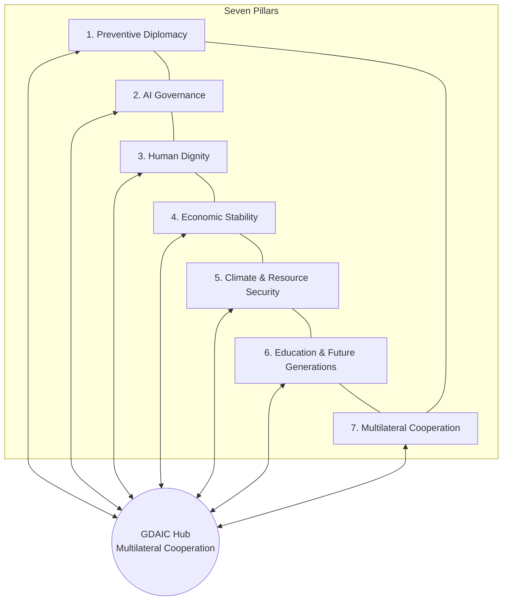

# 5. FMS PEACE ARCHITECTURE FRAMEWORK™

## 5.1 Conceptual Foundation

The **FMS Peace Architecture Framework™** is an original integrative model developed for this inaugural volume of *FMS Strategic Review*. It unifies preventive diplomacy, artificial intelligence governance, human dignity, economic stability, climate and resource security, education for future generations, and multilateral cooperation into a single operational architecture for sustainable peace in the digital age. The framework subsumes and extends the **Global Diplomatic AI Compact (GDAIC)**—positioning GDAIC as the institutional hub within Pillar 2 (AI Governance) and Pillar 7 (Multilateral Cooperation), rather than as a standalone technocratic instrument.

Peace research has long distinguished **negative peace** (absence of direct violence) from **positive peace** (structural conditions for justice and dignity) (Galtung, 1969). Digital-era diplomacy adds a third dimension: **epistemic peace**—the shared ability of states and peoples to trust the information environment in which negotiations occur (Chesney & Citron, 2019; United Nations, 2024). The seven pillars address negative, positive, and epistemic peace simultaneously. No pillar is sufficient alone; failure in any pillar can collapse the architecture, much as a missing load-bearing element compromises a bridge.

**Figure 0: FMS Peace Architecture Framework™** — seven pillars with Multilateral Cooperation (GDAIC hub) at center; bidirectional interconnections indicate mutual reinforcement.

## 5.2 The Seven Pillars

### Pillar 1: Preventive Diplomacy

Preventive diplomacy—Chapter VI engagement before armed conflict—receives disproportionate investment under the framework (United Nations Charter, 1945; United Nations, 2023). AI applications prioritized here include: conflict early warning fusion (UCDP-aligned datasets); scenario modeling for mediators; back-channel facilitation with cryptographic confidentiality; and ceasefire monitoring support. **Design rule:** No autonomous recommendation to authorize force; human mediators set engagement thresholds (Diehl et al., 2021).

Quantitative urgency: UCDP recorded **59 state-based armed conflicts** in 2023—the highest since 1946 (Uppsala University, 2024). Prevention priced at $100–160M globally (illustrative short-term envelope) remains below 0.01% of $2.44 trillion military expenditure (SIPRI, 2024).

### Pillar 2: AI Governance

GDAIC operationalizes this pillar: legality, humanity, accountability, transparency, inclusivity, security, sustainability. **Provenance standards** for leader communications, **human-in-the-loop** mandates for transmitted texts, **HRIAs** before procurement, and the **UN diplomatic AI commons** are core mechanisms (European Parliament and Council, 2024; United Nations, 2024). Export controls under the Wassenaar Arrangement must cover dual-use diplomatic prediction tools (Wassenaar Arrangement, n.d.).

**Governance chart recommendation:** Maturity model Levels 0–4 (ad hoc → remedies), with target dates 2027–2038+ (see Section 11.6).

### Pillar 3: Human Dignity

Human dignity is the non-negotiable metric of success (FMS mission). This pillar embeds international human rights law and international humanitarian law as superseding efficiency claims. Refugees are not reduced to risk scores; women and youth participate in design (United Nations, General Assembly, 2000; Caparini, 2020); conflict-affected communities validate tools before deployment (Autesserre, 2014). The **Independent International Diplomatic AI Review Panel** reports to the Human Rights Council and General Assembly Fourth Committee.

### Pillar 4: Economic Stability

Economic stability links prevention finance, sanctions equity, and post-conflict reconstruction scenario modeling (World Bank, 2017; Gordon, 2022). Algorithmic sanctions enforcement without humanitarian carve-outs repeats documented harm in Yemen and Afghanistan corridors. **Prevention bonds** and regional development bank co-financing are recommended financing instruments (illustrative).

Institute for Economics & Peace (2024) estimates global economic impact of violence exceeds **$19 trillion** annually (broad measure). One avoided major war preserves $100B–$1T+ GDP over a decade—far exceeding cumulative framework investment.

### Pillar 5: Climate & Resource Security

Climate change is a **risk multiplier**, not a deterministic cause of war (IPCC, 2022; Buhaug et al., 2014). AI climate models in diplomatic briefings require **IPCC-aligned ranges** and third-party scientific co-signature to prevent politically motivated securitization. Water diplomacy in Nile, Tigris-Euphrates, and Indus basins exemplifies regional application (UNEP, n.d.).

### Pillar 6: Education & Future Generations

Long-horizon prevention requires youth civic resilience, peace education, and child data governance in ed-tech (United Nations, 2020; UNICEF, 2021). CVE applications must prohibit student "risk scoring" in GDAIC minimum standards. Open curricula under Creative Commons licenses with LDC access parity prevent two-tier diplomatic education systems.

### Pillar 7: Multilateral Cooperation

Multilateral cooperation hosts the **GDAIC Conference of Parties**, Technical Secretariat (UN ODA/DPPA), Independent Review Panel, and UN diplomatic AI commons. Regional organizations (AU, ASEAN, EU, OAS) co-lead pilots with **regional custody** of negotiation platforms—protecting smaller members from cloud surveillance (African Union, 2023; OECD, 2024).

## 5.3 Pillar Interaction Matrix

| Interaction | Mechanism | Failure mode if neglected |
|-------------|-----------|---------------------------|
| 1 ↔ 2 | Prevention tools governed by GDAIC | Ungoverned early warning → escalation |
| 2 ↔ 3 | HRIA gate on all diplomatic AI | Rights violations → legitimacy collapse |
| 3 ↔ 4 | Sanctions AI with economic rights review | Humanitarian harm → radicalization |
| 4 ↔ 5 | Climate adaptation financing diplomacy | Securitized borders → displacement |
| 5 ↔ 6 | Climate curricula in youth programs | Generational unpreparedness |
| 6 ↔ 7 | UNICEF standards in UN commons | Corporate capture of peace education |
| 1 ↔ 7 | UN DPPA pilots via regional orgs | Centralized New York bias |

## 5.4 Relationship to GDAIC

GDAIC is not replaced—it is **nested**. States adopting GDAIC adopt minimum standards for Pillars 2 and 7; the full framework encourages exceeding minimums in Pillars 1, 3–6. Ministers may present GDAIC at the UN as the **operational treaty instrument** while the FMS Peace Architecture Framework™ serves as the **strategic narrative** for public education and cross-sector mobilization.

## 5.5 Implementation Priorities by Pillar (2026–2028)

| Pillar | Priority action | Budget share (illustrative) |
|--------|-----------------|------------------------------|
| 1 | 3–5 regional prevention pilots | 35% |
| 2 | Provenance v0.1 + registry | 25% |
| 3 | HRIA template + Review Panel startup | 15% |
| 4 | Sanctions humanitarian dashboard | 10% |
| 5 | Sahel climate-security pilot | 8% |
| 6 | 5,000-diplomat literacy program | 5% |
| 7 | GDAIC consultation + Envoy | 2% |

## 5.6 Theory of Change (Framework-Level)

**Inputs:** Seven-pillar national strategies, GDAIC adherence, commons infrastructure.  
**Activities:** Pilots, audits, capacity-building, provenance adoption.  
**Outputs:** Registered systems, trained personnel, published evaluations.  
**Outcomes:** De-escalation milestones, access improvements, reduced synthetic incidents.  
**Impact:** Lower battle deaths in pilot regions; narrowed diplomatic bandwidth inequality; strengthened epistemic peace (Uppsala University, 2024; World Bank, 2017).

**Visual content recommendation:** Stakeholder influence map—UN, regional orgs, ICRC, civil society, tech firms, conflict-affected communities—mapped to pillar lead responsibilities.
